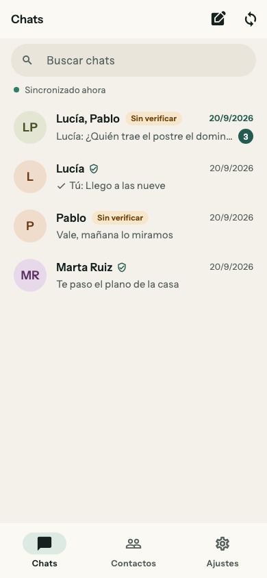
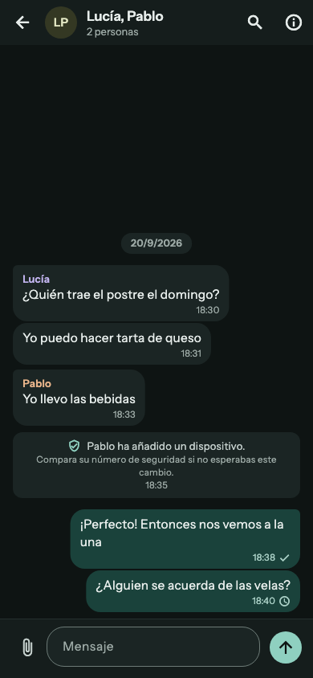
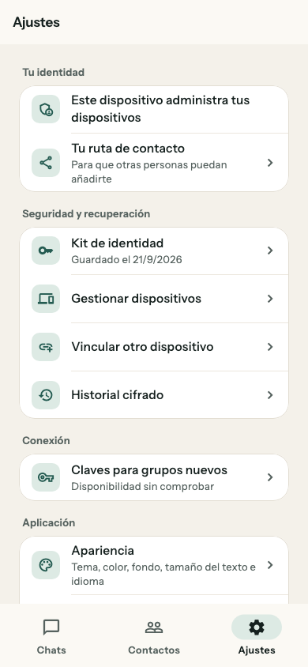
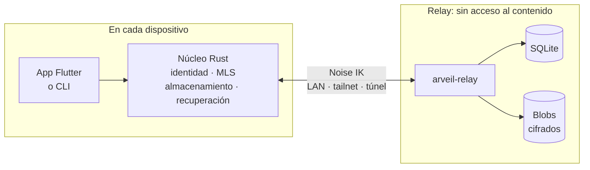

<div align="center">


# Arveil

**Mensajería privada para familias y pequeños círculos de confianza, en un servidor tuyo.**

Cifrado de extremo a extremo con MLS (RFC 9420) · un único binario Go como relay, sobre SQLite · apps para macOS y Android

[](https://github.com/Ulzuhan/arveil/actions/workflows/ci.yml)
[](https://ulzuhan.github.io/arveil/)
[](LICENSE)
[](#estado-del-proyecto)

[Web](https://arveil.kaicorplabs.com/es/) ·
[Documentación](docs/es/README.md) ·
[Instalar](docs/es/INSTALLATION.md) ·
[Modelo de amenazas](docs/es/THREAT_MODEL.md) ·
[Protocolo](docs/es/PROTOCOL.md) ·
[English](README.md)

</div>

> [!WARNING]
> Arveil es experimental y **no** ha pasado una auditoría de seguridad
> independiente. Todavía no hay ninguna versión publicada. Usa perfiles de
> prueba desechables y lee el [modelo de amenazas](docs/es/THREAT_MODEL.md)
> antes de confiarle algo importante.

<p align="center">
  <picture>
    <source media="(prefers-color-scheme: dark)" srcset="docs/assets/screens/desktop_conversation_dark.png">
    
  </picture>
</p>
<p align="center"><sub>La app de macOS en español. Funciona en español y en inglés, según el sistema o lo que elijas en Ajustes.</sub></p>

## Por qué Arveil

Quien quiere un chat familiar privado suele tener dos opciones: confiar en un
servicio alojado que no puede administrar, o autoalojar un software que
necesita a alguien de sistemas para seguir funcionando. Arveil busca las dos
cosas: cifrado de extremo a extremo moderno y un servidor que una familia
puede mantener en una máquina pequeña sin tener que entenderlo.

- **El servidor no guarda conversaciones.** Solo almacena buzones opacos y
  sobres cifrados. Los miembros, los títulos y la composición de los grupos
  existen únicamente en el estado MLS de tus dispositivos.
- **Tu identidad es tuya, no del servidor.** Una clave raíz generada en tu
  dispositivo firma cada dispositivo que añades. Quien administra el relay
  decide quién puede usarlo, nunca quién eres.
- **Cada dispositivo es visible.** Cada conversación, también las de dos
  personas, es un grupo MLS con una hoja por dispositivo. Añadir un teléfono
  o revocar uno perdido es una operación criptográfica explícita, y tus
  contactos la ven.
- **Funciona llegues como llegues a casa.** Un canal Noise IK entre el
  dispositivo y el relay viaja dentro de cualquier transporte: LAN, una
  tailnet, una redirección de puertos o un túnel que termina TLS. El túnel ve
  patrones de tráfico, nunca la API, los identificadores ni las credenciales.
- **Primero local, primero la recuperación.** Puedes leer y escribir con el
  servidor caído. Recuperar la identidad, añadir un dispositivo y archivar el
  historial son tres mecanismos separados y explícitos. Nunca se restaura un
  estado MLS antiguo para seguir enviando.
- **Pensado para un homelab.** SQLite en modo WAL con una configuración de
  durabilidad verificada, copias de seguridad copiando un directorio, y sin
  Redis, Postgres, colas de mensajes ni Kubernetes.

## Funciones

<table>
<tr>
<td valign="top" width="50%">

**Mensajería**

- Conversaciones de dos personas y de grupo, cada una un grupo MLS
- Funciona sin conexión: lees el historial, escribes y se envía cuando el relay responde
- Adjuntos cifrados con transferencias que se reanudan
- Estados de entrega que nunca afirman que alguien leyó tu mensaje
- Búsqueda dentro de una conversación, en tu dispositivo
- Mensajes sin leer y vista previa de cada conversación

</td>
<td valign="top" width="50%">

**Identidad y dispositivos**

- Identidad raíz Ed25519 generada en el dispositivo
- Vincula un dispositivo nuevo comparando un código y revoca uno perdido
- Números de seguridad para verificar contactos en persona o por otro canal
- Un aviso en el chat cuando un contacto añade o retira un dispositivo
- Kit de identidad: un archivo de recuperación cifrado con una clave aparte
- Archivos cifrados del historial, separados de la recuperación de la identidad

</td>
</tr>
<tr>
<td valign="top">

**Apps**

- Flutter para macOS y Android sobre un núcleo Rust compartido
- Perfil cifrado en reposo con SQLCipher; la clave se queda en el llavero o en el Keystore de Android
- Diseño adaptable del móvil al escritorio, con atajos de teclado
- Español e inglés, temas claro y oscuro, seis colores de acento, fondos y tamaño del texto
- Etiquetas para lectores de pantalla, texto al 200 % y movimiento reducido
- Un informe de diagnóstico que no incluye secretos

</td>
<td valign="top">

**Relay**

- Un único binario Go con SQLite y blobs cifrados en disco
- Noise IK sobre WebSocket, con una lista firmada de direcciones y TLS opcional
- Invitaciones de un solo uso, límites por dirección, comprobaciones de salud y métricas
- Instalación con Docker Compose, systemd o Podman sin root
- Procedimientos de copia y restauración probados
- Imágenes para Linux x86-64 y ARM64 con procedencia de compilación, publicadas con cada etiqueta de versión

</td>
</tr>
</table>

<p align="center">
  
  &nbsp;
  
  &nbsp;
  
</p>

## Cómo funciona



El núcleo Rust (`arveil-core` y la capa de operaciones `arveil-app`) se
encarga de la identidad, MLS ([mls-rs](https://github.com/awslabs/mls-rs)),
el estado persistente y la recuperación. La CLI y las apps Flutter lo
comparten mediante
[flutter_rust_bridge](https://github.com/fzyzcjy/flutter_rust_bridge); el
lado Dart solo guarda el estado de la interfaz. El relay autentica
dispositivos, guarda los sobres hasta entregarlos y no sabe nada de las
conversaciones.

**Qué ve el relay y qué no**

| Visible para quien opera el relay | Nunca visible para el relay |
|---|---|
| Los miembros registrados, sus claves públicas y sus dispositivos | El texto de los mensajes, los archivos, sus nombres y sus tipos |
| Qué dispositivo envía a qué buzón, y cuándo | Los identificadores, epochs, miembros y títulos de los grupos |
| Direcciones IP, tamaños, horas, frecuencia y tokens de push | Las claves privadas y los secretos de recuperación |
| | El contenido de las copias del historial |

Un relay modificado todavía puede deducir quién habla con quién a partir de
las conexiones y las entregas. El
[modelo de amenazas](docs/es/THREAT_MODEL.md) detalla cada garantía, sus
condiciones y los invariantes (I-01 a I-13) que comprueban las pruebas.

## Estado del proyecto

El relay, el núcleo Rust y la CLI están completos hasta la fase 4. Las apps
Flutter cubren los flujos del día a día y avanzan hacia una beta limitada.

| Fase | Alcance | Estado |
|---|---|---|
| 0 · Viabilidad | Núcleo Rust, dos clientes CLI, relay mínimo; MLS real y persistencia atómica | ✅ Hecha |
| 1 · Vertical en LAN | Grupos, bandeja de salida sin conexión, TTL, adjuntos, canal Noise con lista de direcciones | ✅ Hecha |
| 2 · Uso personal | Multidispositivo, kit de identidad, archivo del historial, revocación, cifrado en reposo | ✅ Hecha |
| 3a · Lista para repartir | Vinculación, verificación de contactos, transferencias reanudables, aviso de push, compilaciones firmadas | ✅ Hecha |
| 4 · Operable | Empaquetado, límites por dirección, salud y métricas, TLS, copias de seguridad | ✅ Hecha |
| 3b · Apps | Clientes Flutter, actualizaciones firmadas, revisión de seguridad externa | 🚧 En curso |

Los hitos M3b.0 a M3b.4 de la fase 3b están implementados: compilación
nativa y puente, contrato de la aplicación, alta y vinculación,
conversaciones y uso diario. Lo siguiente es **M3b.5**, una beta limitada
para macOS y Android en la que tres personas externas completan los flujos
principales. Para producción (M3b.8) hacen falta además una revisión de
seguridad externa y actualizaciones firmadas. Consulta el
[plan de la fase 3b](docs/es/PHASE3B.md) y el
[registro de implementación del cliente](docs/es/CLIENT_FOUNDATION.md).

**Plataformas**

| Plataforma | Estado |
|---|---|
| Relay en Linux x86-64 y ARM64 | Las imágenes de contenedor se construyen en CI y se publican con la primera etiqueta de versión |
| Relay y CLI en Linux x86-64 y macOS arm64 | Flujo de publicación listo, con sumas de comprobación y procedencia de compilación |
| App para macOS 12 o posterior (Apple silicon) | Paquete experimental; actualización desde una versión anterior verificada |
| App para Android 7.0 o posterior (arm64) | APK experimental; verificada en el emulador, falta en dispositivos físicos |
| Apps de escritorio para Windows y Linux | Previstas (M3b.6) |
| App para iOS | Prevista (M3b.7) |

La [matriz de plataformas](docs/es/PLATFORMS.md) recoge qué se probó, en qué
dispositivo y con qué commit.

## Primeros pasos

### Poner en marcha un relay

Necesitas Git, Docker y el complemento Docker Compose.

```sh
git clone https://github.com/Ulzuhan/arveil.git
cd arveil
docker compose -f relay/compose.yaml up -d --build
docker compose -f relay/compose.yaml exec arveil-relay /arveil-relay healthcheck -admin http://127.0.0.1:9090
```

Después muestra los datos de conexión del relay y crea una invitación de un
solo uso:

```sh
docker compose -f relay/compose.yaml logs --no-log-prefix arveil-relay | head -1
docker compose -f relay/compose.yaml exec arveil-relay /arveil-relay invite -data-dir /data
```

Por defecto solo escucha en la interfaz local. Para llegar desde un teléfono,
elige una dirección en [Poner en marcha un realm](docs/es/OPERATIONS.md) o
sigue la [guía de Podman sin root y Tailscale](docs/PODMAN.md) (en inglés).

### Conseguir las apps

Aún no hay ninguna versión publicada de las apps. Compílalas desde el código
(más abajo) o pide a una persona mantenedora un ZIP de macOS o un APK de
Android experimentales, preparados con la
[guía de paquetes del cliente](docs/es/CLIENT_RELEASES.md). Ninguno necesita
herramientas de desarrollo para instalarse. La
[guía de instalación](docs/es/INSTALLATION.md) explica cada camino, qué se ha
verificado y qué falta. Para quien simplemente ha recibido una invitación, la
web tiene una [guía paso a paso](https://arveil.kaicorplabs.com/es/instalar/)
más corta.

### Probar la demo de línea de comandos

Con Go 1.27, Rust 1.98.1 y `sqlite3` instalados:

```sh
./scripts/demo.sh
```

La demo arranca un relay y da de alta dos dispositivos con invitaciones de un
solo uso. Abre una conversación MLS, intercambia mensajes y reinicia el
relay. Después hace que un cliente falle justo tras un commit, muestra que el
reenvío llega exactamente una vez y lista lo que contiene la base de datos
del relay.

### Compilar desde el código

| Componente | Herramientas |
|---|---|
| Relay | Go 1.27 (`relay/go.mod`) |
| Núcleo Rust y CLI | Rust 1.98.1 (`core/rust-toolchain.toml`) |
| Apps | Flutter 3.44.1, Xcode para macOS, SDK de Android con NDK 28 para Android |

```sh
make build        # relay y espacio de trabajo Rust
make test         # pruebas de Go y Rust
make lint         # formato, vet y clippy
make docs-serve   # web de documentación en local (necesita uv)
```

```sh
cd clients/flutter
flutter pub get
flutter run -d macos
```

La biblioteca nativa se compila sola mediante `rust_builder`. El
[README del cliente](clients/flutter/README.md) (en inglés) cubre los
bindings, las pruebas de aceptación y las herramientas de Android.

## Documentación

La documentación completa está publicada en
**[ulzuhan.github.io/arveil](https://ulzuhan.github.io/arveil/)**, en inglés
y [en español](docs/es/README.md). La web del proyecto,
**[arveil.kaicorplabs.com](https://arveil.kaicorplabs.com/es/)**, presenta
Arveil a quien no es técnico y tendrá los enlaces de descarga.

| Tema | Documentos |
|---|---|
| Usarlo y administrarlo | [Instalación](docs/es/INSTALLATION.md) · [Poner en marcha un realm](docs/es/OPERATIONS.md) · [Podman sin root](docs/PODMAN.md) (en inglés) · [Paquetes del cliente](docs/es/CLIENT_RELEASES.md) |
| Diseño | [Arquitectura](docs/es/ARCHITECTURE.md) · [Modelo de amenazas](docs/es/THREAT_MODEL.md) · [Protocolo](docs/es/PROTOCOL.md) · [Modelo de dominio](docs/es/DOMAIN_MODEL.md) |
| Decisiones | [ADR-001 a ADR-010](docs/es/adr/): Go y Rust, MLS, servidor sin confianza, SQLite, identidad, recuperación, redundancia, transporte, Flutter, y distribución y actualizaciones |
| Apps | [Diseño del cliente](docs/es/CLIENT_DESIGN.md) · [Registro de implementación](docs/es/CLIENT_FOUNDATION.md) · [Plan de la fase 3b](docs/es/PHASE3B.md) · [Matriz de plataformas](docs/es/PLATFORMS.md) |
| Historia | Planes de las fases [0](docs/PHASE0.md) · [1](docs/PHASE1.md) · [2](docs/PHASE2.md) · [3](docs/PHASE3.md) · [4](docs/PHASE4.md) (en inglés) · [Revisión de viabilidad v0.3](docs/es/REVIEW-v0.3.md) |

## Seguridad

Arveil **no** ha pasado una auditoría independiente. Los escenarios de
aceptación automatizados ejercitan el protocolo y la recuperación
documentados, pero que las pruebas pasen no equivale a una revisión. Informa
de vulnerabilidades en privado mediante los
[avisos de seguridad de GitHub](https://github.com/Ulzuhan/arveil/security/advisories/new);
[SECURITY.md](SECURITY.md) (en inglés) explica el alcance y qué incluir.

Las versiones incluirán archivos `SHA256SUMS` y procedencia de compilación
firmada (`gh attestation verify <archivo> --repo Ulzuhan/arveil`). Las
compilaciones no están notarizadas ni firmadas para cada plataforma, así que
macOS y Windows mostrarán un aviso la primera vez. Verifica las descargas con
las sumas y la procedencia.

## Qué no es Arveil

Arveil no tiene federación, llamadas de voz o vídeo, bots ni puentes, cliente
web, red de anonimato ni perfil poscuántico, y la primera versión no tiene
alta disponibilidad. El relay sigue viendo direcciones IP, horas, tamaños y
quién habla con quién.

## Contribuir

Las contribuciones son bienvenidas. [CONTRIBUTING.md](CONTRIBUTING.md) (en
inglés) explica las comprobaciones de desarrollo, la higiene de publicación y
cómo preparar un pull request. Abre un issue antes de cambiar el protocolo o
añadir una función importante, y revisa los diseños contra una ADR o una fila
concreta del modelo de amenazas.

<details>
<summary><b>Estructura del repositorio</b></summary>

```text
.
├── relay/      Relay en Go (arveil-relay), imagen de contenedor y empaquetado
├── core/       Espacio de trabajo Rust: arveil-core, arveil-app, arveil-cli, arveil-flutter
├── clients/    App Flutter para macOS y Android
├── scripts/    Escenarios de aceptación, empaquetado y ayudas de despliegue
├── docs/       Documentación en inglés; docs/es/ en español (web con MkDocs)
├── assets/     Fuentes de la marca: icono y símbolo
└── spikes/     Investigaciones desechables, como la comparación de OpenMLS y mls-rs
```

</details>

## Licencia

Arveil se distribuye bajo la [licencia Apache 2.0](LICENSE). La licencia
permisiva es deliberada: el núcleo Rust está pensado para integrarse en
clientes que este proyecto no escribe, y el protocolo, para que otras
personas puedan implementarlo.
