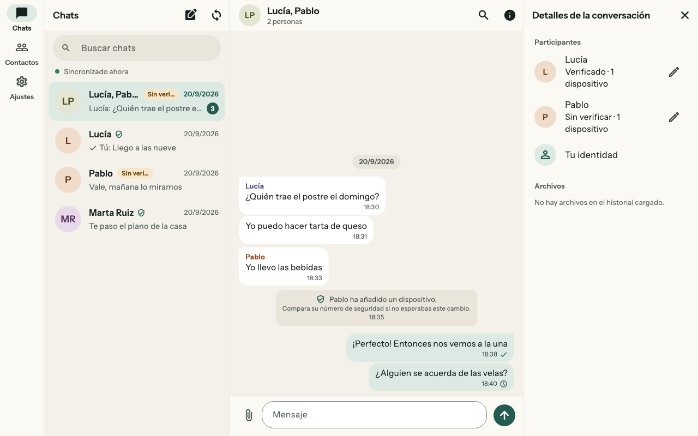
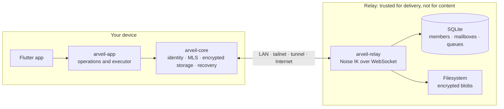

<div align="center">


# Arveil

**Private messaging for families and small circles of trust, on a server you own.**

End-to-end encrypted with MLS (RFC 9420) · one Go relay binary on SQLite · apps for macOS and Android

[](https://github.com/Ulzuhan/arveil/actions/workflows/ci.yml)
[](https://ulzuhan.github.io/arveil/)
[](LICENSE)
[](#project-status)

[Documentation](https://ulzuhan.github.io/arveil/) ·
[Install](docs/INSTALLATION.md) ·
[Threat model](docs/THREAT_MODEL.md) ·
[Protocol](docs/PROTOCOL.md) ·
[Español](docs/es/README.md)

</div>

> [!WARNING]
> Arveil is experimental and has **not** been independently audited. No
> release has been published yet. Use disposable test profiles, and read the
> [threat model](docs/THREAT_MODEL.md) before trusting it with anything that
> matters.

<p align="center">
  <picture>
    <source media="(prefers-color-scheme: dark)" srcset="docs/assets/screens/desktop_conversation_dark.png">
    
  </picture>
</p>
<p align="center"><sub>The macOS app in Spanish. It speaks English and Spanish, following the system or a choice in Settings.</sub></p>

## Why Arveil

Most people who want private family chat have two options. They can trust
a hosted service they cannot run themselves, or self-host software that
needs a sysadmin to keep it alive. Arveil aims for both: modern end-to-end
encryption, and a server a household can run on a small machine without
understanding it.

- **The server stores no conversations.** It keeps opaque mailboxes and
  encrypted envelopes. Group membership, titles and rosters exist only in
  MLS state on your devices.
- **Your identity belongs to you, not to the server.** A root key generated
  on your device signs every device you add. The person running the relay
  decides who may use it, never who you are.
- **Every device is visible.** Each conversation, including 1:1 chats, is an
  MLS group with one leaf per device. Adding a phone or revoking a lost one
  is an explicit cryptographic operation, and your contacts see it.
- **It works however you reach home.** A Noise IK channel between device
  and relay runs inside any carrier: LAN, a tailnet, port forwarding or a
  tunnel that terminates TLS. The tunnel sees traffic patterns, never the
  API, identifiers or credentials.
- **Local-first, recovery-first.** You can read and write while the server
  is down. Identity recovery, adding a device and history archives are three
  separate, explicit mechanisms. Old MLS state is never restored to keep
  sending.
- **Built for homelab operations.** SQLite in WAL mode with verified
  durability settings, backups by copying a directory, and no Redis,
  Postgres, message broker or Kubernetes.

## Features

<table>
<tr>
<td valign="top" width="50%">

**Messaging**

- 1:1 and group conversations, each an MLS group
- Works offline: read history, write, and send once the relay is reachable
- Encrypted attachments with resumable transfers
- Delivery states that never claim someone read your message
- Search within a conversation, run on your device
- Unread counts and conversation previews

</td>
<td valign="top" width="50%">

**Identity and devices**

- Device-generated Ed25519 root identity
- Link a new device by comparing a code, and revoke a lost one
- Safety numbers to verify contacts in person or over another channel
- A notice in the chat when a contact adds or removes a device
- Identity kit: an encrypted recovery file with a separate secret
- Encrypted history archives, kept apart from identity recovery

</td>
</tr>
<tr>
<td valign="top">

**Apps**

- Flutter for macOS and Android over a shared Rust core
- Profile encrypted at rest with SQLCipher; the key stays in the Keychain or Android Keystore
- Adaptive layouts from phone to desktop, with keyboard shortcuts
- English and Spanish, light and dark themes, six accents, backgrounds and text size
- Screen reader labels, 200% text and reduced motion
- A diagnostic report that leaves out secrets

</td>
<td valign="top">

**Relay**

- A single Go binary with SQLite and encrypted blobs on disk
- Noise IK over WebSocket, with a signed endpoint list and optional TLS
- One-use invitations, per-address limits, health checks and metrics
- Docker Compose, systemd and rootless Podman setups
- Tested backup and restore procedures
- Linux x86-64 and ARM64 images with build provenance, published on release tags

</td>
</tr>
</table>

## How it works



The Rust core owns identity, MLS ([mls-rs](https://github.com/awslabs/mls-rs)),
durable state and recovery. The CLI and the Flutter apps share it through
[flutter_rust_bridge](https://github.com/fzyzcjy/flutter_rust_bridge), and
the Dart side holds only presentation state. The relay authenticates
devices, stores envelopes until they are delivered, and knows nothing about
conversations.

**What the relay can and cannot see**

| Visible to the relay operator | Never visible to the relay |
|---|---|
| Registered members, their public keys and devices | Message text, files, file names and types |
| Which device sends to which mailbox, and when | Group IDs, epochs, rosters and titles |
| IP addresses, sizes, timing, frequency and push tokens | Private keys and recovery secrets |
| | History backup contents |

A modified relay can still infer who talks to whom from connections and
deliveries. The [threat model](docs/THREAT_MODEL.md) states each guarantee,
its conditions, and the invariants (I-01 to I-13) the tests check.

## Project status

The relay, the Rust core and the CLI are complete through Phase 4. The
Flutter apps cover the everyday flows and are moving towards a limited beta.

| Phase | Scope | Status |
|---|---|---|
| 0 · Viability | Rust core, two CLI clients, minimal relay; real MLS and atomic persistence | ✅ Done |
| 1 · LAN vertical | Groups, offline outbox, TTL, attachments, Noise channel with endpoint list | ✅ Done |
| 2 · Personal use | Multi-device, identity kit, history archive, revocation, encryption at rest | ✅ Done |
| 3a · Ready to hand out | Pairing, contact verification, resumable transfers, push hint, signed builds | ✅ Done |
| 4 · Operable | Packaging, per-address limits, health and metrics, TLS, backups | ✅ Done |
| 3b · Apps | Flutter clients, signed updates, external security review | 🚧 In progress |

Phase 3b milestones M3b.0 to M3b.4 are implemented: native build and bridge,
application contract, enrollment and pairing, conversations and daily use.
Next is **M3b.5**, a limited macOS and Android beta in which three external
users complete the main flows. Production (M3b.8) additionally requires an
external security review and signed updates. See the
[Phase 3b plan](docs/PHASE3B.md) and the
[client implementation record](docs/CLIENT_FOUNDATION.md).

**Platforms**

| Platform | Status |
|---|---|
| Relay on Linux x86-64 and ARM64 | Container images build in CI and publish on the first release tag |
| Relay and CLI on Linux x86-64 and macOS arm64 | Release workflow ready, with checksums and build provenance |
| macOS 12+ app (Apple silicon) | Experimental package; update from an earlier build verified |
| Android 7.0+ app (arm64) | Experimental APK; verified on the emulator, physical devices pending |
| Windows and Linux desktop apps | Planned (M3b.6) |
| iOS app | Planned (M3b.7) |

The [platform record](docs/PLATFORMS.md) lists what was tested, on which
device and at which commit.

## Getting started

### Run a relay

You need Git, Docker and the Docker Compose plugin.

```sh
git clone https://github.com/Ulzuhan/arveil.git
cd arveil
docker compose -f relay/compose.yaml up -d --build
docker compose -f relay/compose.yaml exec arveil-relay /arveil-relay healthcheck -admin http://127.0.0.1:9090
```

Then print the relay's connection data and create a one-use invitation:

```sh
docker compose -f relay/compose.yaml logs --no-log-prefix arveil-relay | head -1
docker compose -f relay/compose.yaml exec arveil-relay /arveil-relay invite -data-dir /data
```

The default listens on loopback only. To reach it from a phone, choose an
address in [Running a realm](docs/OPERATIONS.md), or follow the
[rootless Podman and Tailscale guide](docs/PODMAN.md).

### Get the apps

No app release is published yet. Build from source (below), or ask a
maintainer for an experimental macOS ZIP or Android APK prepared with the
[client packaging guide](docs/CLIENT_RELEASES.md). Neither needs developer
tools to install. The [installation guide](docs/INSTALLATION.md) covers
each route, what has been verified and what is still pending.

### Try the command-line demo

With Go 1.27, Rust 1.98.1 and `sqlite3` installed:

```sh
./scripts/demo.sh
```

The demo starts a relay and enrolls two devices with one-use invitations.
It opens an MLS conversation, exchanges messages and restarts the relay. It
then crashes a client after a commit, shows the retransmission arriving
exactly once, and lists what the relay database holds.

### Build from source

| Component | Toolchain |
|---|---|
| Relay | Go 1.27 (`relay/go.mod`) |
| Rust core and CLI | Rust 1.98.1 (`core/rust-toolchain.toml`) |
| Apps | Flutter 3.44.1, Xcode for macOS, Android SDK with NDK 28 for Android |

```sh
make build        # relay and Rust workspace
make test         # Go and Rust test suites
make lint         # formatting, vet and clippy
make docs-serve   # documentation site on localhost (needs uv)
```

```sh
cd clients/flutter
flutter pub get
flutter run -d macos
```

The native library builds automatically through `rust_builder`. The
[client README](clients/flutter/README.md) covers bindings, acceptance
checks and Android tooling.

## Documentation

The full documentation is published at
**[ulzuhan.github.io/arveil](https://ulzuhan.github.io/arveil/)** and is
available in English and [Spanish](docs/es/README.md).

| Topic | Documents |
|---|---|
| Using and running it | [Installation](docs/INSTALLATION.md) · [Running a realm](docs/OPERATIONS.md) · [Rootless Podman](docs/PODMAN.md) · [Client packages](docs/CLIENT_RELEASES.md) |
| Design | [Architecture](docs/ARCHITECTURE.md) · [Threat model](docs/THREAT_MODEL.md) · [Protocol](docs/PROTOCOL.md) · [Domain model](docs/DOMAIN_MODEL.md) |
| Decisions | [ADR-001 to ADR-009](docs/adr/): Go and Rust, MLS, zero-trust server, SQLite, identity, recovery, redundancy, transport, Flutter |
| Apps | [Client design](docs/CLIENT_DESIGN.md) · [Implementation record](docs/CLIENT_FOUNDATION.md) · [Phase 3b plan](docs/PHASE3B.md) · [Platform record](docs/PLATFORMS.md) |
| History | Phase plans [0](docs/PHASE0.md) · [1](docs/PHASE1.md) · [2](docs/PHASE2.md) · [3](docs/PHASE3.md) · [4](docs/PHASE4.md) · [Viability review v0.3](docs/REVIEW-v0.3.md) |

## Security

Arveil has **not** been independently audited. Automated acceptance scenarios
exercise the documented protocol and recovery behavior, but passing tests are
not a review. Please report vulnerabilities privately through
[GitHub security advisories](https://github.com/Ulzuhan/arveil/security/advisories/new);
see [SECURITY.md](SECURITY.md) for scope and what to include.

Releases will ship `SHA256SUMS` files and signed build provenance
(`gh attestation verify <file> --repo Ulzuhan/arveil`). The builds are not
notarized or code-signed per platform, so macOS and Windows will warn on
first launch. Verify downloads with checksums and provenance instead.

## What Arveil is not

Arveil has no federation, voice or video calls, bots or bridges, web client,
anonymity network or post-quantum profile, and no high availability in the
first version. The relay still sees IP addresses, timing, sizes and who
talks to whom.

## Contributing

Contributions are welcome. Read [CONTRIBUTING.md](CONTRIBUTING.md) for the
development checks, publication hygiene and pull request guidance. Open an
issue before changing the protocol or adding a major feature, and review
designs against a specific ADR or threat-model row.

<details>
<summary><b>Repository layout</b></summary>

```text
.
├── relay/      Go relay (arveil-relay), container image and packaging
├── core/       Rust workspace: arveil-core, arveil-app, arveil-cli, arveil-flutter
├── clients/    Flutter app for macOS and Android
├── scripts/    Acceptance scenarios, packaging and deployment helpers
├── docs/       Documentation in English, docs/es/ in Spanish (MkDocs site)
├── assets/     Brand sources: icon and mark
└── spikes/     Throwaway investigations, such as the OpenMLS and mls-rs comparison
```

</details>

## License

Arveil is licensed under the [Apache License 2.0](LICENSE). The permissive
license is deliberate: the Rust core is meant to be embedded in clients this
project does not write, and the protocol is meant to be implementable by
others.
