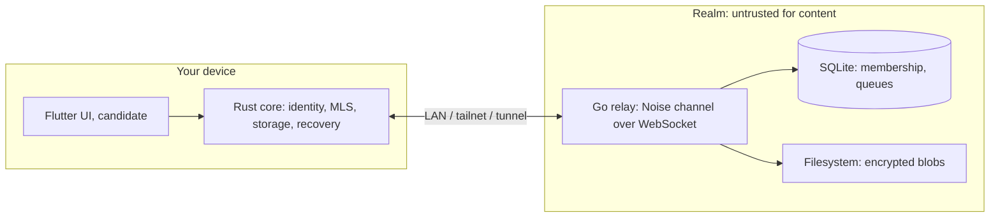

# Arveil

**A self-hosted, end-to-end encrypted messenger for families and small circles of trust.**
One Go binary, one SQLite file, one data directory. Runs on a Raspberry Pi in your home and stays reachable over LAN, Tailscale, or a Cloudflare Tunnel, without changing a single security guarantee.

> **Status: everything except the graphical clients (2026-09-04). Installable, operable and used from the command line.**
> Command-line clients chat in groups with real MLS through the Go relay, with several devices per person, several conversations, encrypted files, messages written while the relay is down, and honest expiry. A device is paired over a live channel with a number both screens show, and never silently; people verify each other with a safety number and name each other locally; revoking a device stops it at the realm and inside every group; losing the group's creator no longer means recreating the group; a lost identity comes back from its `age` kit and its history from its archive, with a rolled-back realm reported rather than believed; interrupted transfers resume; the local database is encrypted at rest. The realm ships as a container image, a compose file and a systemd unit, with limits per address, health and metrics on their own listener, TLS of its own or through your tunnel, and a backup that restores into a working realm. The relay never sees plaintext, a group id or a conversation table, and a TLS-terminating proxy records nothing but opaque frames. Every claim runs in CI: [`scripts/phase4.sh`](scripts/phase4.sh), [`scripts/phase3.sh`](scripts/phase3.sh), [`scripts/phase2.sh`](scripts/phase2.sh), [`scripts/phase1.sh`](scripts/phase1.sh), [`scripts/demo.sh`](scripts/demo.sh), [`scripts/interop.sh`](scripts/interop.sh), [`scripts/q3-capture.sh`](scripts/q3-capture.sh). Start here: [Running a realm](docs/OPERATIONS.md). What is left is the mobile and desktop clients and an external review; see the [roadmap](#roadmap).

## Why another messenger

Most self-hostable messengers make you choose between privacy and operability. Matrix homeservers are heavy and their group encryption has a complicated history. XMPP has OMEMO, but multi-device is uneven. Hosted E2EE apps are excellent and not self-hostable. Arveil is built around a different set of bets:

- **The server has no rooms table.** It stores opaque mailboxes and encrypted envelopes. Group membership, titles and rosters exist only inside MLS state on your devices.
- **MLS (RFC 9420), one leaf per device.** Every conversation, including 1:1, is an MLS group. Adding a phone or revoking a lost one is a visible cryptographic operation, not an account setting.
- **Identity does not belong to the server.** An Ed25519 root key generated on your device signs your device credentials. The homelab admin decides who may use the server, never who you are.
- **Carrier-independent transport.** A Noise IK channel between device and relay runs inside whatever gets you there: LAN, tailnet, port forwarding, Tailscale Funnel, Cloudflare Tunnel. A tunnel that terminates TLS sees connection patterns, never the API, its identifiers or credentials.
- **Local-first, recovery-first.** Read and write with the server down. Identity recovery, device enrollment and history archives are three separate, explicit mechanisms. No old MLS state is ever "restored" to keep sending.
- **Homelab operations by design.** SQLite in WAL mode with verified durability settings, offline backup by copying a directory, no Redis, Postgres, brokers or Kubernetes.

## What Arveil is not

No federation, no voice or video, no bots or bridges, no web client served by the realm, no anonymity network, no post-quantum profile, no high availability in V1. The threat model says plainly what the relay still sees: IPs, timing, sizes, and who talks to whom. Read it before trusting anything.

## Architecture at a glance



Full documentation, in reading order:

| Document | Contents |
|---|---|
| [Architecture](docs/ARCHITECTURE.md) | Components, boundaries, deployment, access paths, scope and phases |
| [Threat model](docs/THREAT_MODEL.md) | Assets, adversaries, what the server knows, conditional guarantees, verifiable invariants |
| [Protocol](docs/PROTOCOL.md) | Layers, objects, bootstrap, MLS groups, durable delivery, frame catalog, recovery |
| [Domain model](docs/DOMAIN_MODEL.md) | Entities, key lifecycle, server schema, local atomicity, state machines |
| [Decision records](docs/adr/) | ADR-001 to ADR-008: Go + Rust, MLS, zero-trust server, SQLite, identity, local-first, redundancy, carrier-independent transport |
| [Running a realm](docs/OPERATIONS.md) | Install, tunnels, limits, health and metrics, backups and restore |
| [Phase 0 plan](docs/PHASE0.md) | Milestones, acceptance criteria and results of the viability slice |
| [Phase 1 plan](docs/PHASE1.md) | Groups, offline outbox, TTL, endpoint fallback, attachments: milestones and results |
| [Phase 2 plan](docs/PHASE2.md) | Multi-device, revocation, coordinator succession, identity kit and archive, encryption at rest |
| [Phase 3 plan](docs/PHASE3.md) | Pairing over a live channel, contact verification, resumable transfers, push hint, signed builds |
| [Phase 4 plan](docs/PHASE4.md) | Packaging, limits per address, health and metrics, TLS, backups, and the client gaps |
| [Viability review v0.3](docs/REVIEW-v0.3.md) | External-style review with verified references and open risks |

La documentación completa también está disponible en español en [`docs/es/`](docs/es/README.md).

## Releases

Tagging `v*` runs [the release workflow](.github/workflows/release.yml): it builds the relay and the client for Linux x86-64 and macOS arm64, injects the commit each binary reports through `arveil version` and `arveil-relay -version`, publishes a `SHA256SUMS.txt`, and attaches signed build provenance so somebody who did not build them can check where they came from.

It does **not** do platform code signing: there is no Apple notarization and no Windows Authenticode certificate, so those systems will still warn on first run. Verify a download with its checksum and its provenance attestation (`gh attestation verify <file> --repo Ulzuhan/arveil`), not with the absence of a warning.

## Roadmap

| Phase | Deliverable | Exit condition |
|---|---|---|
| 0: viability (done) | Rust core without full UI, two CLI clients, minimal relay | Real MLS, verified identity and atomic persistence demonstrated |
| 1: LAN vertical (done) | 1:1 and group chat, offline outbox, queues, attachments, Noise channel with endpoint list | Restarts, duplicates, TTL, network loss and carrier switching with no silent loss |
| 2: personal use (done) | Multi-device, identity kit, history archive, revocation | Total-loss and restore drills; enrollment is never silent |
| 3a: ready to hand out (done) | Pairing over a live channel, contact verification, resumable transfers, push hint, signed builds | Every claim in `scripts/phase3.sh`; builds a stranger can check |
| 4: operable (done) | Container image, compose and systemd, limits per address, health and metrics, TLS, backups; KeyPackage replenishment, several conversations, contact names | Somebody else can install it, watch it, back it up and restore it |
| 3b: distribution | Mobile and desktop clients, signed updates, optional push | Signed builds, external review, verified platform matrix |

## Repository layout

```text
.
├── core/       Rust workspace: arveil-core (library) and arveil-cli
├── relay/      Go module: arveil-relay server
├── spikes/     Throwaway investigations; spikes/mls compares OpenMLS and mls-rs (M0.5)
├── docs/       Architecture docs (English), docs/es/ (Spanish), MkDocs site source
├── mkdocs.yml  Documentation site
└── Makefile    build, test, lint, docs
```

## Try the Phase 0 demo

Requires Go 1.27.x, Rust 1.98.1 and `sqlite3` on the PATH.

```bash
./scripts/demo.sh
```

It starts a relay, enrolls two devices with one-use invites, opens an MLS conversation, exchanges messages, restarts the relay, crashes a client after it committed a message, shows the retransmission arriving exactly once, and inventories the relay database.

## Building

Requires Go 1.27.x and Rust 1.98.1 (see [ADR-001](docs/adr/ADR-001-go-server-rust-core.md) for why these versions are pinned).

```bash
make build
```

```bash
make test
```

```bash
make docs-serve
```

## Contributing and security

The project is at a stage where design review is more valuable than code. Open an issue against a specific ADR or threat-model row. Security-relevant findings: see [SECURITY.md](SECURITY.md).

## License

Apache-2.0. See [LICENSE](LICENSE). The permissive choice is deliberate: the Rust core is meant to be embedded in mobile and desktop clients, including ones this project does not write, and the protocol is meant to be implementable by others.
