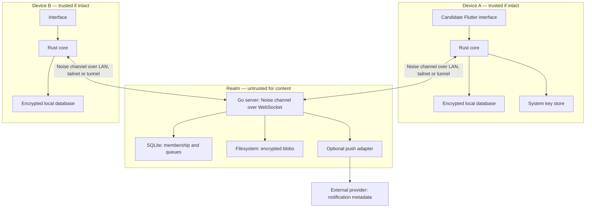

# Architecture

**Status:** proposal v0.4 · **Date:** 2026-09-04. [Index](README.md) · [Threat model](THREAT_MODEL.md) · [Protocol](PROTOCOL.md).

*Versión en español: [es/ARCHITECTURE.md](es/ARCHITECTURE.md)*

## 1. Product and promise

Arveil is a messenger for small groups that want to host their infrastructure at home. Its bet is that the server is simple to install, update and recover, while the devices retain authority over identity and history.

The security promise is limited to content: with legitimate clients, correctly verified identities and endpoint keys kept safe, compromising the realm must not be enough to read conversations. The server still sees traffic, memberships and part of the routing; it can prevent communication. We do not promise "that nothing leaks" or anonymity equivalent to a specialized relay network.

Initial requirements:

- 1:1 conversations and private groups with mandatory E2EE.
- Several independent devices per person, visible enrollment and revocation.
- Local reading and writing without a server; deferred delivery and truthful states.
- Encrypted attachments, identity recovery and optional history transfer.
- A single realm per instance, reachable at the same time over LAN, tailnet, direct Internet or a tunnel, without the access path changing the security guarantees.
- Installation with a single server binary or an image, a SQLite database and a data directory.

As a design budget, tens of people and hundreds of devices are prioritized, not massive public communities. These are not measured capacity figures. The first benchmark will propose 50 people, 150 devices, groups of up to 100 devices and bursts of 10 messages per second, also measuring the cost of per-recipient fan-out.

## 2. Components and boundaries



### Go server: modular monolith

| Module | Responsibility | Constraint |
|---|---|---|
| Channel and endpoints | Noise handshake, frames, signed endpoint list, keepalive | No frame is processed before the handshake completes; administration only on `admin` endpoints |
| Realm and administration | Configuration, enrollments, expulsions, quotas | The administrator does not issue personal identity |
| Invitations | Expiring single-use tokens | Admitting into the service is not equivalent to verifying a person |
| Directory | Public credentials, device manifests and KeyPackages | Clients verify signatures and continuity |
| Mailboxes and delivery | Capabilities, persistent queues, fetch, ACK, TTL | Do not interpret messages or maintain semantic rooms |
| Blobs | Quotas, atomic upload, download, expiration | Only encrypted bytes; no original names |
| Operations | Backups, migrations, health, aggregate metrics | No content, keys or tokens in logs |
| Optional push | Generic notice of pending activity | No names of contacts, groups or messages |

Cleanup and notification tasks live in the process; the durable queue is SQLite. Redis, RabbitMQ, MongoDB, PostgreSQL or Kubernetes are not required. Modules depend on small storage and transport interfaces; they are not split into services up front.

### Rust core: the client's security authority

It contains identity validation, the MLS library, authorization of group events, outer and attachment encryption, encrypted storage, outbox/inbox, synchronization and recovery. A single implementation feeds the mobile and desktop interfaces.

The Go server **does not link the Rust core** and does not participate as an MLS member. Its Noise key, its signing key and its verification of public signatures are independent of the E2EE keys. The interface receives messages to display them, but does not decide whether a signature, device or commit is valid. The bindings expose operations and handles, avoiding the export of private keys.

The system store protects a wrapping key for the local database. Keychain, Keystore and equivalent mechanisms do not imply that every Ed25519/MLS operation happens in secure hardware; actual compatibility must be checked per platform. SQLCipher is a candidate, including its integration with the MLS storage provider.

## 3. Identity, access and membership

An identity is born on a client from an Ed25519 root key. Its fingerprint is computed over a versioned encoding of its public key. Username, domain and realm account are presentation or authorization attributes, not cryptographic identity.

Each device has its own keys and a credential signed by the root key. The first design requires unlocking the root key on an administration device or through the identity kit in order to sign enrollments: another ordinary device cannot authorize new devices merely because it exists. Delegation of that power is deferred.

A signed, versioned and chained device manifest records enrollments and revocations. Already verified contacts reject root key substitutions and rollbacks relative to their known maximum. The first linking requires a QR code or fingerprint over a trusted channel; the realm directory alone does not authenticate a person.

An authorized device of a person does not automatically enter all of that person's conversations either. It must be enrolled into each MLS group according to its policy. Expelling from the realm blocks the service on an honest server; removing from a group requires a valid MLS Remove and commit. They are distinct operations.

## 4. Conversations, MLS and distribution

Every conversation, including a 1:1, is an MLS group. Each active device is a leaf; two people with two devices each produce four cryptographic participants. Person identity and leaf are not conflated.

The client keeps the roster, titles, policy and route map inside local state and E2EE exchanges. The server stores mailboxes and envelopes without `conversation_id`, `room_members` or message text. Even so, it associates mailboxes with devices for access and quotas; with IP, sessions and fan-out it can infer relationships.

A message is encrypted with MLS once; each recipient receives a distinct HPKE envelope, with its own random delivery identifier. The envelope hides MLS headers, Welcome and correlation by ciphertext equality from the server. It does not hide sizes, timing or destination. The server remains able to correlate authenticated requests.

The prototype proposes a single **commit coordinator per group**, a device chosen when the group is created; its adoption for V1 depends on the availability and revocation gate of ADR-002. Any participant can send messages; only that coordinator produces epoch changes acceptable under the group policy. It is an explicit availability trade-off: if it is absent, membership changes wait; loss, removal or revocation of the coordinator requires closing the affected group and creating a new verified one. There is no automatic election under partitions and no room sequencer on the server. The [protocol](PROTOCOL.md) details collisions and safe blocking.

## 5. Persistence and delivery

The server is store-and-forward, not the conversation archive. A queue ACK authorizes deleting an envelope; it does not prove that a person has read it. Device and read receipts are independent E2EE events.

The client confirms an outgoing message and the new MLS state in a local transaction together with the retry ciphertext. Only afterwards does it attempt to send it. On receipt, it persists MLS state and the deduplicated event before ACK. A failure between those steps may produce retransmissions; it must not produce reuse of cryptographic state or silent loss. The ability of the MLS provider to participate in that transaction is a condition for library adoption.

Proposed initial values for the prototype, configurable and subject to testing:

| Parameter | Initial value | Consequence |
|---|---|---|
| Envelope TTL | 30 days | A device absent for longer may require rejoin |
| Retention after ACK | Immediate logical deletion; asynchronous cleanup | Not equivalent to physical deletion from backups/SSD |
| Maximum envelope size | 256 KiB, after padding | Attachments go outside the queue |
| Maximum file | 25 MiB | Limit enforced before and during upload |
| Blob TTL | 30 days from completed upload | Remote history does not guarantee permanent attachments |
| Future epoch wait | 1,000 envelopes or 16 MiB per group | Exceeding the limit requires resynchronization |

The client keeps the files the user wants to archive; the history backup only preserves attachments included explicitly. Exhausting quota returns a visible error and allows retry; a message presented as delivered is never silently discarded.

## 6. Homelab and operations

```text
/data/
├── config.toml
├── realm.db
├── realm.db-wal      # SQLite files managed by SQLite
├── realm.db-shm
├── server-secrets/   # realm signing key and Noise key, optional TLS; never personal secrets
├── endpoints.toml    # source of the signed RealmEndpointList
├── blobs/
└── staging/
```

One server binary per supported platform and an image pinned by version/digest are distributed. "Single-binary" refers to the server, not to the clients or to all optional network components. Whether the chosen SQLite driver allows the desired static packaging must be checked; `CGO_ENABLED=0` is not taken for granted.

### Access paths

Protocol security does not depend on the access path: the Noise channel of [ADR-008](adr/ADR-008-carrier-independent-transport.md) authenticates realm and device and protects the API on any carrier. The realm publishes a signed endpoint list and clients use all available ones, preferring LAN, then tailnet, then public. A single deployment normally combines several paths:

| Path | Intended use | TLS | Who sees what |
|---|---|---|---|
| Direct LAN | At home; works without Internet, ACME or public DNS | Self-signed or omitted; optional mDNS for discovery only | Nobody outside the local network |
| Tailnet | Administration and advanced users; not required of the family | Unnecessary over WireGuard | Tailscale: communicating nodes and volume |
| Cloudflare Tunnel with own domain | Default public path for mobile; hides the home IP and filters scanners | Terminates at Cloudflare; the origin receives the WebSocket in the clear and the Noise channel protects it | Cloudflare: each client's IP, timing, sizes; never frames or credentials |
| Tailscale Funnel | Public alternative without own domain | Terminates at the node | Tailscale: TLS bytes, SNI, IP |
| Port forwarding | When there is a public IP and exposing it is accepted | WebPKI with ACME or self-signed, because the pin is Noise | Nobody, but the home IP is visible |
| VPS with TCP passthrough | Replacement for Cloudflare without a third party terminating TLS | Terminates at the node | VPS provider: TLS bytes, IP |

Intermediaries that terminate TLS see connection patterns, not the API. Closing idle connections is common in tunnels: the channel emits keepalive. The administration plane is accepted only on endpoints marked `admin`, normally loopback, LAN or tailnet, with its own administrative credential; a public tunnel does not expose it even if it shares the process. Changing the path means editing the endpoint list and republishing it, not changing the protocol.

SQLite uses WAL on local disk, one logical writer and short transactions; WAL is not placed on NFS/SMB and no active replicas write to the same database. Busy timeout, queue limits, checkpoint and durability are configured before measuring performance. Corruption or a full disk halts durable acceptance with an explicit error.

The persistence profile must meet the [verified requirements of ADR-004](adr/ADR-004-sqlite-single-binary.md#verified-durability-requirements), including the WAL-reset fix and write synchronization. They also apply to the engine that stores the client's cryptographic state. The platform matrix and the permitted debug features are verified according to [ADR-001](adr/ADR-001-go-server-rust-core.md) and [ADR-002](adr/ADR-002-mls.md).

### Backups and restore

The first version allows an offline copy: stop the service cleanly and copy the complete directory with permissions and a version manifest. A later online copy will need the SQLite backup API and GC/blob coordination to obtain a consistent set. Copying only `realm.db` while WAL is active is not a valid procedure.

Server backups include metadata and operational secrets, so they are encrypted with an operator key stored off the server. They do not contain the user's recovery key. They are checked on an isolated instance before a backup is considered complete.

After a restore, clients keep their version maxima and cryptographic state; they do not roll back to the server snapshot. Reappeared envelopes are deduplicated and lost envelopes may require resending or rejoin. Restored revocations and capabilities may be stale: they are reconciled before reopening external access. If compromise is suspected, the realm's Noise key is rotated by publishing a new endpoint list; the realm's signing key is only rotated with a procedure that requires a new bootstrap of the clients.

Migrations run with an exclusive lock and a prior backup. In-place downgrade is not promised: a rollback restores a compatible snapshot and declares its loss window. Aggregate metrics for queues, errors, disk and latency; no labels per person, IP, device, mailbox or group. Do not expose pprof, dumps or diagnostic endpoints publicly.

## 7. Local-first and recovery-first

Without network, the application opens its history and accepts messages into the outbox. The UI distinguishes "pending locally", "accepted by server", "received by device" and "read". No write without connectivity simulates delivery.

Three mechanisms are separated: identity recovery from a protected root key, enrollment of devices with new keys and history recovery as an encrypted archive. An old MLS snapshot is not restored to keep sending. Losing all devices without the identity kit implies a new identity; without an archive or a surviving device, the history is unrecoverable.

Transferring history to a new device is an explicit action, with a selected period and attachments. It does not hand over old epoch keys: it hands over exported records over an authenticated channel. That copy still increases the exposure of the past if the destination or its backup is compromised.

## 8. Scope and engineering gates

| Phase | Deliverable | Exit condition |
|---|---|---|
| 0: viability | Core without complete UI, two clients, minimal realm | Real MLS, verified identity and atomic persistence demonstrated |
| 1: LAN vertical | 1:1/group, offline, queues, attachments and Noise channel with endpoint list | Restarts, duplicates, TTL, network outage and carrier switching with no silent loss; opaque capture behind a tunnel that terminates TLS |
| 2: personal use | Multi-device, identity kit, archive and revocation | Drills of total loss and restore; enrollment never silent |
| 3: distribution | Mobile/desktop UI, updates and optional push | Signed builds, external review and verified platform matrix |

Voice/video, bridges, bots, federation, giant groups, chat browser, Tor, advanced anonymity, post-quantum profiles and the HA/load-balancing mode are out of V1. The administration web UI does not host the E2EE client: a compromised realm could serve malicious JavaScript and capture keys. Clients signed through an independent channel reduce that risk, without eliminating the supply-chain one.

Acceptance tests: MLS vectors and compatibility, input fuzzing, deduplication properties, crash injection in transactions, adversarial server, offline revocation and recovery from backups. A test for absence of plaintext is not interpreted as a mathematical demonstration of confidentiality. See the [threat model](THREAT_MODEL.md) and [ADRs](README.md).

## 9. Possible evolution: optional realm redundancy

**Out of V1; proposed for future evaluation.** A realm could operate on several Raspberry Pis or mini PCs, within a homelab or across households, to continue deliveries after machine or location failures. Standalone keeps local SQLite, filesystem and simple operation as the default experience.

The preferred direction is **independent relays**: each node is a realm-relay with its own key, its own SQLite and its own endpoint list; each device publishes a `RouteBundle` per relay and the sender delivers to all of the recipient's relays. There is no leader, consensus or replication, and the truth remains on the clients. One node in each household, each with its own tunnel, tolerates the loss of an entire household. The shared-state cluster alternative, with a write leader and coordinated replicas, is kept as a secondary option: it requires replicating operational state, queues and attachments, defining when a delivery is confirmed and adding real operations. In that case, several replicas of a tunnel on the same domain give ingress failover without a dedicated load balancer.

Fault tolerance depends on where the votes, the data and the network access are; several machines in one household do not guarantee surviving the loss of that household. E2EE remains on the clients, while the metadata surface and operational responsibilities grow. Realm availability does not solve the loss of a group's MLS coordinator.

[ADR-007](adr/ADR-007-optional-realm-redundancy.md) documents options, acceptance conditions, partitions, blob replication and the tests required. The signed endpoint list and the carrier-independent channel, which that ADR foresaw for HA, are already part of V1 through [ADR-008](adr/ADR-008-carrier-independent-transport.md); V1 frames do not advertise cluster support.
