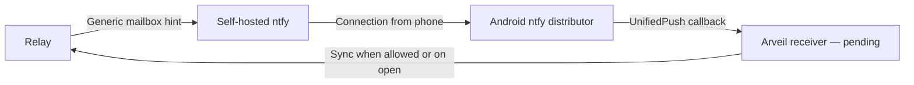

# Opening attachments and receiving notifications

**Source increment, September 30, 2026; not yet a published client release.**
Tracked in [issue 140](https://github.com/Ulzuhan/arveil/issues/140).
Android notification direction: self-hosted delivery without Google/FCM.

*Versión en español: [es/CLIENT_FILES_NOTIFICATIONS.md](es/CLIENT_FILES_NOTIFICATIONS.md)*

## Open a file from the conversation

Choose **Download and open** on an incoming attachment, or **Open** on a file
already available locally. PNG, JPEG and WebP images open inside Arveil with
zoom. Opening an already available file works offline. **Save copy…** remains a
separate export action; previewing does not add a file to Downloads or Photos.

The viewer gets authenticated bytes from Rust's existing `exportAttachment`
API, which checks availability, decryption and integrity. Despite its name,
that API returns bytes and does not write an exported file. The image decoder
uses content signatures, owns and disposes its image, and avoids Flutter's shared
image cache. Encoded size stays under the attachment limit; decoded source
dimensions are limited to 16,384 per side and 64 million pixels, with the display
image scaled to at most 4,096 per side and 4 million pixels. Only the first frame
is displayed. HTML/SVG are not rendered as web content.

PDF and other formats currently use **Open with…**, following an explicit
confirmation that another application receives decrypted bytes. Android uses a
`FileProvider` scoped to `cache/attachment-open`, a content URI and temporary
read permission. macOS opens a private temporary file through `NSWorkspace`.
Each opening gets its own random directory. Copies expire after one hour, with
cleanup every 30 seconds while running and on the next launch after expiry.
Android revokes URI grants during cleanup; Mac directories/files use 0700/0600
and are excluded from backup. External applications can retain their own copies;
cleanup cannot erase those copies or promise secure deletion.

An internal PDF renderer remains a separate increment. It must be reviewed for
plaintext staging, resource limits and renderer isolation before adoption.

## macOS notifications and background operation

**Settings → Notifications** offers two independent, off-by-default options:

- **Show notifications on this Mac** requests the system's alert/sound permission.
  Notices are generic; no name, message text, filename or conversation identifier
  is passed to the operating system.
- **Keep Arveil running in the background** keeps the profile unlocked and syncs
  every ten seconds. Closing the window hides it; the menu-bar item can reopen
  Arveil or quit it. Closing the profile removes the background menu and notices.

The same Rust profile and conversation coordinator own synchronization and read
state. Window focus, route visibility and sync eligibility are separate: hidden
activity is not marked read. New unread activity in the visible conversation is
silent; own activity, unchanged snapshots and the initial history snapshot are
also silent. Several new conversations in one snapshot produce one generic
notice. A tap selects a known conversation; a token no longer known opens the inbox.

Presentation receipts are SHA-256 hashes of a group/cursor pair, bounded to 512
entries in the nonsynchronizing login Keychain. They contain no previews or
read markers. A receipt is saved before presenting, so a crash in that interval
can miss a banner; it cannot change unread messages. The mapping from notice
tokens to conversations exists only in memory.

Explicit Quit, a closed profile or a sleeping Mac stops this local delivery.
macOS Focus/notification settings can silence it. Opening/waking catches up
through normal sync. This does not provide delivery into a terminated process
or use APNs. Packaged-app permission, menu/window behavior, click handling and
sleep/wake delivery still require interactive acceptance before a release promise.

## Android: self-hosted experiment



The Mac mini can host ntfy beside the relay. The phone still needs a receiver:
the first experiment uses the ntfy Android distributor as a second application.
**Arveil's Android connector and notification UI are not implemented in this
increment. Installing ntfy alone does not enable Arveil notifications.**

ntfy documents that self-hosted subscriptions avoid Firebase and its F-Droid
flavor omits Firebase entirely: [Android/UnifiedPush documentation](https://docs.ntfy.sh/subscribe/phone/).
The deployment needs a stable HTTPS address reachable from mobile data, no
Firebase key or upstream relay, and the publisher/subscriber permissions in
[ntfy's UnifiedPush configuration](https://docs.ntfy.sh/config/#example-unifiedpush).
Do not expose the acceptance test's anonymous loopback configuration publicly.
Endpoints are capabilities: keep them out of logs and protect subscriber access.
Self-hosting still reveals endpoint/IP/timing metadata to the host and any TLS proxy.

The relay already accepts a device's hint URL and sends only `arveil-hint/v1`
when its mailbox becomes nonempty. The reproducible experiment is:

```sh
cd core && cargo build -p arveil-cli
cd ..
python3 scripts/test_ntfy_hints.py --ntfy /path/to/server-capable/ntfy
# Or forward a disposable remote ntfy instance to a local port:
python3 scripts/test_ntfy_hints.py --ntfy-url http://127.0.0.1:2586
```

The first form creates its own ntfy configuration and also tests restart/outage.
The second does not stop or reconfigure the supplied server. Both build a fresh
loopback relay, use synthetic profiles and a random topic, check the fixed marker,
coalescing, acknowledgement and unregistration, then remove local test data.
Failure diagnostics remain private in ignored `.local/ntfy-acceptance`.
The official Darwin ntfy archive is client-only; its source has a
`make cli-darwin-server` target for this experiment. Verified with ntfy v2.28.0.

### Remaining reliability and integration work

- Hints are currently best effort: one attempt, five seconds, no retry. A missed
  hint does not trigger again while mail stays pending; normal sync recovers it.
  HTTP error responses also currently count as sent. A retry/coalescing policy
  would change the timing policy in [Phase 3](PHASE3.md) and needs an explicit design.
- Before accepting general delivery endpoints, constrain destinations, resolved
  addresses and redirects, with intentional operator exceptions; bound delivery
  concurrency. Scheme validation alone is not an outbound network policy.
- Implement endpoint registration/rotation/removal, Android notification permission,
  locked-profile handling and a generic hint notice. Hints are not verified messages;
  they must not cause a second profile executor or claim a sender/message count.
- Test screen-off/Doze, battery saver, Wi-Fi/mobile switching, restart, process death,
  Recents swipe and force-stop/reopen on a physical phone. Measure delay and battery.
  A server cannot bypass [Android's background limits](https://developer.android.com/training/monitoring-device-state/doze-standby).
- An embedded receiver could later remove the second app, but needs a legitimate
  service lifecycle. A `dataSync` service cannot be assumed to run indefinitely;
  see [Android foreground service limits](https://developer.android.com/develop/background-work/services/fgs/timeout).

## Evidence and limits

The implementation passes Flutter analysis and 293 unit/widget tests, including
preview bounds, external-sharing confirmation, failed verification, notification
deduplication, permission denial and hidden read-marker protection. Debug builds
passed on macOS and Android. Disposable native macOS acceptance checks encrypted
transfer/reopen, offline sent/received image preview, cancellation, duplicate
filenames and the explicit export boundary.

The local ntfy v2.28.0 run passed marker/coalescing/unregistration, restart and
missed-hint catch-up. A disposable Linux ARM64 ntfy on the Mac mini also passed
marker/coalescing/unregistration over an authenticated loopback SSH forward;
its service and data were removed afterwards. Neither run used Firebase or an
upstream provider. The remote run did not test its server's restart/outage.

The ntfy experiment checks the transport separately from the phone. OS banner
delivery, native external-app handoff/cleanup and physical Android behavior remain
interactive release gates. Contact testing is deferred to the next iteration.
