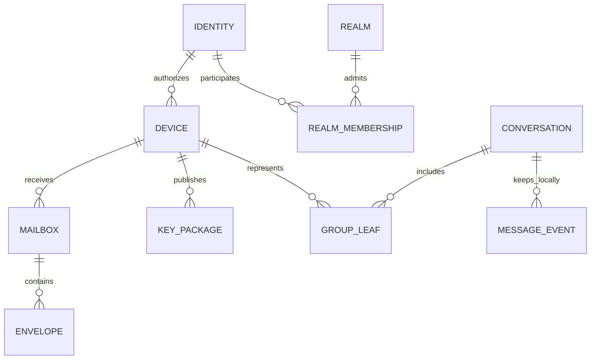

# Domain model

**Status:** proposal v0.4. Types are conceptual, not a frozen SQL schema or ABI. [Protocol](PROTOCOL.md) · [Architecture](ARCHITECTURE.md).

*Versión en español: [es/DOMAIN_MODEL.md](es/DOMAIN_MODEL.md)*

## 1. Vocabulary and ownership

| Entity | Identifier and essential data | Authority / location |
|---|---|---|
| Identity | `identity_id = hash(domain, version, root_public_key)`; public root | Root generated by the person; secret on client/kit |
| Device | Random ID, separate public keys, state | Identity authorizes; client keeps secrets |
| DeviceCredential | Root, device ID, keys, usage, validity, root signature | Client verification; public copy in the directory |
| DeviceManifest | Root, version, previous hash, active/revoked credentials, signature | Root; known maximums on each client |
| Realm | ID bound to the signing key; current Noise key; operational policy | Operator; does not authenticate people |
| RealmEndpointList | Sequence, realm Noise key, endpoints with type, priority and expiry, realm signature | Operator publishes; each client keeps its known maximum |
| RealmMembership | Realm, identity, role, state and quota | Server authorizes resource usage |
| Invite | Hash of a random token, expiry, remaining uses, permitted role | Realm, atomic consumption |
| KeyPackageRecord | MLS reference, standard bytes, device, expiry, state | Client generates/signs; relay distributes |
| Mailbox | Random ID, owning device, limits and generation | Recipient manages; server knows the owner |
| DeliveryCapability | Random secret, mailbox, scope, expiry and generation | Recipient shares; server verifies the hash |
| Envelope | Mailbox, random ID local to that delivery, ciphertext, expiration | Relay stores bytes; client interprets |
| Blob | Random ID, ciphertext, stored size, state and TTL | Client encrypts; relay retains temporarily |
| Conversation | Local/app ID, MLS group, title, policy, roster of people/devices | Clients and E2EE messages only |
| GroupState | MLS ID, epoch, transcript/context, own leaf and active secrets | MLS library in encrypted storage |
| MessageEvent | Random ID, author device, type, body, references | Client; validated against MLS authentication |
| RouteBundle | Device ID, relay by signing key, mailbox, capability, outer key, version, signature | Published by the recipient inside an authenticated exchange; no URLs, which come from the `RealmEndpointList` |
| RecoveryKit | Encrypted private root, minimal recovery metadata | User custody; distinct from the server backup |
| HistoryArchive | Exported records and optional attachments, version and manifest | Encrypted archive; no active MLS states |

Identity hashes have domain separation and an exact versioned representation. Do not use ambiguous concatenations or usernames as security keys. IDs and capabilities use a CSPRNG; proposal: 256 bits for capabilities and 128 bits or more for non-secret IDs. Knowing an ID does not grant access.

## 2. Relationships



The diagram combines local and server entities. `CONVERSATION`, `GROUP_LEAF` and `MESSAGE_EVENT` are not realm tables. The same person can belong to several realms with the same identity; that eases continuity and allows correlation across them. Using different identities is allowed if the user wants to separate contexts; they are not merged automatically.

## 3. Key lifecycle

| Material | Usage and residence | Rotation / loss |
|---|---|---|
| Ed25519 root | Signs credentials and manifests; stored encrypted, explicit unlock | Compromise requires a new root and re-verification; without it there is no strong continuity |
| Per-device MLS signing key | Leaf and MLS messages; core only | A new device gets a new key; it is not cloned |
| Device static Noise key (X25519) | Initiator of the channel with the realm; proof of possession is the handshake | Rotatable through a new credential signed by the root; separate from MLS signing, outer HPKE and root |
| Outer HPKE receiving key | Hide wrapping/headers per device | Rotate and keep the previous one only during a bounded queue window |
| Epoch and message secrets | MLS encryption/decryption | The library evolves and deletes them according to policy; do not export to recover history |
| Local data key | Encrypt DB, indexes and persisted secrets | Wrapped through the OS store; transactional migration on rotation |
| FileKey | One random key per file | Distributed inside MLS; do not reuse across files |
| Kit secret / archive secret | Open root recovery / history | High entropy, separate; losing them prevents opening each copy |
| Realm signing key (Ed25519) | Service identity; signs endpoint lists and the Noise key | Rotating it requires a new bootstrap of clients; does not change users' roots |
| Realm static Noise key (X25519) | Responder of the channel | Rotated by publishing a new list; the previous one is accepted during a bounded window |
| Endpoint TLS certificate | Traverse proxies and middleboxes | Optional; WebPKI or self-signed; does not take part in protocol security |
| Capabilities | Limited access to mailbox/blob | Revocable secret per scope; stored as a hash where verifiable |

A device credential binds all its public keys with their usages, the device ID and the identity. Do not reuse the bytes of an Ed25519 key as an X25519 encryption key for convenience. The profile of suites and encodings is fixed in [PROTOCOL](PROTOCOL.md).

## 4. Logical server schema

Proposed tables: `realm_memberships`, `invites`, `device_credentials`, `device_manifests`, `key_packages`, `mailboxes`, `capabilities`, `envelopes`, `blobs`, `push_subscriptions`, `endpoint_lists`, `schema_migrations`. There is no sessions table: the session is the in-memory Noise channel, and authorization is resolved against `device_credentials` upon completing the handshake. No table contains conversations.

Essential constraints:

- `envelopes` is unique per `(mailbox_id, delivery_id)`, with a body hash to detect a conflicting retry. Never use a common message ID for all recipients.
- ACK operates on concrete IDs and mailbox membership; it does not indiscriminately delete everything prior to a client cursor.
- An invitation token has its consumption and membership creation in one transaction.
- KeyPackages move `available → consumed` atomically when claimed. A lost response may waste a package; it does not put it back into circulation. A malicious relay can still replay it and clients must detect that wherever they hold state.
- `mailboxes.owner_device_id` and quota are visible data: opacity of the ID does not mean anonymity of the owner.
- Read, write and admin capabilities have independent scopes. Hashes of high-entropy random secrets, constant-time comparison, expiry and revocation.
- An envelope is confirmed to the sender only after durable commit. The body is not modified after acceptance.
- Complete blobs are immutable; `staging → committed → expired → deleted`. GC ignores active uploads and coordinates with snapshots.
- No message bodies, original file names, recovery keys, MLS secrets or local keys.

The server may keep minimal operational metadata, but it is never trusted for content authenticity. A compromised realm can forge consumption states, expiry and ACKs.

## 5. Local state and atomicity

The encrypted database contains contacts and their verified fingerprints, manifest maximums, MLS groups, policy, roster, events, per-recipient outbox, inbox/deduplication, routes and local archive. It must cover the MLS provider's storage, WAL, search indexes and temporary files.

**Send unit:** subsequent MLS state + local event + produced MLS bytes + persisted delivery attempts. If outer encryption happens afterwards, it starts from those same persisted bytes; the MLS send is never re-executed from a previous snapshot.

**Receive unit:** processed-delivery mark + MLS change + event/receipt + pending work. The transport ACK is emitted after the commit. Events from a future epoch can be persisted as pending before ACK, but not shown as authenticated until they can be validated.

Do not rely on two databases or two autonomous connections committing "almost at the same time". The feasibility proof must choose a provider with a shared transaction or design and review a durable journal with equivalent recovery.

Control commits have their own persistent state: `prepared → selected → merged → welcome_released`, with a single selection record per parent epoch in the coordinator profile. Do not confuse it with the application message outbox. See [preparation and acceptance](PROTOCOL.md#changes-ordering-and-partitions). The local database must meet the [durability requirements](adr/ADR-004-sqlite-single-binary.md#verified-durability-requirements).

## 6. States and transitions

### Local delivery, per recipient

```text
draft → queued_local → sealed_durable → relay_accepted → device_received
                        │                  │                 └→ read (optional)
                        ├→ retry_wait      └→ expired_or_unknown
                        └→ failed_action_required
```

`relay_accepted` comes from the server and may be false if it is malicious. `device_received` requires an E2EE receipt from that device. `read` only occurs if receipts are enabled and never proves human attention. A group's aggregate shows pending/partial; it does not turn one device's ACK into receipt by all. A removed device stops being counted for future messages, without rewriting the evidence of earlier ones.

Drafts can be edited freely; an already sealed event is immutable. Editing a sent message, if added after V1, will be another E2EE event with explicit authorization and reference.

### Device

```text
created_local → root_authorized → realm_registered → group_joined
                       └→ revoked                  └→ removed_from_group
```

These are related axes, not a single global state: a device can be registered and belong to no group, or be removed from the realm but keep old messages. `revoked` is terminal for that credential; recovery generates a new ID and keys.

### Group

```text
creating → active → awaiting_commit → active
              ├→ needs_resync → fresh_rejoin
              └→ fork_suspected → paused → verified_new_group
```

MLS secret forks are not merged with "last write wins" rules. Old history can remain readable while sending to the affected group is suspended.

## 7. Domain invariants

1. Identity does not depend on the name, hostname or membership on the server.
2. A valid signature attests who authorized bytes; it does not imply freshness or authorization of any action.
3. Each leaf is bound to an authorized device; one person can occupy several leaves.
4. The server does not add devices to a group by modifying its directory.
5. Clients do not roll back known versions or resurrect MLS states from backups.
6. Recovering identity, recovering history and rejoining groups are separate operations.
7. A local deletion or a TTL does not promise remote deletion of copies.
8. The UI derives its states from local facts, relay acceptance and authenticated receipts separately.

References and review scope: [README](README.md#references-and-traceability).
