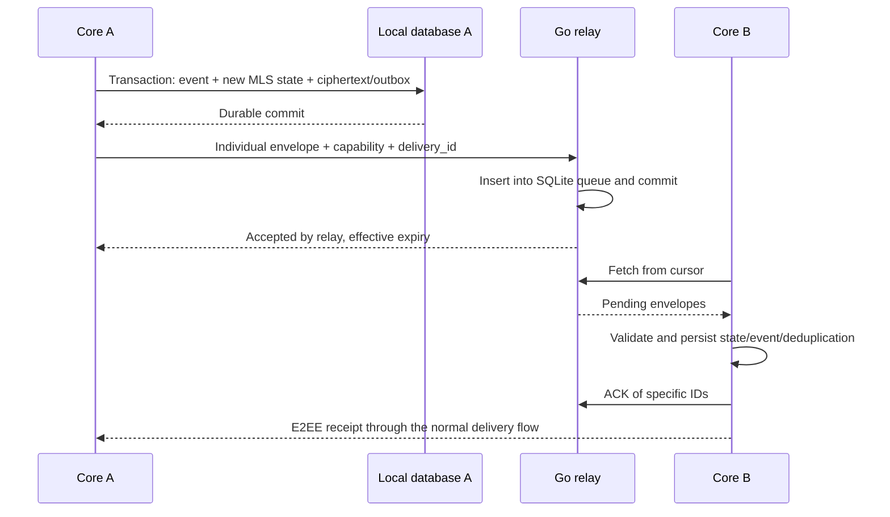

# Application protocol and flows

**Status:** design draft v0.4. It does not constitute a protocol ready for interoperability or production. [Domain model](DOMAIN_MODEL.md) · [Threat model](THREAT_MODEL.md) · [ADR-008](adr/ADR-008-carrier-independent-transport.md).

*Versión en español: [es/PROTOCOL.md](es/PROTOCOL.md)*

## 1. Layers and responsibilities

```text
Application event
  → MLS (conversation/group, device authentication)
  → independent HPKE envelope for each receiving device
  → versioned CBOR frame inside the device↔realm Noise channel
  → WebSocket over the available carrier: LAN, tailnet, tunnel, Internet
  → optional TLS with WebPKI validation; adds no security to the protocol
```

The Noise channel mutually authenticates device and realm and protects frames, identifiers and API credentials against any intermediary on the carrier, including tunnels and CDNs that terminate TLS. MLS protects content and cryptographic membership. The outer HPKE hides MLS headers and bytes common to all recipients from the relay; by itself it neither authenticates the sender nor provides anonymity. The identity protocol authenticates the keys consumed by MLS, the outer keys and the static Noise key of each device. TLS only helps traverse proxies and middleboxes; no security requirement depends on where it terminates. Channel profile in [ADR-008](adr/ADR-008-carrier-independent-transport.md#technical-profile-of-the-channel).

MLS uses the encoding defined by the standard. Our own signed objects will use a strict deterministic CBOR profile: defined keys, types, limits, integers and byte representation, with no duplicate keys. Signature over protocol context + version + canonical bytes. Parsers reject alternative representations; do not sign reserialized JSON or assume that any Protobuf is canonical.

Candidate cryptographic profile: MLS `MLS_128_DHKEMX25519_AES128GCM_SHA256_Ed25519`, the mandatory suite of MLS 1.0 and declared by OpenMLS ([RFC 9420, section 17.1](https://www.rfc-editor.org/rfc/rfc9420#section-17.1)); Ed25519 identity; HPKE X25519/HKDF-SHA256/AES-128-GCM through an RFC 9180-compatible library. No custom primitives or variants are implemented. The exact selection must be validated with test vectors, dependencies and review before freezing v1. No post-quantum security is claimed.

## 2. Versioning and objects

All framing carries `protocol_version`; required capabilities are authenticated inside signed or E2EE objects. An unknown major version or a missing mandatory capability returns incompatibility. There is no negotiation down to plaintext. Maximum lengths are established before allocating memory or interpreting CBOR/MLS.

```text
DeviceCredential {
  version, identity_root_public_key, device_id,
  mls_signature_public_key, transport_noise_public_key,
  envelope_hpke_public_key, validity, allowed_uses,
  root_signature
}

RealmEndpointList {               # signed by the realm signing key
  version, realm_id, sequence, realm_noise_public_key,
  previous_noise_public_key_valid_until,
  endpoints[{ kind: lan | tailnet | public | admin,
              url, priority, valid_until }],
  realm_signature
}

DeviceManifest {
  version, identity_id, manifest_sequence, previous_manifest_hash,
  active_credential_hashes, revoked_credential_hashes,
  root_signature
}

DeliveryRequest {                 # visible to the relay
  protocol_version, mailbox_id, delivery_id,
  requested_expiry, hpke_enc, ciphertext
}

InnerPayload {                    # inside HPKE
  version, kind, payload_bytes, padding
}

ApplicationEvent {                # inside MLS
  version, event_id, conversation_id,
  event_kind, author_device_id, client_created_at,
  body, optional_references
}
```

`hpke_enc` is the encapsulation output of the library, not a private key. `transport_noise_public_key` is a static X25519 key of its own, not derived from the signing key. The write capability travels as a frame field inside the Noise channel, never in URLs, HTTP headers, cookies or logs. The HPKE context binds version, realm, mailbox and delivery ID as authenticated information; the exact encoding profile must be fixed. Once the envelope is prepared, the authenticated fields are not modified on a retry. The server may apply a shorter effective expiry and declare it in its response.

`kind` may indicate MLS, device linking or history transfer, but it is not exposed in the outer framing. The identity declared in an event MUST match the leaf authenticated by MLS; `author_device_id` is not trusted on its own. `client_created_at` is informational: it proves neither ordering nor prevents replay.

Text, group title, roster, file descriptors and receipts stay inside the E2EE protection. Event IDs are used for local deduplication; they are not copied into the outer ID shared by all recipients.

## 3. Realm bootstrap and identity

1. The operator initializes the realm signing key, its static Noise key and an independent administrative credential. It publishes an initial `RealmEndpointList`. It creates a single-use invitation with an expiry and a minimal role.
2. The QR embeds the version, the hash of the realm signing key, the initial `RealmEndpointList` or its hash, a bootstrap endpoint and the invitation secret. It is delivered over a trusted channel; a signature from the same server does not make a substituted QR trustworthy.
3. The client opens a Noise channel against the bootstrap endpoint. The handshake only succeeds if the realm's static key matches the one certified by the signing key whose hash the QR carries. During bootstrap the device uses a freshly generated Noise key that will later be included in its credential. TLS, if present, is validated with ordinary WebPKI and does not replace this step.
4. The client creates a local root key and identity or uses an existing one. It generates new device keys and signs its credential/device manifest by unlocking the root key.
5. It consumes the invitation and registers the public materials. Proof of possession of the Noise key is the handshake itself; proof for the other keys is provided by signature inside the frame. Consumed token and new membership are confirmed atomically.
6. It stores the realm, its signing key and the endpoint list; prepares the identity kit and publishes KeyPackages/routes according to permissions. Membership does not yet verify any contact.

The transport session coincides with the lifetime of the Noise channel: there are no reusable session tokens. The realm authorizes the connection by associating the initiator's static key with an active credential of a member; a revoked credential closes the channel. A generic signature over server-controlled bytes with the personal root key is never used.

**Implemented session states (M0.3).** The relay classifies a channel by the initiator's Noise static key: unknown keys open a *provisional* session that may only send `invite_redeem`, `endpoint_list_get` and `ping`; a key bound to an active credential opens a *member* session; a revoked or expired credential is refused before message 2. `invite_redeem` carries the invite token, the signed credential and the first manifest (sequence 1, listing that credential); the relay verifies the root signature, checks that the credential's `transport_noise_public_key` equals the session's static key, and consumes the invite, creates the membership and stores credential and manifest in one transaction.

**Implemented delivery (M0.4).** `mailbox_create` returns a random 16-byte mailbox id with a 32-byte read capability and a 32-byte write capability; the relay stores only SHA-256 hashes of capabilities. `envelope_put` carries mailbox id, write capability, delivery id (1–32 bytes, chosen by the sender), requested expiry, `hpke_enc` and ciphertext; a retry with identical bytes is idempotent, a different body under the same delivery id is a conflict (409), envelopes above 256 KiB plus overhead are refused (413) and a mailbox holds at most 1 000 queued envelopes (429). `envelope_fetch` pages by an opaque increasing sequence; `envelope_ack` deletes named envelopes. The outer envelope is HPKE base mode with `info = "arveil/envelope/v1"` and AAD `{version, realm_id, mailbox_id, delivery_id}` in deterministic CBOR; the inner payload is padded to buckets of 256 B, 1 KiB, 4 KiB, 16 KiB, 64 KiB and 256 KiB.

**Implemented attachments (M1.5).** `blob_upload_begin { size }` returns a random 16-byte blob id and a 32-byte read capability; `blob_chunk` appends contiguous chunks of at most 60 KiB to a staging file; `blob_commit { ciphertext_hash, requested_expiry }` verifies size and SHA-256, fsyncs, renames into place and marks the row committed (default TTL 30 days, per-member quota 200 MiB, files up to 25 MiB); `blob_fetch` reads ranges with the capability and answers 410 once expired. A reconciler removes files without a committed row. The client encrypts the whole file with AES-256-GCM under a random FileKey and nonce with `aad = "arveil/file/v1"`, and sends `FileDescriptor { version, blob_id, read_capability, file_key, nonce, ciphertext_hash, size, name, mime }` as a `file` event inside MLS. Receivers verify the hash and the AEAD tag before writing under a sanitized base name.

### Endpoints and carriers

**Implemented formats (M0.2).** The signed list travels as `SignedObject { context: tstr, body: bstr, signature: bstr(64) }` where `signature = Ed25519(u16be(len(context)) || context || body)`, `context = "arveil/endpoint-list/v1"` and `body` is the deterministic CBOR encoding of `RealmEndpointList` (fields `version`, `realm_id`, `sequence`, `realm_noise_public_key`, `endpoints[{kind, url, priority}]`). `realm_id = SHA-256("arveil/realm-id/v1" || realm signing public key)`. The Phase 0 bootstrap string, precursor of the QR, is `arveil-bootstrap:v0:<realm_id>:<signing_pub>:<noise_pub>:<url>` in hex. Frames are `{ id, payload }` in CBOR with the payload externally tagged by variant name; fragments carry a one-byte flag header (bit 0 = last) inside Noise messages of at most 65 535 bytes.

A realm is reachable through several access paths at once. The client keeps the `RealmEndpointList` with the highest known `sequence`, rejects rollbacks and invalid signatures, and requests the current list when opening any channel. It orders the endpoints by `priority`, normally LAN, then tailnet, then public, and switches from one to another when the connection or the handshake fails; a wrong or hostile endpoint compromises nothing, because it only produces a failed handshake. Administrative frames are accepted only on endpoints of kind `admin`.

The carrier is not part of the contract: direct LAN, a Tailscale tailnet, port forwarding, Tailscale Funnel, Cloudflare Tunnel or a VPS with TCP passthrough carry the same frames. An intermediary that terminates TLS observes IP, timing, sizes and number of connections; it does not observe frames, identifiers or credentials. The comparison by carrier is in [ADR-008](adr/ADR-008-carrier-independent-transport.md#what-each-intermediary-sees-with-this-design). With several independent relays, each relay has its own list; see [ADR-007](adr/ADR-007-optional-realm-redundancy.md).

## 4. Contact verification and routes

The first contact exchanges root key/fingerprint via QR or a trusted external channel. A contact obtained only from the directory remains "unverified". Changing the root key requires a warning and re-verification; keeping the same name does not preserve trust.

The client verifies the root credential, the current device manifest against its known maximum, proof of possession, validity and key bindings. A lower sequence is rejected; two different manifests with the same sequence constitute a conflict. A signed chain does not guarantee that it is the latest if a server hides updates. Clients share known hashes/maximums over authenticated channels to detect inconsistencies, without promising detection under total isolation.

A `RouteBundle` signed by the device binds its HPKE key, the destination realm or relay identified by its signing key, mailbox, capability and generation. It does not include URLs: the sender obtains them from that relay's `RealmEndpointList`. It is exchanged over a verified or E2EE channel; there is no public address book by default. Distributing a capability authorizes transport, not admission into conversations. V1 additionally requires that deliveries be published over the Noise channel of a member device of the relay: this simplifies quotas and makes the requester's identity visible to the relay. An anonymous delivery profile will require another ADR.

## 5. MLS groups, KeyPackages and authorization

Each device generates its own standard KeyPackages and keeps the corresponding private material in encrypted storage. They are published in a bounded batch and claimed once through an atomic relay operation. On timeout another package is used; a doubtful one is not reused. A malicious server can replay or exhaust packages: the library, the local state and the limits must handle this without trusting the relay's `consumed` flag.

Identity is carried in an MLS credential with an explicit binding to the device credential. The client checks that the KeyPackage signing key and the leaf match the root authorization. Using a `BasicCredential` with an arbitrary name does not satisfy that validation. The exact binding format is a deliverable of the spike.

### Creation and enrollment

1. The creator verifies initial identities and devices, obtains KeyPackages and creates the group with a random ID and an authenticated policy.
2. The creating device is designated commit coordinator in the group's authenticated context. Initial policy: enrollments/removals and changes require its approval; silent enrollment through the directory is not allowed.
3. It prepares Add/Commit and Welcome through the library, without activating the new state yet. It resolves and persists acceptance according to the procedure below. Only then does it release the Welcome; it distributes each piece inside individual HPKE envelopes.
4. The receiver validates the identity of the inviter and the members, credentials, policy and MLS material before accepting. The roster is presented to the user.
5. Routes are distributed inside authenticated group events. A new device does not decrypt messages from earlier epochs just by joining; history is a separate flow.

The policy and the identity of the coordinator must be bound to the authenticated MLS state, for example through a mandatory GroupContext extension supported and validated by all clients. The library API must allow inspecting a commit and its effects before making it durable. If it does not allow enforcing that policy safely, adoption is blocked and the design is revisited; we do not pretend that MLS enforces it automatically.

### Changes, ordering and partitions

The prototype profile allows a single coordinator per group to serialize commits; its suitability for V1 still has to be validated. The rest send authenticated proposals/requests. A member's own update operations are handled through the appropriate MLS operations and the coordinator; it is not accepted that any member produces arbitrary commits.

**Implemented committer rule (M2.4).** The fixed coordinator is replaced by a deterministic successor, resolving [v0.3 review §3.1](REVIEW-v0.3.md#31-single-commit-coordinator). The `GroupPolicy` GroupContext extension (type `0xF000`, version 2) carries the creator's leaf for the record; the rule every member applies is that the authorized committer is the **lowest leaf that is not known to be revoked**. A device may displace the leaves below it only by removing them in the same commit, and only when each of them was revoked by a manifest that member verified under that identity's own root. There is no election and no relay sequencing: losing the group's creator no longer means recreating the group. A member that has not yet seen the revoking manifest refuses the successor's commit and retries after its next manifest refresh, rather than trusting the commit's own claim.

**Preparation and acceptance:** generating a Commit is not the same as accepting it, nor does it authorize sending its Welcome. Persist the pending candidate, select the canonical commit per epoch and merge afterwards; release the Welcome only once acceptance is established. This is distinct from advancing the ratchet when encrypting application messages. [RFC 9420, section 14](https://www.rfc-editor.org/rfc/rfc9420#section-14).

In our prototype, the coordinator keeps a durable and irrevocable selection per `(group_id, parent_epoch)` under local exclusion and without clones of its state. Preparing a candidate, recording the selection and activating the state are recoverable steps; a crash resumes that same selection. Relay acceptance only certifies storage, not MLS validity. If unique selection cannot be demonstrated or a conflict appears, it pauses; another branch is not chosen after its keys have been used. The specific atomicity depends on the provider and must be tested.

A bounded local log of authenticated commits and checkpoints is kept for offline devices. The server does not identify them as group control. Application messages are ordered by MLS state and local reception sequence; no global total ordering of messages or Matrix-style state resolution is offered.

A repeated valid commit is deduplicated. A message from a future epoch is held pending in a bounded way until the missing commits are obtained. If they are definitively missing, a rejoin with new keys is required; never skip epochs by inventing state. Messages from old epochs are only accepted within the explicit window of retained secrets and according to the revocation policy.

Two incompatible commits for the same parent trigger `fork_suspected`: stop sending, preserve evidence and verify with participants. The coordinator cannot undo a commit already used to send messages by rolling back locally. Loss of the coordinator still allows sending application messages in a valid state, but blocks membership changes; recovery in the initial profile consists of creating a new group with re-verified participants and keeping the previous one as an archive. There is no automatic election. This limitation must be visible in the UI.

**Removal of the coordinator:** MLS requires that a remaining member remove whoever leaves. Since the profile restricts who can make commits, it does not resolve the removal of the coordinator itself within the same group. The conservative decision for the prototype is to create a new group without that device, re-verify participants and archive the previous one; a revoked coordinator never authorizes its own recovery. A cooperative role handover requires separate design and testing. [RFC 9750, section 6.1](https://www.rfc-editor.org/rfc/rfc9750#section-6.1).

**Rejoin:** V1 does not accept external commits or automatic rejoins using only GroupInfo delivered by the relay. Authorized Add/Welcome or a new verified group is used. The RFC warns of the risk of recovering against stale server state; that operation could reintroduce compromised members. [RFC 9750, section 5.3](https://www.rfc-editor.org/rfc/rfc9750#section-5.3).

## 6. Durable delivery and retries



The fan-out includes the sender's other devices, in addition to the devices of the other members. The sending device keeps its own event from the send transaction; it does not attempt to decrypt its own MLS message as if it were another receiver. The routes and roster used belong to the known authenticated state, and a missing route remains as a visible pending delivery.

The transport semantics are **at least once**. The visible result must be idempotent thanks to persistence and deduplication. Distributed exactly-once is not promised.

- A retry of `(mailbox_id, delivery_id)` with the same bytes returns the existing acceptance; with a different body it yields a conflict.
- Network retries reuse the persisted envelope. If re-encryption for a new epoch is needed after an explicit recovery, a new event is created that references the previous one and keeps the possibly uncertain outcome visible.
- The mailbox ACK only means that the receiver took durable custody. A future envelope may be persisted as pending, without a displayed message. The UI does not equate it with reading.
- The realm sends a `mailbox_wakeup` frame over the channel to announce availability; fetch and a durable cursor allow recovering lost notices. A cursor is not a proof of group ordering.
- Content deleted by the user is not resent without an explicit policy. TTL and a missing ACK leave an expired/unknown state, not "delivered".

### Channel frame catalog

All operations are CBOR frames with a `frame_id` inside the Noise channel; the realm responds with a correlated result frame. There are no HTTP routes: the only URL is that of each endpoint's WebSocket. Noise messages have a maximum of 65,535 bytes; larger frames, such as envelopes and blob chunks, are fragmented with a bounded reassembly limit.

| Frame | Authorization | Result/invariant |
|---|---|---|
| `invite_redeem` | Invitation + possession signatures | Single consumption and atomic enrollment |
| `endpoint_list_get` | Established channel | Current signed list; the client validates sequence and signature |
| `device_credential_put` | Channel + root signature | Never replaces another root key nor resurrects a removed credential |
| `manifest_put` | Channel + root signature | Increasing sequence on an honest server; final validation on the client |
| `key_packages_publish` | Device channel | Bounded batch associated with that device |
| `key_packages_claim` | Authorized member | Atomic consumption; a package does not yet equal a trusted identity |
| `mailbox_create` | Device channel | Mailbox and separate capabilities |
| `envelope_put` | Channel + write capability | Durable commit, idempotency and quota |
| `envelope_fetch` | Owner + read capability | Bounded page, opaque cursor |
| `envelope_ack` | Owner + read capability | Idempotent ACK over specific IDs |
| `blob_upload_begin` / `blob_chunk` / `blob_commit` | Channel + quota | Fragmented staging upload with limits and explicit confirmation |
| `blob_fetch` | Blob read capability | Encrypted bytes of the complete object, fragmented |
| `mailbox_wakeup` (server → client) | Receiver's channel | Activity notice, not a source of truth |
| `admin_*` | `admin` endpoint + administrative credential | Rejected on any other endpoint |

Still to be frozen: the rotation/revocation frames, complete manifests and orderly channel shutdown. Their obligations are described, not an implemented API. Expected errors: unsupported version, unauthorized, idempotency conflict, quota, expiry and retry due to saturation; without including capabilities or ciphertext in the error text.

## 7. Attachments

The client generates a random FileKey per file. V1 proposes AEAD encryption of the whole file through a reviewed library and a 25 MiB limit; cryptographic chunking/resume is deferred. Nonces are not improvised per chunk index. If a streaming format is adopted, it will require separate specification and review.

After encrypting, it uploads the bytes to staging; the server confirms the object only when its length and persistence are consistent. An atomic rename and the DB transition need durable ordering and orphan reconciliation after a crash: there is no automatic transaction between SQLite and the filesystem.

The E2EE descriptor contains the format version, suite, blob ID, read capability, FileKey, required nonce/parameters, hash of the ciphertext, sizes, original name and MIME type. The receiver verifies limits, hash and authentication before opening or generating previews; a hash without MAC/AEAD is not sufficient. It never auto-executes downloaded content.

The relay may learn the encrypted size and access times. There is no deduplication by plaintext hash. An expired blob is not recovered from the message; only from a client or archive that retains it.

## 8. Adding, removing and recovering devices

### Enrollment with a surviving device

The new device generates its keys and shows a linking QR with ephemeral material, nonce and expiry. The administration device scans it and verifies the transcript; it establishes an authenticated channel through an existing, reviewed protocol. The specific choice of protocol remains open and blocks the implementation of production pairing.

The user unlocks the root key to sign the new credential and the next device manifest, without transmitting the root key to the new device. The public keys are registered. Each group accepts an explicit Add; the new device receives keys for new epochs, not a clone of the previous device's state. An ordinary device without the root key can transfer history to an already authorized device, but cannot sign its enrollment.

**Implemented linking (M2.1, M2.2).** Until the pairing protocol of Phase 3 exists, the transcript is replaced by two strings the user copies over a channel they already trust. `device request` prints `arveil-link-request:v0:<device id>:<mls key>:<noise key>:<hpke key>` and keeps every private half on the new device. `device authorize`, on the device holding the root, signs a credential for exactly those keys and manifest N+1 listing it active, publishes both to the realm and prints `arveil-link-grant:v0:<hex CBOR {credential, manifest, root_public}>`; no private material travels. `device link` accepts the grant only if the credential names its own keys, verifies under the grant's root, and the manifest lists it active. The realm registers a credential only when the newest manifest it holds already lists it, and logs the enrollment, so a new device is never silent.

Routes carry the device: `arveil-route:v1:<identity id>:<device id>:<credential hash>:<root key>:<mailbox>:<write capability>:<hpke key>`, and the identity id must derive from the root key in the route. One MLS leaf, one mailbox and one route per device; a message fans out to every device of every member, one's own included.

### Removal

1. The root key signs a new device manifest that revokes the credential.
2. It is published to contacts and groups over authenticated routes; sessions are closed and affected mailboxes/capabilities are invalidated on an honest server.
3. Each group processes a Remove of all affected leaves and a valid commit. Whoever knows about the revocation pauses sending until then.
4. Shared routes/capabilities that the device may have known are rotated. This limits transport abuse; it does not erase secrets already copied.

**Implemented removal (M2.3).** `device revoke` signs manifest N+1 without that device, publishes it and sends it as a `manifest` event inside every conversation; where the revoking device is the authorized committer it removes the leaf in the same pass. The relay marks the credential revoked and revokes every capability of the mailboxes that device owned, so its handshake and its mailbox stop working at once. Members accept a manifest only under the root they already stored for that identity and only if it advances the sequence they know; `chat sync` also pulls each identity's newest manifest from the realm, so a group that has not carried the manifest yet and a realm that hides versions each catch the other. A revoked device receives nothing more, and members that are not the committer pause sending, with a visible reason, until an epoch without that leaf. Envelopes already queued to a refused mailbox become `undeliverable`; they are never retried and never shown as delivered.

**Implemented recovery (M2.5).** With every device lost, the identity kit is the authority. A clean client restores the root, signs a credential for its new device and a manifest that revokes every credential the chain listed, and sends `recover_identity { credential, manifest }` on a provisional session: the only way to become a member without an invite. The realm checks that the credential binds that session's Noise key, that the root is the one it stored for the identity, and that the manifest advances the chain it holds; it never rolls back. The reply carries the sequence the realm held **before** the call, so a realm restored from an older snapshot is reported to the recovering device (invariant I-08) instead of being believed. A kit older than the realm is refused with the same honesty: continuity then needs a surviving device or a contact.

Revoking in the directory does not replace the MLS step. An isolated device that does not yet know about the revocation has no guaranteed global freshness.

### Total loss or client rollback

The identity kit allows decrypting the root key on a clean client with a high-entropy recovery secret. New device keys and a new device ID are generated. The most recent device manifests are compared against surviving devices/contacts; if the server hides versions and there is no trusted source, recovering continuity requires external verification, not overwriting the directory with a guessed version.

Lost devices are revoked, the new state is published and a rejoin or a new group is requested. Active MLS sending secrets are not restored from an old snapshot: it could reuse generations or ignore revocations. The history archive is imported as separate historical records and not as the authority over the current state.

## 9. History transfer and archive

Two already authorized devices agree on an ephemeral authenticated channel and verify the recipient. The user selects conversations, period and files; the source produces a manifest and encrypted records. The destination verifies integrity, origin and duplicates before importing. Historical receipts are not presented as new events nor resent to other members.

A history backup is a versioned and authenticated archive, encrypted with its own random secret; it is stored outside the single server/device if disaster recovery is sought. The archive format and library will be selected before implementing. Human-chosen passwords do not replace high-entropy keys by default; if allowed, they will require a reviewed KDF and parameters.

The identity kit and the history backup have separate keys and contain neither active MLS material nor private keys of messaging devices. A copy of the root key retains the power to authorize: its risks are explained to the user. Availability of backups on the realm is optional and does not turn the operator into a recovery authority.

**Implemented format (M2.5).** Both files are `age` with an X25519 recipient, as recommended by the [v0.3 review](REVIEW-v0.3.md); the secret handed to the user is the age identity itself, high entropy by construction, so no password KDF is involved. The kit holds `{version, root_seed, identity_id, manifest_sequence, latest_manifest, exported_at}` and the archive holds `{version, identity_id, exported_at, records[]}`, each record being `{group_id, event_id, kind, body, created_at, file_name, file}` in deterministic CBOR. Imported records land in their own table: they are shown as archived history, are never re-sent, never become new events and never restore an epoch (invariant I-07). Re-importing the same archive changes nothing.

**Implemented storage (M2.6).** The client database is opened through SQLCipher with a 32-byte raw key, which covers the identity and root seed, the MLS provider's tables, the outbox, the inbox, the events and the WAL. A human-chosen password is refused rather than stretched. Without a key the file is plain SQLite and the client says so.

## 10. Gates before declaring v1

Fix schemas and limits, suites and providers, the channel's Noise pattern and suite, the frame fragmentation format, the bootstrap/pairing transcript, the MLS policy extension, the AEAD profile for files/archives, epoch retention and revocation behavior. Verify the acceptance criteria of [ADR-008](adr/ADR-008-carrier-independent-transport.md#acceptance-criteria) with at least one carrier that terminates TLS. Create cross-client test vectors and an adversarial corpus. Verify network loss at every step of enrollment, commit, delivery, ACK, blob and recovery. The review must cover the application layers and their metadata in addition to MLS.

Primary references and review scope: [README](README.md#references-and-traceability).
