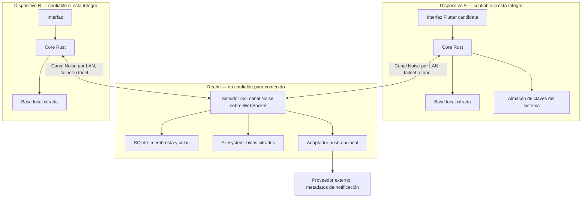

# Arquitectura

**Actualización de implementación del cliente:** la [base actual](CLIENT_FOUNDATION.md) documenta `arveil-app`, ejecución cooperativa, exclusión transaccional, vinculación reanudable y bloqueo entre procesos. La [ADR-009](adr/ADR-009-flutter-first.md) elige Flutter primero y el [plan de fase 3b](PHASE3B.md) fija los criterios de aceptación. Los diagramas y candidatos que siguen pertenecen a la propuesta histórica: SQLCipher y `mls-rs` están implementados; almacén de claves del SO y GUI siguen pendientes.

**Estado:** propuesta v0.4 · **Fecha:** 2026-09-04. [Índice](README.md) · [Amenazas](THREAT_MODEL.md) · [Protocolo](PROTOCOL.md).

*English version: [../ARCHITECTURE.md](../ARCHITECTURE.md)*

## 1. Producto y promesa

Arveil es un messenger para pequeños grupos que quieren alojar su infraestructura en casa. Su apuesta es que el servidor resulte sencillo de instalar, actualizar y recuperar, mientras los dispositivos conservan la autoridad sobre identidad e historial.

La promesa de seguridad se limita al contenido: con clientes legítimos, identidades correctamente verificadas y claves de endpoint a salvo, comprometer el realm no debe bastar para leer conversaciones. El servidor sigue viendo tráfico, membresías y parte del enrutamiento; puede impedir la comunicación. No prometemos «que nada se filtre» ni anonimato equivalente a una red de relays especializada.

Requisitos iniciales:

- Conversaciones 1:1 y grupos privados con E2EE obligatorio.
- Varios dispositivos independientes por persona, incorporación visible y revocación.
- Lectura y escritura local sin servidor; entrega diferida y estados veraces.
- Adjuntos cifrados, recuperación de identidad y transferencia optativa de historial.
- Un único realm por instancia, alcanzable a la vez por LAN, tailnet, Internet directo o un túnel, sin que la vía de acceso cambie las garantías de seguridad.
- Instalación con un binario servidor o una imagen, una base SQLite y un directorio de datos.

Como presupuesto de diseño, se priorizan decenas de personas y cientos de dispositivos, no comunidades públicas masivas. No son cifras de capacidad medidas. El primer benchmark propondrá 50 personas, 150 dispositivos, grupos de hasta 100 dispositivos y ráfagas de 10 mensajes por segundo, midiendo también el coste del fan-out por destinatario.

## 2. Componentes y fronteras



### Servidor Go: monolito modular

| Módulo | Responsabilidad | Restricción |
|---|---|---|
| Canal y endpoints | Handshake Noise, frames, lista firmada de endpoints, keepalive | Ningún frame se procesa antes de completar el handshake; administración solo en endpoints `admin` |
| Realm y administración | Configuración, altas, expulsiones, cuotas | El administrador no emite identidad personal |
| Invitaciones | Tokens caducables de un uso | Admitir en el servicio no equivale a verificar una persona |
| Directorio | Credenciales públicas, manifiestos de dispositivos y KeyPackages | Los clientes verifican firmas y continuidad |
| Mailboxes y entrega | Capabilities, colas persistentes, fetch, ACK, TTL | No interpretar mensajes ni mantener rooms semánticas |
| Blobs | Cuotas, carga atómica, descarga, expiración | Solo bytes cifrados; sin nombres originales |
| Operación | Backups, migraciones, salud, métricas agregadas | Sin contenido, claves o tokens en logs |
| Push opcional | Aviso genérico de actividad pendiente | No nombres de contactos, grupos o mensajes |

Las tareas de limpieza y notificación viven en el proceso; la cola durable es SQLite. No se requiere Redis, RabbitMQ, MongoDB, PostgreSQL o Kubernetes. Los módulos dependen de interfaces pequeñas de almacenamiento y transporte; no se fragmentan en servicios de antemano.

### Core Rust: autoridad de seguridad del cliente

Contiene validación de identidad, biblioteca MLS, autorización de eventos de grupo, cifrado exterior y de adjuntos, almacenamiento cifrado, outbox/inbox, sincronización y recuperación. Una única implementación alimenta las interfaces móviles y de escritorio.

El servidor Go **no enlaza el core Rust** y no participa como miembro MLS. Su clave Noise, su clave de firma y su verificación de firmas públicas son independientes de las claves E2EE. La interfaz recibe mensajes para mostrarlos, pero no decide si una firma, dispositivo o commit es válido. Los bindings exponen operaciones y handles, evitando exportar claves privadas.

El almacén del sistema protege una clave de envoltura de la base local. Keychain, Keystore y mecanismos equivalentes no implican que toda operación Ed25519/MLS ocurra en hardware seguro; la compatibilidad real debe comprobarse por plataforma. SQLCipher es candidato, incluyendo su integración con el provider de almacenamiento MLS.

## 3. Identidad, acceso y pertenencia

Una identidad nace en un cliente a partir de una raíz Ed25519. Su fingerprint se calcula sobre una codificación versionada de su clave pública. Username, dominio y cuenta del realm son atributos de presentación o autorización, no identidad criptográfica.

Cada dispositivo tiene claves propias y una credencial firmada por la raíz. El primer diseño exige desbloquear la raíz en un dispositivo de administración o mediante el kit para firmar altas: otro dispositivo ordinario no puede autorizar nuevos dispositivos por el mero hecho de existir. La delegación de esa facultad queda aplazada.

Un manifiesto de dispositivos firmado, versionado y encadenado registra altas y revocaciones. Contactos ya verificados rechazan sustituciones de raíz y retrocesos respecto a su máximo conocido. La primera vinculación exige QR o fingerprint por un canal confiable; el directorio del realm por sí solo no autentica a una persona.

Un dispositivo autorizado de una persona tampoco entra automáticamente en todas sus conversaciones. Debe incorporarse a cada grupo MLS según su política. Expulsar del realm bloquea el servicio en un servidor honesto; retirar de un grupo requiere un Remove y un commit MLS válidos. Son operaciones distintas.

## 4. Conversaciones, MLS y distribución

Cada conversación, también una 1:1, es un grupo MLS. Cada dispositivo activo es una leaf; dos personas con dos dispositivos cada una producen cuatro participantes criptográficos. Identidad de persona y leaf no se confunden.

El cliente mantiene roster, títulos, política y mapa de rutas dentro del estado local y de intercambios E2EE. El servidor guarda mailboxes y sobres sin `conversation_id`, `room_members` ni texto de mensajes. Aun así, asocia mailboxes a dispositivos para acceso y cuotas; con IP, sesiones y fan-out puede inferir relaciones.

Un mensaje se cifra con MLS una vez; cada destinatario recibe un envoltorio HPKE distinto, con identificador de entrega aleatorio propio. El envoltorio oculta cabeceras MLS, Welcome y correlación por igualdad de ciphertext al servidor. No oculta tamaños, tiempos o destino. El servidor sigue siendo capaz de correlacionar solicitudes autenticadas.

El prototipo propone un único **coordinador de commits por grupo**, un dispositivo escogido al crear el grupo; su adopción para V1 depende del gate de disponibilidad y revocación de ADR-002. Cualquier participante puede enviar mensajes; solo ese coordinador produce cambios de epoch aceptables bajo la política del grupo. Es un compromiso explícito de disponibilidad: si está ausente, los cambios de miembros esperan; la pérdida, retirada o revocación del coordinador exige cerrar el grupo afectado y crear uno nuevo verificado. No hay elección automática ante particiones ni secuenciador de rooms en el servidor. El [protocolo](PROTOCOL.md) detalla colisiones y bloqueo seguro.

## 5. Persistencia y entrega

El servidor es store-and-forward, no el archivo de conversaciones. Un ACK de cola autoriza borrar un sobre; no prueba que una persona lo haya leído. Los recibos de dispositivo y lectura son eventos E2EE independientes.

El cliente confirma un mensaje saliente y el nuevo estado MLS en una transacción local junto con el ciphertext de reintento. Solo después intenta enviarlo. Al recibir, persiste estado MLS y evento deduplicado antes de ACK. Un fallo entre esos pasos puede producir retransmisiones, no debe producir reutilización de estado criptográfico ni pérdida silenciosa. La capacidad del provider MLS para participar en esa transacción es una condición de adopción de biblioteca.

Valores iniciales propuestos para prototipo, configurables y sujetos a pruebas:

| Parámetro | Valor inicial | Consecuencia |
|---|---|---|
| TTL de sobres | 30 días | Un dispositivo ausente más tiempo puede requerir reingreso |
| Retención tras ACK | Borrado lógico inmediato; limpieza asíncrona | No equivale a borrado físico de backups/SSD |
| Tamaño máximo de sobre | 256 KiB, tras padding | Los adjuntos van fuera de la cola |
| Archivo máximo | 25 MiB | Límite aplicado antes y durante la carga |
| TTL de blobs | 30 días desde carga completa | El historial remoto no garantiza adjuntos permanentes |
| Espera de epoch futuro | 1.000 sobres o 16 MiB por grupo | Al superar el límite se requiere resincronización |

El cliente conserva archivos que el usuario quiera archivar; el backup de historial solo preserva adjuntos incluidos explícitamente. Agotar cuota devuelve error visible y permite reintentar; no se descarta silenciosamente un mensaje presentado como entregado.

## 6. Homelab y operación

```text
/data/
├── config.toml
├── realm.db
├── realm.db-wal      # archivos de SQLite administrados por SQLite
├── realm.db-shm
├── server-secrets/   # clave de firma y clave Noise del realm, TLS opcional; nunca secretos personales
├── endpoints.toml    # fuente del RealmEndpointList firmado
├── blobs/
└── staging/
```

Se distribuye un binario servidor por plataforma soportada y una imagen fijada por versión/digest. «Single-binary» se refiere al servidor, no a los clientes ni a todos los componentes opcionales de red. Debe comprobarse si el driver SQLite elegido permite el empaquetado estático deseado; no se da por supuesto `CGO_ENABLED=0`.

### Vías de acceso

La seguridad del protocolo no depende de la vía de acceso: el canal Noise de [ADR-008](adr/ADR-008-carrier-independent-transport.md) autentica realm y dispositivo y protege la API en cualquier carrier. El realm publica una lista firmada de endpoints y los clientes usan todos los disponibles, prefiriendo LAN, después tailnet, después público. Un mismo despliegue combina normalmente varias vías:

| Vía | Uso previsto | TLS | Quién ve qué |
|---|---|---|---|
| LAN directa | En casa; funciona sin Internet, ACME ni DNS público | Autofirmado u omitido; mDNS opcional solo para descubrimiento | Nadie fuera de la red local |
| Tailnet | Administración y usuarios avanzados; no se exige a la familia | Innecesario sobre WireGuard | Tailscale: nodos que se comunican y volumen |
| Cloudflare Tunnel con dominio propio | Vía pública por defecto para móviles; oculta la IP doméstica y filtra escáneres | Termina en Cloudflare; el origen recibe el WebSocket en claro y el canal Noise lo protege | Cloudflare: IP de cada cliente, tiempos, tamaños; nunca frames ni credenciales |
| Tailscale Funnel | Alternativa pública sin dominio propio | Termina en el nodo | Tailscale: bytes TLS, SNI, IP |
| Puertos expuestos | Cuando hay IP pública y se acepta exponerla | WebPKI con ACME o autofirmado, porque el pin es Noise | Nadie, pero la IP doméstica es visible |
| VPS con passthrough TCP | Sustituto de Cloudflare sin tercero que termine TLS | Termina en el nodo | Proveedor del VPS: bytes TLS, IP |

Los intermediarios que terminan TLS ven patrones de conexión, no la API. Cerrar conexiones inactivas es habitual en túneles: el canal emite keepalive. El plano de administración se acepta solo en endpoints marcados `admin`, normalmente loopback, LAN o tailnet, con credencial administrativa propia; un túnel público no lo expone aunque comparta proceso. Cambiar de vía es editar la lista de endpoints y republicarla, no cambiar el protocolo.

SQLite usa WAL sobre disco local, un escritor lógico y transacciones breves; no se coloca WAL en NFS/SMB ni se ejecutan réplicas activas escribiendo la misma base. Se configuran busy timeout, límites de cola, checkpoint y durabilidad antes de medir rendimiento. La corrupción o disco lleno detienen la aceptación durable con error explícito.

El perfil de persistencia debe cumplir los [requisitos verificados de ADR-004](adr/ADR-004-sqlite-single-binary.md#requisitos-verificados-de-durabilidad), incluyendo el arreglo de WAL-reset y sincronización de escrituras. Se aplican también al motor que almacena el estado criptográfico del cliente. La matriz de plataformas y las funciones de debug permitidas se verifican según [ADR-001](adr/ADR-001-go-server-rust-core.md) y [ADR-002](adr/ADR-002-mls.md).

### Backups y restauración

La primera versión permite una copia offline: detener el servicio limpiamente y copiar el directorio completo con permisos y manifiesto de versión. Una copia online posterior necesitará la API de backup de SQLite y coordinación de GC/blobs para obtener un conjunto consistente. Copiar solo `realm.db` mientras WAL está activo no es un procedimiento válido.

Los backups del servidor incluyen metadatos y secretos operativos, por lo que se cifran con una clave del operador guardada fuera del servidor. No contienen la clave de recuperación del usuario. Se comprueban en una instancia aislada antes de considerar terminado un backup.

Tras restaurar, los clientes mantienen sus máximos de versión y estado criptográfico; no retroceden al snapshot del servidor. Sobres reaparecidos se deduplican y sobres perdidos pueden requerir reenvío o reingreso. Las revocaciones y capabilities restauradas pueden estar obsoletas: se reconcilian antes de reabrir el acceso externo. Si existe sospecha de compromiso, se rota la clave Noise del realm publicando una lista de endpoints nueva; la clave de firma del realm solo se rota con un procedimiento que exige nuevo bootstrap de los clientes.

Las migraciones se ejecutan con bloqueo exclusivo y backup previo. No se promete downgrade in-place: una reversión restaura un snapshot compatible y declara su ventana de pérdida. Métricas agregadas de colas, errores, disco y latencia; sin etiquetas por persona, IP, dispositivo, mailbox o grupo. No exponer pprof, volcados o endpoints de diagnóstico públicamente.

## 7. Local-first y recovery-first

Sin red, la aplicación abre su historial y acepta mensajes en outbox. La UI distingue «pendiente local», «aceptado por servidor», «recibido por dispositivo» y «leído». Ninguna escritura sin conectividad simula entrega.

Se separan tres mecanismos: recuperación de identidad desde raíz protegida, incorporación de dispositivos con claves nuevas y recuperación de historial como archivo cifrado. No se restaura un snapshot antiguo de MLS para seguir enviando. La pérdida de todos los dispositivos sin kit implica una nueva identidad; sin archivo o dispositivo superviviente, el historial es irrecuperable.

Transferir historia a un nuevo dispositivo es una acción explícita, con periodo y adjuntos seleccionados. No le entrega viejas claves de epochs: entrega registros exportados en un canal autenticado. Esa copia sigue aumentando la exposición del pasado si se compromete el destino o su backup.

## 8. Alcance y gates de ingeniería

| Fase | Entregable | Condición de salida |
|---|---|---|
| 0: viabilidad | Core sin UI completa, dos clientes, realm mínimo | MLS real, identidad verificada y persistencia atómica demostradas |
| 1: vertical LAN | 1:1/grupo, offline, colas, adjuntos y canal Noise con lista de endpoints | Reinicios, duplicados, TTL, caída de red y conmutación de carrier sin pérdida silenciosa; captura opaca tras un túnel que termina TLS |
| 2: uso personal | Multidispositivo, kit, archivo y revocación | Simulacros de pérdida total y restore; incorporación nunca silenciosa |
| 3: distribución | UI móvil/escritorio, actualizaciones y push opcional | Builds firmadas, revisión externa y matriz de plataformas verificada |

Voz/vídeo, bridges, bots, federación, grupos gigantes, navegador de chat, Tor, anonimato avanzado, perfiles postcuánticos y el modo HA/balanceo quedan fuera de V1. La UI web de administración no aloja el cliente E2EE: un realm comprometido podría servir JavaScript malicioso y capturar claves. Clientes firmados por un canal independiente reducen ese riesgo, sin eliminar el de supply chain.

Pruebas de aceptación: vectores y compatibilidad de MLS, fuzzing de entradas, propiedades de deduplicación, crash injection en las transacciones, servidor adversarial, revocación offline y recuperación desde backups. No se interpreta un test de ausencia de plaintext como demostración matemática de confidencialidad. Véanse [amenazas](THREAT_MODEL.md) y [ADRs](README.md).

## 9. Evolución posible: redundancia opcional del realm

**Fuera de V1; propuesta para evaluación futura.** Un realm podría operar en varias Raspberry Pi o minipcs, dentro de un homelab o entre domicilios, para continuar las entregas tras fallos de máquina o ubicación. Standalone conserva SQLite local, filesystem y operación sencilla como experiencia predeterminada.

La dirección preferente son **relays independientes**: cada nodo es un realm-relay con su propia clave, su propio SQLite y su propia lista de endpoints; cada dispositivo publica un `RouteBundle` por relay y el remitente entrega a todos los relays del destinatario. No hay líder, consenso ni réplica, y la verdad sigue en los clientes. Un nodo en cada domicilio, cada uno con su túnel, tolera la pérdida de una vivienda completa. La alternativa de clúster con estado compartido, con líder de escritura y réplicas coordinadas, se conserva como opción secundaria: exige replicar estado operativo, colas y adjuntos, definir cuándo una entrega está confirmada y añadir operación real. En ese caso, varias réplicas de un túnel sobre el mismo dominio dan failover de ingreso sin balanceador propio.

La tolerancia a fallos depende de dónde estén los votos, los datos y el acceso de red; varias máquinas en una vivienda no garantizan sobrevivir a perder esa vivienda. E2EE permanece en clientes, mientras crecen la superficie de metadatos y las responsabilidades operativas. La disponibilidad del realm no resuelve la pérdida del coordinador MLS de un grupo.

El [ADR-007](adr/ADR-007-optional-realm-redundancy.md) documenta opciones, condiciones de aceptación, particiones, replicación de blobs y pruebas necesarias. La lista firmada de endpoints y el canal independiente del carrier, que ese ADR preveía para HA, ya forman parte de V1 por [ADR-008](adr/ADR-008-carrier-independent-transport.md); los frames de V1 no anuncian soporte de clúster.
