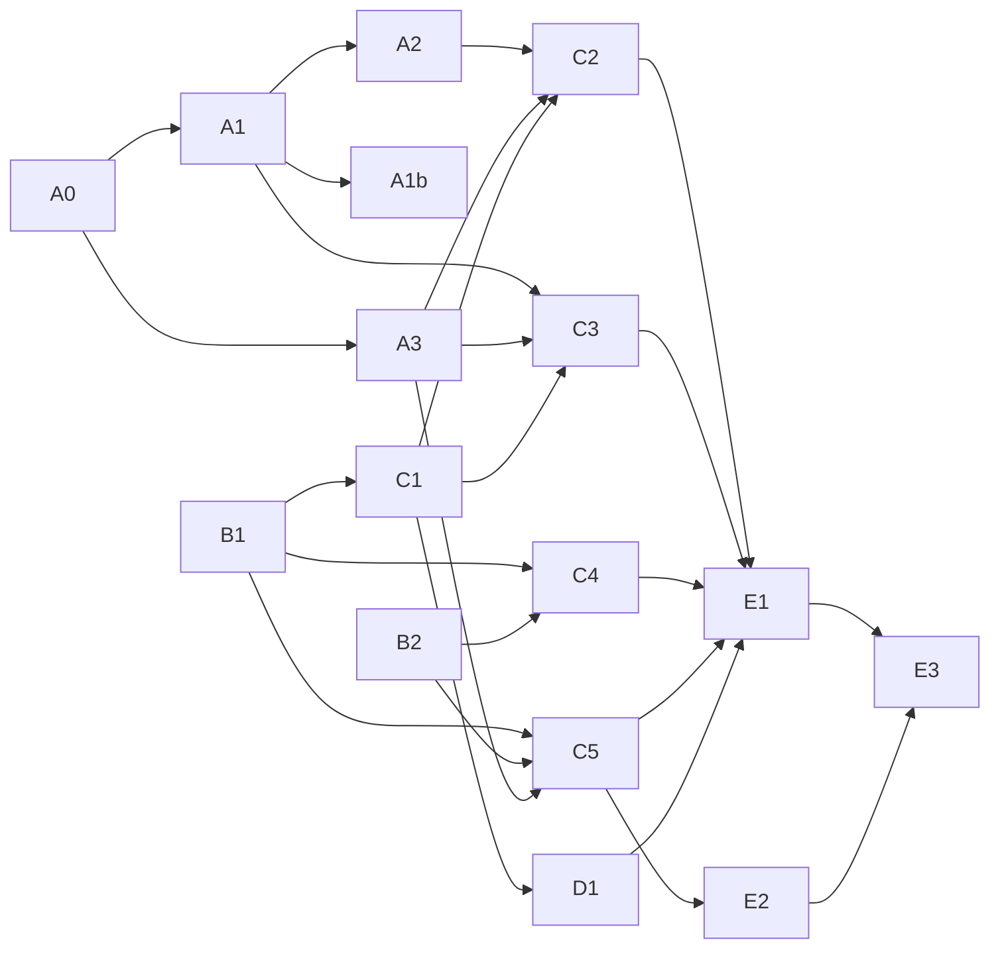

# Diseño del cliente: sistema visual y plan de implementación

[English version](../CLIENT_DESIGN.md). Este documento en español es la fuente normativa; la versión inglesa es una traducción resumida que debe actualizarse en la misma revisión. Ante discrepancias, prevalece este documento.

Estado: dirección visual aprobada el 25 de septiembre de 2026 sobre maquetas de las pantallas principales. Implementados: A0 (versionado del esquema), A1 (remitente y hora del historial en vivo), A1b (remitente en el historial cifrado), A2 (resumen de conversaciones y no leídos) y A3 (estado del kit, avisos de dispositivos y estado de sincronización); el resto está pendiente. El plan se ejecuta dentro de [M3b.5](PHASE3B.md) y antes de la prueba con tres usuarios externos. No modifica el protocolo ni el relay, salvo el paquete opcional F1 (invitación por QR), que requiere su propia revisión de formato.

## Por qué y qué no

Las pantallas actuales usan los componentes de Material por defecto: un único `ColorScheme.fromSeed` sin tema oscuro, la página del perfil como inicio con paneles apilados, textos escritos directamente en español y estados de entrega expresados como frases largas. Funcionan y están probadas, pero no sirven para evaluar la experiencia con personas externas.

El objetivo es una calidad visual y de interacción comparable a la de las aplicaciones de mensajería de uso masivo en los flujos principales, con identidad propia. No se copia la identidad visual de otra aplicación ni se imitan funciones que Arveil no tiene. El sistema visual se construye para admitir personalización.

Fuera de alcance: reacciones, respuestas citadas, reenvío, indicador de escritura, confirmaciones de lectura, notas de voz, llamadas, estados, notificaciones push, hora de envío declarada por el emisor, búsqueda en todo el historial y sincronización de preferencias entre dispositivos. Varias requieren cambiar el formato de los mensajes MLS, y la fase 3b excluye el rediseño del protocolo.

## Principios

1. **Estados honestos.** La interfaz distingue pendiente, aceptado por el servidor y fallo. Nunca muestra doble confirmación ni «leído»: el protocolo no tiene confirmaciones de lectura y M3b.3 exige no confundir la aceptación del relay con la lectura humana. Sin push en la beta, se muestra cuándo fue la última sincronización correcta.
2. **Seguridad visible y comprensible.** La verificación de contactos, los dispositivos y el kit de identidad forman parte del producto, no son ajustes escondidos. Una operación criptográfica visible, como que un contacto añada o retire un dispositivo, aparece como aviso en la conversación. Los avisos informan sin bloquear salvo cuando el riesgo lo exige.
3. **Local primero.** Leer y escribir funcionan sin conexión; la falta de conexión es un aviso, no un error modal.
4. **Rust es la fuente de verdad.** Los datos nuevos que necesita la interfaz (remitente, resumen de conversación, no leídos, estado de recuperación) se añaden al contrato Rust. Dart no mantiene una segunda base durable del dominio; solo las preferencias globales de apariencia viven fuera de Rust (véase [Personalización](#personalización)).
5. **Accesible por construcción.** Contraste AA garantizado por una prueba sobre los tokens, objetivos táctiles de al menos 48 dp en Android y 44 pt en sistemas Apple, etiquetas para lectores de pantalla y texto escalable.
6. **Sin fugas desde el propio cliente.** Fuentes, iconos y fondos se empaquetan en la app; nada se descarga en tiempo de ejecución (por ejemplo, no se usa la descarga dinámica de `google_fonts`). Sin analítica. Las capturas de documentación no contienen invitaciones, rutas, direcciones ni identificadores reales.
7. **Bilingüe.** Interfaz en español e inglés con un glosario común.

## Glosario de la interfaz

| Término técnico | Interfaz en español | Interfaz en inglés |
|---|---|---|
| relay / realm | servidor | server |
| bootstrap + invitación | invitación | invitation |
| identity kit | kit de identidad | identity kit |
| safety number | número de seguridad | safety number |
| KeyPackages | claves para grupos nuevos | keys for new groups |
| history archive | historial cifrado | encrypted history |
| route | ruta de contacto | contact route |
| pairing | vincular dispositivo | link a device |

Los términos técnicos se mantienen en el diagnóstico y en la documentación de operación.

## Sistema visual

Las maquetas de referencia cubren bienvenida, lista de chats, conversación de grupo, verificación de contacto, ajustes, escritorio con tres paneles y conversación sin conexión en modo oscuro. Son privadas del mantenedor; las capturas públicas se generarán desde la app implementada (E3). Los valores siguientes son normativos para la primera implementación y se pueden ajustar en revisión si una prueba real lo justifica.

### Color

| Token | Claro | Oscuro | Uso |
|---|---|---|---|
| `ground` | `#F4F1EA` | `#0E1413` | Fondo de pantallas y del área de mensajes |
| `bar` | `#FBF9F4` | `#151D1C` | Barras, compositor y paneles laterales |
| `surface` | `#FFFFFF` | `#151D1C` | Tarjetas y grupos de ajustes |
| `surfaceRaised` | `#FFFFFF` | `#1B2524` | Burbujas ajenas y campos de texto |
| `ink` | `#16211F` | `#E6ECEA` | Texto principal |
| `inkMuted` | `#56625F` | `#9DAAA6` | Texto secundario, horas, iconos inactivos |
| `inkSoft` | `#3F4B48` | `#C4CFCC` | Avisos de sistema e iconos de acción |
| `line` | `#E3DED3` | `#25302E` | Bordes |
| `divider` | `#ECE7DE` | `#25302E` | Separadores dentro de un grupo |
| `accent` | `#245B51` | `#8FD0C0` | Acción principal, enlaces, verificado, no leídos |
| `onAccent` | `#FFFFFF` | `#0E1413` | Texto e iconos sobre `accent` |
| `accentSoft` | `#DDEAE4` | `#1D4740` | Burbuja propia, selección, pestaña activa |
| `ownMeta` | `#3D5A53` | `#A9CFC5` | Hora y estado dentro de la burbuja propia |
| `chip` | `#EAE5DA` | `#1B2524` | Separadores de fecha y avisos de sistema |
| `attention` / `onAttention` | `#F6E7CC` / `#6B4108` | `#3A2A12` / `#F2C98A` | Kit sin guardar, contacto sin verificar, sin conexión |
| `danger` | `#A2382B` | `#F2A59B` | Acciones destructivas y fallos |
| `online` | `#2E7D6B` | `#6FB3A3` | Indicador de conexión |

Avatares (fondo / texto), asignados de forma determinista a partir del identificador de identidad para que un contacto tenga el mismo color en todos los dispositivos:

| Tono | Claro | Oscuro |
|---|---|---|
| Salvia | `#DCE8D5` / `#2E4A28` | `#243A2A` / `#CFE6C8` |
| Arcilla | `#EFDCCB` / `#6A3A17` | `#40301F` / `#F0D6BF` |
| Azul | `#D9E4F0` / `#24476B` | `#243548` / `#CFE0F2` |
| Malva | `#E8D9EA` / `#5A3561` | `#3A2A40` / `#EBD3F0` |
| Oliva | `#E3E6D2` / `#4A4F24` | `#343823` / `#E2E6C2` |

Nombres de remitente en grupos, asignados con la misma regla: claro `#8A4B1E`, `#2F5D8A`, `#5B4A8A`, `#2E6B3E`; oscuro `#E8B48A`, `#9CC3EE`, `#C3B5F0`, `#A5D6A7`.

El 25 de septiembre de 2026 todos los pares texto/fondo de estas tablas dan un contraste de al menos 5,05:1. B1 convierte esa comprobación en una prueba automática que también cubre los acentos de la personalización.

### Tipografía

| Rol | Familia | Tamaño / peso |
|---|---|---|
| Título de pantalla | Newsreader | 34 / 500 en móvil; 24 / 500 en escritorio y paneles |
| Título de barra | Instrument Sans | 17 / 600 |
| Nombre en una lista | Instrument Sans | 16 / 600 |
| Cuerpo de mensaje | Instrument Sans | 15,5 / 400, interlineado 1,4 |
| Vista previa y filas | Instrument Sans | 14,5 / 400 |
| Texto secundario | Instrument Sans | 13 / 400–600 |
| Horas y etiquetas | Instrument Sans | 11,5–12,5 / 400–600 |
| Número de seguridad | IBM Plex Mono | 25 / 500, espaciado 0,08 em, ocho grupos en dos columnas |
| Identificadores | IBM Plex Mono | 13,5–14 / 400 |

Las tres familias tienen licencia SIL OFL 1.1. Se empaquetan en `clients/flutter/assets/fonts/` y sus licencias se registran en `LicenseRegistry`. Los tamaños se multiplican por el escalado de texto del sistema y por el ajuste de la app.

### Forma, espacio e iconos

- Radios: burbujas 18, con 6 en la esquina de la cola; tarjetas y grupos 20; botones principales 16 con 52 de alto; botones pequeños 12; etiquetas totalmente redondeadas; avatares circulares.
- Espaciado en múltiplos de 4 (8, 12, 16, 20, 24); márgenes laterales de 16 a 20 en móvil.
- Iconos de trazo 1,8 sobre rejilla de 24 con extremos redondeados, de un conjunto con licencia permisiva empaquetado en la app (candidato: Lucide, licencia ISC). B1 registra la decisión y la licencia.
- Movimiento breve (hasta 200 ms), desactivado si el sistema pide reducir movimiento.
- Marca: la A de cinta marfil (`#F6EFDF`) sobre verde pino `#245B51` de `assets/brand/`, que es el icono de macOS y Android desde `0.1.0+11`. Dentro de la app se usa su versión vectorial `mark.svg` (bienvenida, cabecera de escritorio y pantalla de carga). El arco de las maquetas queda solo como motivo decorativo de fondo.

## Pantallas y navegación

| Pantalla | Sustituye a | Contenido principal |
|---|---|---|
| Bienvenida | Formulario de alta en `main.dart` | Tres entradas: unirse con invitación, vincular otro dispositivo y restaurar desde un kit; explica que la identidad nace en el dispositivo |
| Alta paso a paso | `main.dart`, `recovery_panel.dart`, `pairing_panel.dart` | Invitación (pegada; QR en F1), progreso reanudable y kit con opción de posponer y riesgo visible |
| Chats | Lista de `conversations_page.dart` | Estado de sincronización, aviso del kit, filas con avatar, vista previa, hora, no leídos y estado; botón «Nuevo chat» |
| Conversación | Detalle de `conversations_page.dart` | Burbujas agrupadas por remitente, separadores de fecha, estados, adjuntos, avisos de sistema y compositor |
| Nuevo chat | `NewConversationPage` | Contactos guardados, comparación de números y creación |
| Contactos | `contacts_page.dart` | Lista, alias, ruta propia para compartir y alta de contactos |
| Verificar contacto | `contacts_page.dart` | Número de seguridad, dispositivos y «Coinciden» / «No coinciden» |
| Ajustes | Página del perfil en `main.dart` | Identidad; Seguridad y recuperación; Conexión; Aplicación; cerrar perfil |
| Dispositivos, historial cifrado y claves | `devices_page.dart`, `archives_page.dart`, `key_packages_panel.dart` | Los mismos flujos con el nuevo sistema visual |
| Apariencia | — | Personalización (D1) |

Navegación:

- **Compacta (ancho menor de 600 dp):** barra inferior con Chats, Contactos y Ajustes; conversación y subpantallas se apilan.
- **Media (600–839 dp):** igual que la compacta, con márgenes mayores.
- **Expandida (840 dp o más):** lista y conversación en paneles. A partir de 1200 dp puede quedar abierto el panel de detalles del grupo, con participantes, su estado de verificación, sus dispositivos y los archivos.
- El alta vive fuera de la navegación principal: un perfil sin identidad solo muestra la bienvenida y el alta.
- **Atajos** (⌘ en macOS, Ctrl en los demás sistemas): ⌘N nuevo chat, ⌘K buscar chats, ⌥↑/⌥↓ chat anterior o siguiente, ⌘, ajustes, Esc cierra panel o diálogo. En escritorio Intro envía y Mayús+Intro inserta una línea; en móvil Intro inserta una línea.

Estados de entrega, a partir de las cadenas `delivery` que ya devuelve Rust:

| Estado en Rust | Presentación | Texto accesible y detalle |
|---|---|---|
| Sin destinatarios (`delivery` vacío) | Alerta `attention` | «Guardado solo en este dispositivo: no hay destinatarios disponibles» |
| Pendiente (cualquier otro estado no final) | Reloj | «Pendiente de envío» |
| Todos `accepted…` | Una marca | «Aceptado por el servidor», nunca «leído» |
| Algún `undeliverable…` | Alerta `danger` | «Algún buzón rechazó el mensaje» |
| Algún `expired/unknown` | Alerta `attention` | «Entrega caducada o desconocida» |

El detalle por buzón se abre con una pulsación larga o con el clic secundario.

Cada estado de `AttachmentStateView` tiene presentación propia. `Pending` ofrece «Descargar» y nunca descarga automáticamente. `Transferring` muestra progreso y cancelación. `Ready` y `Sent` permiten abrir o guardar una copia. `Cancelled` permite volver a pedir la descarga. `Expired`, `Unavailable`, `Invalid` y `Legacy` explican el motivo sin ofrecer reintentos que no pueden funcionar. Un 403 no se presenta como caducidad.

## Personalización

**Primera versión, incluida en la beta (D1):**

- Tema: sistema, claro u oscuro.
- Acento: seis opciones seleccionadas, cada una con variante clara y oscura y validada por la prueba de contraste. No hay selector de color libre porque no podría garantizar el contraste.
- Fondo de la conversación: liso o uno de cuatro a seis motivos vectoriales propios (por ejemplo, arcos) dibujados por la app, con variante clara y oscura y opacidad limitada. Burbujas, fechas y avisos son opacos, así que el fondo nunca reduce la legibilidad.
- Tamaño de texto: respeta el del sistema y añade un ajuste de 90 % a 130 %.
- Idioma: el del sistema, español o inglés.

Estas preferencias son globales y no revelan nada del perfil, y hacen falta antes de desbloquearlo porque la bienvenida ya usa el tema. Se guardan como JSON en el directorio de soporte de la app, fuera de `profile/`, con escritura atómica. No pueden contener identificadores de conversación, nombres, rutas ni imágenes. En Android ese directorio ya está excluido de copias y transferencias; en macOS no se excluye, porque no contiene datos sensibles.

**Segunda versión, después de la beta:** fondo o acento por conversación y foto propia como fondo. Lo que dependa de una conversación o contenga una imagen del usuario se guarda **dentro del perfil cifrado**, gestionado por Rust y con la misma exclusión de copias que el resto del perfil. Una foto se muestra con un velo que mantiene el contraste. Las preferencias no se sincronizan entre dispositivos; hacerlo exigiría enviarlas por MLS y es una decisión aparte.

## Datos que necesita la interfaz

Hallazgos del 25 de septiembre de 2026 que condicionan el orden del plan:

- `HistoryEventView` no incluye remitente ni hora. Al procesar un mensaje de aplicación, `arveil-app` registra el evento sin el remitente, aunque `mls-rs` lo identifica mediante `sender_index`. Resuelto en A1 para el historial en vivo.
- `ConversationView` no incluye último mensaje, última actividad ni no leídos, y no existe una marca de lectura. Resuelto en A2.
- La base del perfil no tiene versionado de esquema: se crea con `CREATE TABLE IF NOT EXISTS`. Añadir columnas exige migraciones. Resuelto en A0.
- El estado del kit (exportado o pospuesto) solo vive en memoria del panel de recuperación; un aviso persistente necesita estado durable. Resuelto en A3.
- La hora de la última sincronización solo existe en el controlador de conversaciones de Dart, que sincroniza cada 10 segundos mientras está abierto. Como proyección de presentación es aceptable.

## Plan de implementación

Cada paquete es un PR pequeño con sus propias pruebas. Tamaño relativo: S (hasta un día), M (uno o dos días), L (más de dos días). El orden sigue las dependencias; no hay calendario.

### A. Contrato de datos (Rust y puente)

**A0 — Versionado del esquema del perfil (M).** Prerrequisito de A1–A3 y del resto de la distribución externa. Implementado; véase la [base del cliente](CLIENT_FOUNDATION.md).

- Versión con `PRAGMA user_version` y lista ordenada de migraciones en `arveil-core`, cada una en su propia transacción. Una base existente sin versión se trata como versión 0, el esquema de las builds hasta `0.1.0+11`.
- Leer la versión antes de modificar datos. Una versión futura produce un error tipado (por ejemplo, `ProfileTooNew`) sin tocar la base, y la GUI lo presenta.
- Pruebas: migrar y reabrir una base poblada con el esquema actual; un fallo a mitad de migración deja intacta la versión anterior; reabrir es idempotente; una versión futura se rechaza.
- Documentar que no hay vuelta atrás: antes de actualizar, el kit y el historial cifrado son la protección. Esto cubre la parte de migración de perfil que M3b.1 pide definir antes de la distribución externa.

**A1 — Remitente y hora en el historial (M).** Depende de A0. Implementado; véase la [base del cliente](CLIENT_FOUNDATION.md).

- Al registrar eventos recibidos, de texto o de adjunto, guardar el dispositivo y la identidad del emisor obtenidos de la credencial del miembro MLS. Los enviados se marcan como propios.
- `HistoryEventView` añade la identidad del remitente, su etiqueta resuelta en Rust (alias local o identificador corto), si es propio y `created_at` en segundos Unix. La hora es la de registro local: llegada para los recibidos y creación para los enviados. La interfaz no la presenta como hora de envío.
- El remitente del historial cifrado pasa a A1b.
- Los eventos antiguos sin remitente se muestran sin nombre, nunca con un remitente supuesto.
- Pruebas: grupo de tres con dos emisores; emisor revocado después; importación de ambas versiones; paginación intacta; bindings regenerados sin deriva.

**A1b — Remitente en el historial cifrado (S).** Depende de A1. Implementado; véase la [base del cliente](CLIENT_FOUNDATION.md).

- Cada registro exportado incluye la identidad del remitente cuando se conoce, como campo opcional dentro de la versión 1 del formato, igual que `file_present`. Así los archivos nuevos siguen importándose en builds anteriores, que ignoran el campo, y los antiguos se importan sin remitente. Esto sustituye a la nueva versión de formato prevista antes.
- `archived_events` gana la columna del remitente mediante una migración. Los registros importados muestran el nombre local de esa identidad si existe, pero siguen presentándose como historial importado: un archivo aportado por el usuario no prueba la autoría.
- Pruebas: exportar e importar con y sin remitente, importar un archivo sin el campo y comprobar que la importación repetida no sobrescribe el remitente de un registro existente.

**A2 — Resumen de conversaciones y no leídos (M).** Depende de A1. Implementado; véase la [base del cliente](CLIENT_FOUNDATION.md).

- `ConversationView` añade el último evento (tipo, vista previa acotada en Rust, remitente, si es propio, hora y estado de entrega), el número de no leídos y la última actividad. Rust ordena la lista por actividad.
- Marca de lectura local por conversación, monótona (`max(actual, nueva)`), con una operación `mark_read`. Los registros importados no cuentan como no leídos.
- Pruebas: sincronización concurrente con el marcado; un reinicio conserva la marca; orden estable ante empates; las consultas locales responden durante una sincronización lenta, según el contrato de admisión de M3b.1.

**A3 — Estado de recuperación y avisos de sistema (S).** Depende de A0. Implementado; véase la [base del cliente](CLIENT_FOUNDATION.md). El aviso se registra en todas las conversaciones compartidas con la identidad, no solo en la que trajo el manifiesto, porque un manifiesto solo es nuevo la primera vez que se acepta, venga del grupo o del relay.

- Persistir la fecha de la última exportación correcta del kit y exponerla en una consulta de estado de recuperación. «Más tarde» oculta el aviso solo durante la sesión.
- Registrar un evento local de sistema cuando un manifiesto aceptado cambia los dispositivos activos de un contacto, en la conversación por la que llegó, indicando si se añadió o retiró un dispositivo y si la identidad está verificada.
- En Dart, una proyección del estado de sincronización (última sincronización correcta, en curso, sin conexión o error del servidor) derivada de errores tipados, sin prometer entrega inmediata.

### B. Base visual (Dart)

**B1 — Tokens, tema y componentes (L).** Puede empezar en paralelo con A.

- `lib/src/design/` contiene los tokens como `ThemeExtension`, los temas claro y oscuro, la tipografía y las formas. Fuentes e iconos se empaquetan con sus licencias.
- Componentes: avatar, fila de conversación, burbuja (propia o ajena; primera, intermedia o última de un grupo; texto o adjunto), indicador de entrega, separador de fecha, aviso de sistema, banner de estado (información, atención, error y sin conexión), indicador de sincronización, grupo y fila de ajustes, etiqueta de verificación, rejilla del número de seguridad, botones, compositor y estado vacío.
- Pantalla de carga de Android y macOS con la marca de `assets/brand/`; el icono de la app ya existe desde `0.1.0+11`.
- Pruebas: prueba unitaria de contraste sobre todos los pares texto/fondo de ambos temas y de cada acento; golden tests de los componentes en claro y oscuro, generados y comprobados en el job de Flutter para macOS del CI.

**B2 — Localización en español e inglés (M).** Independiente de A.

- `flutter_localizations` y `gen-l10n` con archivos ARB en `lib/l10n/`; el español es la plantilla.
- Extraer todas las cadenas visibles. Las pruebas que buscan texto literal (unas 125 búsquedas el 25 de septiembre) pasan a usar claves o cadenas localizadas.
- El idioma sigue al del sistema; D1 añade la elección manual. Aplicar el glosario.

### C. Pantallas

**C1 — Navegación adaptativa y atajos (M).** Depende de B1. Estructura de tres tamaños descrita arriba, ruta de alta separada y atajos de escritorio con orden de foco probado. Pruebas de widget a 390×844 y a 1280×800.

**C2 — Lista de chats (S).** Depende de A2, A3 y C1. Filas completas, aviso persistente del kit, indicador de sincronización, búsqueda por nombre de conversación o de contacto y estado vacío con acción.

**C3 — Conversación (M).** Depende de A1, A3 y C1. Burbujas agrupadas, separadores de fecha, indicador de entrega con detalle por buzón, adjuntos con todos sus estados, avisos de sistema, banner sin conexión y compositor. Llama a `mark_read` al mostrar mensajes nuevos. En escritorio, panel de detalles. Conserva la paginación existente y responde durante sincronizaciones lentas.

**C4 — Bienvenida y alta (M).** Depende de B1 y B2. Bienvenida con tres entradas, alta por invitación paso a paso, vinculación y restauración con el nuevo sistema visual, y kit con «Más tarde» y riesgo visible. Mantiene la reanudación y los errores tipados existentes.

**C5 — Contactos, verificación y ajustes (M).** Depende de B1, B2 y A3. Contactos y nuevo chat, verificación con el número de seguridad en rejilla, ajustes en secciones y migración de dispositivos, historial cifrado y claves para grupos nuevos al nuevo sistema. «Cerrar perfil» sigue disponible.

### D. Personalización

**D1 — Apariencia (M).** Depende de B1 y C1. Pantalla con las opciones de la primera versión y cambios inmediatos sin reiniciar. El JSON de preferencias se escribe de forma atómica y se usan valores por defecto si falta o es inválido. Pruebas: contraste de cada acento en ambos temas; golden de dos fondos; el fondo no se repinta durante el desplazamiento (`RepaintBoundary`).

### E. Accesibilidad, diagnóstico y cierre

**E1 — Accesibilidad (M).** Depende de C2–C5 y D1.

- Etiquetas semánticas en botones de icono, estados de entrega y burbujas (por ejemplo, «Lucía, 18:40: …»); avatares decorativos excluidos.
- Orden de foco y reducción de movimiento.
- Texto al 200 % sin desbordamientos, con pruebas que usan `textScaler` 2,0.
- Revisión manual con TalkBack en un Android físico y VoiceOver en macOS, registrada en [la matriz de plataformas](PLATFORMS.md).

**E2 — Diagnóstico sin secretos (S).** Depende de C5.

- Ajustes → Diagnóstico exporta un informe mediante el diálogo nativo con versión, compilación, commit, sistema, idioma, estado del perfil (identidad presente, número de conversaciones y de dispositivos) y códigos de los últimos errores tipados.
- No incluye claves, identificadores, rutas, direcciones, invitaciones, nombres ni contenido.
- Una prueba busca en el informe los secretos de un perfil de prueba.

**E3 — Documentación y capturas (S).** Al final. Actualizar [instalación](INSTALLATION.md), [base del cliente](CLIENT_FOUNDATION.md) y [plataformas](PLATFORMS.md) en ambos idiomas, con capturas generadas desde datos de prueba y sin secretos.

### F. Opcionales, recortables sin afectar a la beta

**F1 — Invitación por QR (L).**

- Formato de unión versionado que contiene bootstrap e invitación. Se documenta en [el protocolo](PROTOCOL.md) como dato de un solo uso, tan sensible como el texto.
- El comando `invite` del relay puede mostrarlo como QR en el terminal. Hay que decidir entre una dependencia Go con licencia compatible y documentar una herramienta externa.
- La app escanea con la cámara solo después de pulsar «Escanear», con permisos de cámara en Android y macOS. Pegar el texto sigue siendo siempre posible.
- El contenido no se registra en logs.

**F2 — Búsqueda dentro de una conversación (S).** Consulta acotada en Rust sobre el texto de la conversación abierta, con ⌘F en escritorio. Hasta que exista, la conversación no muestra el botón de búsqueda.

### Dependencias

A y B pueden avanzar en paralelo. F1 y F2 dependen solo de B1.

## Condiciones de salida del rediseño

- Todas las pantallas del inventario usan tokens y componentes; fuera de `design/` y `l10n/` no quedan colores ni cadenas visibles escritos directamente.
- Golden tests de las pantallas principales en móvil (390×844) y escritorio (1280×800), en claro y oscuro; la prueba de contraste pasa.
- Pasan `flutter analyze`, las pruebas de widget e integración, las pruebas Rust con `--locked`, Clippy y los cuatro scripts de fase cuando se toque la capa de consultas.
- Actualizar desde `0.1.0+10` con un perfil poblado conserva identidad, conversaciones, historial y marcas de lectura en el emulador Android y en macOS, siguiendo el procedimiento de [paquetes del cliente](CLIENT_RELEASES.md).
- Un nuevo candidato empaquetado supera la auditoría de paquetes y sus resultados quedan en [la matriz de plataformas](PLATFORMS.md).
- La documentación en español e inglés está actualizada.

Cumplir estas condiciones no cierra M3b.5. Siguen pendientes la aceptación en hardware físico, los tres usuarios externos, las imágenes versionadas del servidor y la decisión sobre la caducidad de las capabilities; ese trabajo no depende del rediseño y puede avanzar en paralelo.

## Notas de implementación

- Regenerar los bindings de `flutter_rust_bridge` al cambiar la API del puente; el CI comprueba que no haya deriva.
- Una dependencia nueva en `arveil-core` exige refrescar el lockfile de `spikes/mls`, que usa el core por ruta, y pasar `cargo test --locked` en ambos.
- Ejecutar `flutter analyze` sobre todo el proyecto, no solo sobre `lib/`.
- Mantener `unsafe_code` prohibido en el core y en la capa de aplicación.
