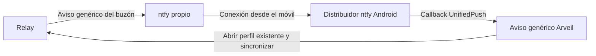

# Abrir adjuntos y recibir notificaciones

**Incremento en código del 30 de septiembre de 2026; aún sin publicar.**
Seguimiento en [issue 140](https://github.com/Ulzuhan/arveil/issues/140).
Dirección elegida para Android: entrega propia sin Google/FCM.

*English version: [../CLIENT_FILES_NOTIFICATIONS.md](../CLIENT_FILES_NOTIFICATIONS.md)*

## Abrir un archivo desde la conversación

Pulsa **Descargar y abrir** en un adjunto recibido o **Abrir** si ya está disponible.
Las imágenes PNG, JPEG y WebP se ven dentro de Arveil con zoom, también sin conexión.
**Guardar copia…** sigue siendo una exportación independiente; previsualizar no
añade archivos a Downloads ni a Fotos.

El visor recibe bytes autenticados mediante la API Rust `exportAttachment`, que
comprueba disponibilidad, descifrado e integridad. Aunque se llame así, devuelve
bytes y no escribe una copia exportada. El decodificador reconoce firmas del
contenido, controla y libera su imagen y evita la caché compartida de Flutter.
El archivo mantiene el límite de adjuntos; la imagen original admite como máximo
16.384 píxeles por lado y 64 millones en total. La visualización se reduce a un
máximo de 4.096 por lado y 4 millones en total. Solo se muestra el primer fotograma.
No se renderiza HTML/SVG como contenido web.

Los PDF y demás formatos usan por ahora **Abrir con…**, tras confirmar que otra
aplicación recibirá bytes descifrados. Android utiliza un `FileProvider` limitado
a `cache/attachment-open`, una URI de contenido y permiso temporal de lectura.
macOS abre un archivo temporal privado mediante `NSWorkspace`. Cada apertura
tiene un directorio aleatorio independiente. Las copias caducan a la hora y se
limpian cada 30 segundos mientras Arveil se ejecuta, o al siguiente arranque si
ya caducaron. Android revoca los permisos URI; Mac usa directorios/archivos
0700/0600 excluidos de las copias de seguridad. La aplicación externa puede
conservar copias propias; esta limpieza no las elimina ni garantiza borrado seguro.

El visor PDF interno queda para otro incremento: antes hay que revisar sus
temporales descifrados, límites de recursos y aislamiento.

## Notificaciones y segundo plano en macOS

**Ajustes → Notificaciones** ofrece dos opciones independientes, desactivadas
inicialmente:

- **Mostrar notificaciones en este Mac** solicita permiso de avisos/sonido al
  sistema. El aviso es genérico: no entrega al sistema nombres, contenido,
  nombres de archivo ni identificadores de conversación.
- **Mantener Arveil en segundo plano** mantiene el perfil desbloqueado y sincroniza
  cada diez segundos. Cerrar la ventana la oculta; el icono de la barra de menús
  permite abrir Arveil o salir. Cerrar el perfil retira ese menú y los avisos.

El mismo perfil Rust y coordinador de conversaciones controlan sincronización
y lecturas. El foco de la ventana, la pantalla visible y la posibilidad de
sincronizar son estados distintos: un mensaje oculto no se marca leído.
La conversación visible, la actividad propia, las consultas sin cambios y la
primera lectura del historial no generan avisos. Varias conversaciones nuevas
en una consulta se agrupan en un aviso genérico. Pulsarlo abre una conversación
conocida; si ya no se conoce el token, abre la bandeja.

Los comprobantes de presentación son hashes SHA-256 del par grupo/cursor,
limitados a 512 entradas en el llavero de inicio de sesión sin sincronización.
No contienen previsualizaciones ni marcas de lectura. Se guardan antes de
presentar: un cierre inesperado en ese intervalo puede perder el aviso, pero
no modifica los mensajes sin leer. La relación entre token y conversación solo
vive en memoria.

Salir de Arveil, cerrar el perfil o suspender el Mac detiene esta entrega local.
Concentración y los ajustes de macOS pueden silenciarla. Al volver se recupera
mediante sincronización normal. No entrega con el proceso terminado ni usa APNs.
Permisos con la aplicación empaquetada, menú/ventana, pulsación del aviso y
suspensión/reactivación requieren aceptación interactiva antes de prometerlos
en una versión publicada.

## Android: experimento con servidor propio



El Mac mini puede alojar ntfy junto al relay. Este incremento añade un receptor
Android experimental con el conector oficial UnifiedPush 3.0.10 y ntfy como
segunda aplicación. Instala la variante F-Droid de ntfy y configura tu propio
servidor HTTPS como predeterminado. Introduce la misma dirección base en
**Arveil → Ajustes → Notificaciones**, activa los avisos y concede el permiso
Android. El endpoint recibido debe pertenecer a ese servidor y ruta; se rechaza
ntfy.sh. HTTP local solo se admite en builds debug para pruebas desechables.

El alta, rotación y baja usan el ejecutor Rust del perfil abierto. Los cambios
sin conexión quedan pendientes y se reintentan al volver o cada 30 segundos
mientras la app está activa. Desactivar suprime los avisos locales inmediatamente,
aunque la baja remota siga pendiente. Una revisión evita que una respuesta antigua
confirme un endpoint nuevo. Abrir otra identidad elimina la suscripción local
anterior; no promete borrar su registro remoto con el perfil cerrado.

El receptor nativo cifra sus preferencias y endpoint con una clave independiente
del Keystore Android. No inicia Flutter, abre perfiles, descifra mensajes ni
modifica lecturas. Solo admite el marcador genérico exacto y agrupa avisos hasta
una sincronización correcta en primer plano. Si llega con Arveil visible y la
sincronización no termina, se muestra una vez al pasar a segundo plano. Volver
a cambiar de plano no repite un aviso ya mostrado o descartado.
Pulsar el aviso abre los chats tras
desbloquear. Puede avisar con el perfil cerrado: desactívalo antes si no lo deseas.
Una rotación recibida en segundo plano solicita abrir Arveil para completar el alta.

Se integra específicamente el marcador genérico en texto plano de ntfy mediante
la compatibilidad del conector. **No es un emisor WebPush/VAPID general**; la vía
moderna de payload cifrado de UnifiedPush queda aparte. Un hint no demuestra un
remitente ni una cantidad de mensajes. Tink se usa como biblioteca criptográfica
local; Arveil no añade FCM ni Google Play Services.

ntfy documenta que las suscripciones a servidores propios evitan Firebase y su
variante F-Droid lo excluye: [documentación Android/UnifiedPush](https://docs.ntfy.sh/subscribe/phone/).
El despliegue necesita HTTPS estable accesible desde datos móviles, sin clave
Firebase ni relay upstream, y los permisos de publicación/lectura de la
[configuración UnifiedPush](https://docs.ntfy.sh/config/#example-unifiedpush).
La configuración anónima de loopback de esta prueba no debe exponerse a Internet.
Los endpoints conceden acceso: deben quedar fuera de registros y protegerse la
lectura. El servidor y cualquier proxy TLS siguen viendo endpoints, IP y tiempos.

El relay permite registrar una URL por dispositivo y envía solo `arveil-hint/v1`
cuando el buzón pasa de vacío a ocupado. Prueba reproducible:

```sh
cd core && cargo build -p arveil-cli
cd ..
python3 scripts/test_ntfy_hints.py --ntfy /ruta/al/ntfy-con-servidor
# O redirige un ntfy remoto desechable a un puerto local:
python3 scripts/test_ntfy_hints.py --ntfy-url http://127.0.0.1:2586
```

La primera forma crea su configuración y comprueba también caída/reinicio.
La segunda no detiene ni reconfigura el servidor facilitado. Ambas compilan un
relay local nuevo, crean perfiles sintéticos y un topic aleatorio, verifican el
marcador fijo, agrupación, confirmación y baja, y eliminan sus datos locales.
Los diagnósticos de fallos quedan privados en `.local/ntfy-acceptance`, ignorado
por Git. El paquete oficial Darwin de ntfy solo trae el cliente; su código
ofrece `make cli-darwin-server` para este experimento. Verificado con v2.28.0.

### Trabajo pendiente para integrarlo y hacerlo fiable

- El aviso hace un intento de cinco segundos, sin reintentos. Si falla, el buzón
  pendiente no vuelve a avisar; la sincronización normal recupera los mensajes.
  Los errores HTTP también se contabilizan hoy como enviados. Cambiar reintentos
  y agrupación modifica la política temporal de [Fase 3](../PHASE3.md) y requiere diseño explícito.
- Antes de admitir endpoints generales, limitar destinos, direcciones resueltas,
  redirecciones y concurrencia, con excepciones intencionales del operador.
  Comprobar solo el esquema de la URL no limita las conexiones salientes.
- Verificar relay → distribuidor ntfy Android real → Arveil, incluyendo rotación,
  muerte del proceso y pulsación del aviso. La prueba instrumentada usa un
  distribuidor sintético desechable, no la app ntfy real.
- Probar pantalla apagada/Doze, ahorro de batería, Wi-Fi/datos, reinicio, muerte
  del proceso, retirada de Recientes y cierre forzado/reapertura en móvil físico.
  Medir demora y consumo. El servidor no evita las
  [restricciones Android](https://developer.android.com/training/monitoring-device-state/doze-standby).
- Integrar el receptor en Arveil podría eliminar la segunda app, pero exige un
  ciclo de servicio legítimo. `dataSync` no puede suponerse indefinido; véanse
  los [límites de servicios Android](https://developer.android.com/develop/background-work/services/fgs/timeout).

## Evidencia y límites

Pasan el análisis Flutter y 298 pruebas unitarias/de interfaz: límites del visor,
confirmación de apertura externa, rechazo de bytes no verificados, deduplicación,
permiso denegado y protección de lecturas ocultas. Compilan los clientes debug
Mac y Android. La aceptación nativa macOS con perfiles desechables comprueba
transferencia/reapertura cifrada, imágenes enviadas y recibidas sin conexión,
cancelación, nombres duplicados y exportación explícita.

ntfy v2.28.0 local pasó marcador/agrupación/baja, reinicio y recuperación tras
aviso perdido. ntfy Linux ARM64 desechable en el Mac mini también pasó
marcador/agrupación/baja mediante redirección SSH local autenticada; se retiraron
el servicio y sus datos al terminar. Ninguno usó Firebase ni proveedor upstream.
La prueba remota no comprobó caída/reinicio de su servidor.

El receptor Android pasa instrumentación nativa en emulador con el conector
oficial, Keystore y gestor de notificaciones: rechazo de token/marcador incorrecto,
rechazo de otro servidor, aviso genérico, agrupación y desactivación local. Una
prueba de regresión cubre un hint en primer plano seguido del paso a segundo plano
sin otro push, transiciones repetidas y descarte antes de sincronizar. Cinco
pruebas Dart cubren alta, carreras de rotación, baja sin conexión, sincronización
solo en primer plano y conservación del aviso tras fallar la sincronización.
Son pruebas separadas del transporte ntfy; no demuestran entrega en móvil físico.
La aceptación del perfil nativo Mac también pasó alta en el relay, entrega del
marcador exacto, rotación/baja y reapertura del perfil cifrado.

La aceptación nativa Mac por separado pasó ocultar y reabrir la ventana, abrir
un archivo real externo, permisos temporales 0700/0600 y limpieza al caducar.
Con el permiso de Arveil activado en Ajustes de macOS, también pasan la entrega
al centro de notificaciones y su retirada al cerrar el perfil. La prueba reabre
la ventana antes de cerrar el perfil para que retirar el último motivo para seguir
en segundo plano no termine el proceso de aceptación. Permisos empaquetados,
banner visible, pulsación, suspensión/reactivación y Android físico siguen pendientes antes de
publicar. Las pruebas de contactos quedan para la siguiente iteración.
