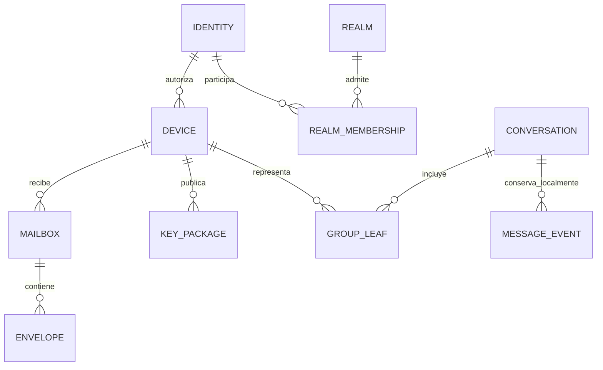

# Modelo de dominio

**Estado:** propuesta v0.4. Los tipos son conceptuales, no un esquema SQL ni un ABI congelados. [Protocolo](PROTOCOL.md) · [Arquitectura](ARCHITECTURE.md).

*English version: [../DOMAIN_MODEL.md](../DOMAIN_MODEL.md)*

## 1. Vocabulario y propiedad

| Entidad | Identificador y datos esenciales | Autoridad / lugar |
|---|---|---|
| Identity | `identity_id = hash(domain, version, root_public_key)`; root pública | Raíz generada por la persona; secreto en cliente/kit |
| Device | ID aleatorio, claves públicas separadas, estado | Identidad autoriza; cliente conserva secretos |
| DeviceCredential | Raíz, device ID, claves, uso, validez, firma raíz | Verificación cliente; copia pública en directorio |
| DeviceManifest | Raíz, versión, hash anterior, credenciales activas/revocadas, firma | Raíz; máximos conocidos en cada cliente |
| Realm | ID ligado a la clave de firma; clave Noise vigente; política operativa | Operador; no autentica personas |
| RealmEndpointList | Secuencia, clave Noise del realm, endpoints con tipo, prioridad y caducidad, firma del realm | Operador publica; cada cliente conserva su máximo conocido |
| RealmMembership | Realm, identidad, rol, estado y cuota | Servidor autoriza uso de recursos |
| Invite | Hash de token aleatorio, caducidad, usos restantes, rol permitido | Realm, consumo atómico |
| KeyPackageRecord | Referencia MLS, bytes estándar, dispositivo, expiry, estado | Cliente genera/firma; relay distribuye |
| Mailbox | ID aleatorio, dispositivo propietario, límites y generación | Receptor administra; servidor conoce propietario |
| DeliveryCapability | Secreto aleatorio, mailbox, alcance, expiry y generación | Receptor comparte; servidor verifica hash |
| Envelope | Mailbox, ID aleatorio local a esa entrega, ciphertext, expiración | Relay guarda bytes; cliente interpreta |
| Blob | ID aleatorio, ciphertext, tamaño almacenado, estado y TTL | Cliente cifra; relay conserva temporalmente |
| Conversation | ID local/app, grupo MLS, título, política, roster de personas/dispositivos | Solo clientes y mensajes E2EE |
| GroupState | ID MLS, epoch, transcript/context, leaf propia y secretos activos | Biblioteca MLS en almacenamiento cifrado |
| MessageEvent | ID aleatorio, autor dispositivo, tipo, cuerpo, referencias | Cliente; validado contra autenticación MLS |
| RouteBundle | Device ID, relay por clave de firma, mailbox, capability, clave exterior, versión, firma | Publicado por receptor dentro de intercambio autenticado; sin URLs, que provienen del `RealmEndpointList` |
| RecoveryKit | Raíz privada cifrada, metadatos mínimos de recuperación | Custodia del usuario; distinto del backup del servidor |
| HistoryArchive | Registros exportados y adjuntos optativos, versión y manifiesto | Archivo cifrado; sin estados MLS activos |

Los hashes de identidad tienen separación de dominio y representación exacta versionada. No usar concatenaciones ambiguas ni nombres de usuario como claves de seguridad. IDs y capabilities emplean CSPRNG; propuesta: 256 bits para capabilities y 128 bits o más para IDs no secretos. Conocer un ID no autoriza acceso.

## 2. Relaciones



El diagrama combina entidades locales y del servidor. `CONVERSATION`, `GROUP_LEAF` y `MESSAGE_EVENT` no son tablas del realm. Una misma persona puede pertenecer a varios realms con la misma identidad; eso facilita continuidad y permite correlación entre ellos. Se permite usar identidades distintas si el usuario desea separar contextos; no se fusionan automáticamente.

## 3. Ciclo de vida de claves

| Material | Uso y residencia | Rotación / pérdida |
|---|---|---|
| Raíz Ed25519 | Firma credenciales y manifiestos; guardada cifrada, desbloqueo explícito | Compromiso exige nueva raíz y reverificación; sin ella no hay continuidad fuerte |
| Clave de firma MLS por dispositivo | Leaf y mensajes MLS; solo core | Dispositivo nuevo obtiene clave nueva; no se clona |
| Clave Noise estática de dispositivo (X25519) | Iniciador del canal con el realm; prueba de posesión es el handshake | Rotable mediante credencial nueva firmada por la raíz; separada de firma MLS, HPKE exterior y raíz |
| Clave HPKE receptora exterior | Ocultar envoltorio/cabeceras por dispositivo | Rotar y conservar anterior solo durante ventana acotada de cola |
| Secretos de epochs y mensajes | Cifrado/descifrado MLS | Biblioteca evoluciona y elimina según política; no exportar para recuperar historial |
| Clave local de datos | Cifrar DB, índices y secretos persistidos | Envueltas mediante almacén del SO; migración transaccional al rotar |
| FileKey | Una clave aleatoria por archivo | Se distribuye dentro de MLS; no reutilizar entre archivos |
| Secreto del kit / secreto del archivo | Abrir recuperación de raíz / historial | Alta entropía, separados; perderlos impide abrir cada copia |
| Clave de firma del realm (Ed25519) | Identidad del servicio; firma listas de endpoints y clave Noise | Rotarla exige nuevo bootstrap de clientes; no cambia la raíz de usuarios |
| Clave Noise estática del realm (X25519) | Respondedor del canal | Se rota publicando lista nueva; la anterior se acepta durante una ventana acotada |
| Certificado TLS del endpoint | Atravesar proxies y middleboxes | Opcional; WebPKI o autofirmado; no participa en la seguridad del protocolo |
| Capabilities | Acceso limitado a mailbox/blob | Secreto revocable por alcance; guardado como hash donde sea verificable |

Una credencial de dispositivo vincula todas sus claves públicas con sus usos, el ID de dispositivo y la identidad. No reutilizar bytes de una clave Ed25519 como una clave X25519 de cifrado por conveniencia. El perfil de suites y codificaciones se fija en [PROTOCOL](PROTOCOL.md).

## 4. Esquema lógico del servidor

Tablas propuestas: `realm_memberships`, `invites`, `device_credentials`, `device_manifests`, `key_packages`, `mailboxes`, `capabilities`, `envelopes`, `blobs`, `push_subscriptions`, `endpoint_lists`, `schema_migrations`. No hay tabla de sesiones: la sesión es el canal Noise en memoria, y la autorización se resuelve contra `device_credentials` al completar el handshake. Ninguna tabla contiene conversaciones.

Restricciones esenciales:

- `envelopes` es única por `(mailbox_id, delivery_id)`, con hash del cuerpo para detectar reintento conflictivo. Nunca usar un ID común de mensaje para todos los destinatarios.
- ACK opera sobre IDs concretos y pertenencia al mailbox; no elimina indiscriminadamente todo lo anterior a un cursor del cliente.
- Un token de invitación tiene consumo y creación de membresía en una transacción.
- Los KeyPackages pasan por `available → consumed` de forma atómica al reclamarlos. Una respuesta perdida puede desperdiciar un paquete; no lo vuelve a poner en circulación. Un relay malicioso aún puede reproducirlo y los clientes deben detectarlo donde tengan estado.
- `mailboxes.owner_device_id` y cuota son datos visibles: opacidad del ID no significa anonimato del dueño.
- Capabilities de lectura, escritura y administración tienen alcances independientes. Hashes de secretos aleatorios de alta entropía, comparación segura, caducidad y revocación.
- Un envelope solo se confirma al remitente después de commit durable. El cuerpo no se modifica tras aceptación.
- Blobs completos son inmutables; `staging → committed → expired → deleted`. GC ignora cargas activas y coordina snapshots.
- Nada de cuerpos de mensaje, nombres de archivos originales, claves de recuperación, secretos MLS o claves locales.

El servidor puede guardar metadatos operativos mínimos, pero nunca se confía en ellos para autenticidad del contenido. El realm comprometido puede falsificar estados de consumo, expiry y ACK.

## 5. Estado local y atomicidad

La base cifrada contiene contactos y sus fingerprints verificados, máximos de manifiestos, grupos MLS, política, roster, eventos, outbox por destinatario, inbox/deduplicación, rutas y archivo local. Debe cubrir el almacenamiento del provider MLS, WAL, índices de búsqueda y temporales.

**Unidad de envío:** estado MLS posterior + evento local + bytes MLS producidos + intentos de entrega persistidos. Si el cifrado exterior ocurre después, parte de esos mismos bytes persistidos; jamás se vuelve a ejecutar el envío MLS desde un snapshot previo.

**Unidad de recepción:** marca de entrega procesada + cambio MLS + evento/recibo + trabajo pendiente. El ACK de transporte se emite después del commit. Los eventos de una epoch futura se pueden persistir como pendientes antes de ACK, pero no mostrarse como autenticados hasta poder validarlos.

No depender de que dos bases o dos conexiones autónomas hagan commit «casi a la vez». La prueba de viabilidad debe elegir un provider con transacción compartida o diseñar y revisar un journal durable con recuperación equivalente.

Los commits de control tienen estado persistente propio: `prepared → selected → merged → welcome_released`, con registro único de selección por epoch padre en el perfil del coordinador. No confundirlo con la outbox de mensajes de aplicación. Véase [preparación y aceptación](PROTOCOL.md#cambios-orden-y-particiones). La base local debe cumplir los [requisitos de durabilidad](adr/ADR-004-sqlite-single-binary.md#requisitos-verificados-de-durabilidad).

## 6. Estados y transiciones

### Entrega local, por destinatario

```text
draft → queued_local → sealed_durable → relay_accepted → device_received
                        │                  │                 └→ read (optativo)
                        ├→ retry_wait      └→ expired_or_unknown
                        └→ failed_action_required
```

`relay_accepted` procede del servidor y puede ser falso si es malicioso. `device_received` exige recibo E2EE de ese dispositivo. `read` solo se produce si se habilitan recibos y nunca demuestra atención humana. El agregado de un grupo muestra pendientes/parciales; no convierte el ACK de un dispositivo en recepción de todos. Un dispositivo eliminado deja de contarse para futuros mensajes, sin reescribir la evidencia de los anteriores.

Los borradores se pueden editar libremente; un evento ya sellado es inmutable. Editar un mensaje enviado, si se añade después de V1, será otro evento E2EE con autorización y referencia explícitas.

### Dispositivo

```text
created_local → root_authorized → realm_registered → group_joined
                       └→ revoked                  └→ removed_from_group
```

Son ejes relacionados, no un estado global único: un dispositivo puede estar registrado y no pertenecer a ningún grupo, o retirado del realm pero conservar viejos mensajes. `revoked` es terminal para esa credencial; recuperar genera nuevo ID y claves.

### Grupo

```text
creating → active → awaiting_commit → active
              ├→ needs_resync → fresh_rejoin
              └→ fork_suspected → paused → verified_new_group
```

No se fusionan forks de secretos MLS con reglas de «última escritura gana». El historial viejo puede permanecer legible mientras se suspende envío al grupo afectado.

## 7. Invariantes de dominio

1. La identidad no depende del nombre, hostname o membresía en el servidor.
2. Una firma válida acredita quién autorizó bytes; no implica frescura ni autorización de cualquier acción.
3. Cada leaf se vincula a un dispositivo autorizado; una persona puede ocupar varias leaves.
4. El servidor no añade dispositivos a un grupo por modificar su directorio.
5. Los clientes no retroceden versiones conocidas ni resucitan estados MLS desde backups.
6. Recuperar identidad, recuperar historial y reingresar en grupos son operaciones separadas.
7. Una eliminación local o un TTL no prometen borrado remoto de copias.
8. La UI deriva sus estados de hechos locales, aceptación de relay y recibos autenticados por separado.

Referencias y alcance de revisión: [README](README.md#referencias-y-trazabilidad).
