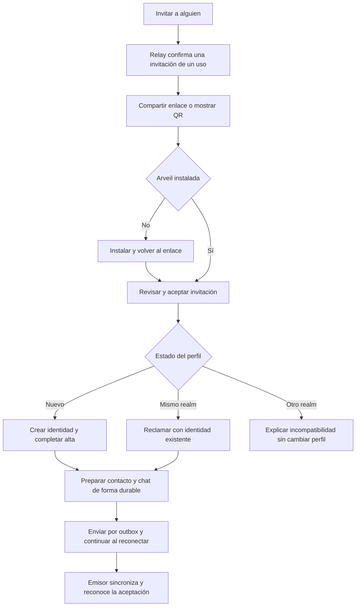

# Plan: una invitación, desde la instalación hasta la primera conversación

Fecha: 1 de octubre de 2026. **Prioridad actual de producto, dentro de M3b.2 y M3b.5. Estado: implementación preparada para revisión; aceptación de integración y publicación pendientes.**

[English summary](../INVITATION_ONBOARDING_PLAN.md). Este documento es la fuente normativa del plan y de sus criterios de aceptación. El [registro de implementación](INVITATIONS.md) cierra D1–D8, concreta el protocolo y enumera pruebas y límites. Los requisitos siguientes describen el hito completo; no afirman que toda la aceptación esté superada.

Base inspeccionada: `f5dfd190b97f13de694c91a7cf4b5257ca59cc26`, fuente de beta 5/build 26. La rama de preparación es `codex/invitation-onboarding`. La publicación de esa beta no significa que las PR de las que depende estén fusionadas. Al empezar la implementación se debe comprobar de nuevo la base y conservar las modificaciones ajenas.

## 1. Resultado que buscamos

Una persona que ya usa Arveil pulsa **Invitar a alguien**, comparte un enlace por el selector del sistema o muestra su QR. Otra persona, sin Arveil instalado, puede instalarlo, aceptar la invitación, crear su propia identidad, entrar en el relay y llegar a una conversación con quien la invitó. No introduce direcciones de servidor ni intercambia una segunda tarjeta de contacto.

El emisor puede cerrar su app después de emitir la invitación. El relay debe seguir accesible; la recepción final se realiza cuando el emisor vuelva a sincronizar. No se promete conexión simultánea, notificación instantánea, recepción con procesos forzados a cerrar ni disponibilidad indefinida.

El alta de una persona crea una identidad independiente. **Vincular un dispositivo** sigue siendo otro recorrido, reservado a dispositivos de una identidad existente. Aceptar una invitación no da acceso al historial, otros contactos, grupos o privilegios del emisor.

## 2. Base inspeccionada antes de la implementación

| Pieza | Situación comprobada | Consecuencia para el plan |
|---|---|---|
| Alta por enlace/QR | `arveil-relay invite` genera un token, enlace y QR; 24 h y un uso por defecto. `relay/cmd/arveil-relay/main.go` | Reutilizar el canje y mantener la CLI como vía de recuperación. La emisión desde la app falta. |
| Permisos del relay | `realm_memberships.role` se almacena, pero no autoriza una API administrativa. ADR-013 está propuesta | No basta mostrar un botón: hay que implantar autorización en el servidor. |
| Invitación y contacto | `Card::Join` solo tiene realm y token; `Card::Contact` tiene ruta, secreto y nombre opcional. `core/crates/arveil-app/src/links.rs` | Falta un formato combinado y su coordinación. |
| Alta reanudable | `onboarding.rs` conserva fases y hashes; `InviteRedeem` repite el resultado del mismo token/identidad/credencial | Reutilizar esta garantía. El token no se guarda hoy, por lo que no hay reanudación autónoma completa tras perder el enlace. |
| Enlace entrante | `clients/flutter/lib/src/incoming_links.dart` mantiene el enlace en memoria; `onboarding.dart` espera a tener perfil | Hay que conservar la intención cifrada una vez aceptada y permitir volver a abrir el enlace antes de ese punto. |
| Contactos | `requests.rs` valida la ruta contra la credencial y limita contactos al mismo realm; los desconocidos llegan como solicitud | Reutilizar validaciones; precisar cómo una invitación personal evita una segunda solicitud innecesaria. |
| Creación de chat | `start_with` guarda MLS, conversación y outbox en una unidad de trabajo; después publica | No existe un identificador durable de la invitación que permita reencontrar ese chat al repetir toda la operación. Añadirlo. |
| QR de contacto | Código presencial de 10 min; enlace de contacto de 30 días; secreto revocable | Ninguno es directamente el ciclo de vida adecuado de una invitación con instalación. |
| Historial de invitaciones | `Store.Sweep` borra invitaciones caducadas o agotadas; existen recibos de canje separados | Cambiar la retención para mostrar estados sin romper la idempotencia del alta. |
| Web | `/join` ya ofrece abrir/copiar e instalar; la guía todavía pide bootstrap y token separados | Actualizar ambas rutas y las instrucciones de Play. |
| Distribución | Beta 5 está en pruebas internas de Google Play; también hay APK y ZIP directos y cask | Acceso a la app y permiso del relay son dos controles distintos. |

Esta ampliación requiere actualizar [ADR-012](adr/ADR-012-qr-codes-and-links.md), el subconjunto de invitaciones de [ADR-013](adr/ADR-013-realm-administration-from-the-app.md), [Protocolo](PROTOCOL.md), [Modelo de dominio](DOMAIN_MODEL.md) y [Modelo de amenazas](THREAT_MODEL.md). No declarar implementada toda ADR-013 por entregar este hito.

## 3. Alcance y límites

Incluido: crear/listar/revocar invitaciones personales desde Mac y Android; compartir/copiar/mostrar QR; alta nueva y aceptación con identidad existente del mismo realm; contacto y conversación vinculados a la invitación; progreso reanudable; estados y errores claros; web de instalación; migración, despliegue y aceptación con dispositivo físico.

Fuera de este hito: federación o cambio automático de realm, directorio de usuarios, invitaciones públicas reutilizables, grupos automáticos, todo el panel de administración (expulsiones y cambios de roles desde la app), recuperación del historial, cámara en Mac, iOS, rediseño de notificaciones y sincronización general de contactos entre todos los dispositivos. Documentar las limitaciones multidispositivo sin atribuirlas a una invitación caducada.

Las pruebas pendientes de adjuntos, notificaciones y contactos de beta 5 siguen abiertas; este cambio de prioridad no las da por superadas.

## 4. Recorridos y pantallas

### 4.1 Emisor

1. Contactos y Nueva conversación ofrecen **Invitar a alguien**.
2. La app consulta si esta identidad puede invitar. Mientras consulta, no presenta el permiso como concedido. Sin conexión puede mostrar las invitaciones ya guardadas con fecha de última comprobación.
3. El emisor pulsa Crear. La app prepara y guarda los secretos en el perfil cifrado, solicita autorización al relay y solo muestra el enlace después de confirmar la emisión.
4. La ficha ofrece Compartir, Copiar enlace, Mostrar QR y Revocar. Muestra caducidad y uso único. Etiqueta opcional, por ejemplo «Invitación para Ana», solo local; no es un nombre autenticado del destinatario.
5. Al recibir una aceptación válida se abre el contacto y aparece actividad en la app. La notificación del sistema es opcional y no condiciona la aceptación.

Sin permiso: explicar «Este servidor no te permite invitar personas nuevas». Compartir una tarjeta de contacto con miembros existentes sigue disponible. No simular una solicitud al propietario mientras ese mecanismo no exista.

### 4.2 Destinatario a distancia

1. Abre el enlace recibido por el medio elegido por el emisor.
2. Si Arveil está instalada, se abre la invitación. Si no, la página explica instalación y regreso al mismo enlace.
3. Dentro de Arveil ve el propósito: crear su identidad, entrar al servidor indicado y añadir al emisor. Nombre del emisor como dato declarado; servidor y claves en detalles. Nada se canjea por abrir una página, generar una vista previa o escanear.
4. Confirma **Aceptar invitación**, elige nombre opcional y protege el perfil con el mecanismo de la plataforma. No se necesita una cuenta con correo/teléfono de Arveil.
5. La app completa el alta, prepara el contacto y abre la conversación. «Preparada» no equivale a entregada ni leída por el emisor.
6. Ofrece guardar el kit con la posibilidad de posponer y recordatorio visible. Notificaciones/ntfy se configuran después; no son requisito para llegar al chat.

### 4.3 En persona

El mismo enlace se muestra como QR. Desde una instalación nueva, **Escanear invitación** debe estar disponible sin introducir datos del relay. Desde la cámara externa se llega a la página de instalación; después se reabre el enlace o se escanea otra vez. Android ofrece cámara, permiso denegado y pegado; Mac muestra QR y recibe enlace/pegado.

Una invitación cuyo QR facilita instalar la app necesita margen de instalación. No reutilizar el secreto presencial de contacto que vence a los diez minutos. Mostrar un QR no altera ni renueva el vencimiento del enlace.

### 4.4 Casos existentes

| Estado del destinatario | Resultado |
|---|---|
| Perfil nuevo | Crear una sola identidad, admitirla y preparar una conversación. |
| Miembro del mismo realm | Usar su identidad; reclamar la invitación para esa identidad sin crear membresía ni elevar su rol. La invitación personal queda gastada. |
| Alta de esa invitación interrumpida | Ofrecer Continuar, recuperando el progreso durable. |
| Otra operación de alta activa | Mostrar el conflicto; no sustituir la identidad ni la invitación anterior. |
| Miembro de otro realm | Explicar que hoy ambos necesitan el mismo servidor. Conservar el perfil existente; no migrarlo ni crear otro silenciosamente. |
| Su propia invitación | Rechazarla de forma reconocible antes de iniciar un chat. |
| Contacto/chat ya asociado a esta operación | Abrir el existente. No deducir que cualquier grupo con esa persona es la conversación correcta. |



## 5. Decisiones iniciales y resolución

| ID | Propuesta inicial | Cierre necesario |
|---|---|---|
| D1 — Permiso | Solo `owner` emite en esta entrega. Los dispositivos activos de esa identidad pueden invitar; siempre a un `member`. | P0: matriz completa y tratamiento de roles legacy. Autorizar miembros/admins después requiere política explícita. |
| D2 — Propietario existente | Comando local del host que promueve la identidad existente, con identificador exacto y comprobación independiente en su app. | P0/P1: contrato operativo; no «primero que conecta», contraseña compartida ni autoascenso de roles antiguos. |
| D3 — Duración | Un uso, siete días como valor por defecto y máximo inicial; el relay fija el vencimiento absoluto. | P0: validar límites; los reintentos y Mostrar QR nunca amplían el plazo. |
| D4 — Contacto | Emitir la invitación personal expresa voluntad de conversar con quien la reclame; el receptor también confirma. Contacto no verificado por defecto. | P0/P4: vincular la aceptación a la identidad reclamante y al emisor MLS; desconocidos sin prueba siguen como solicitudes. |
| D5 — QR/verificación | El formato de invitación no marca a nadie verificado por haber entrado por la cámara. La verificación se ofrece después. | P0: distinguir cámara de lectura en persona; una cámara también puede leer una imagen reenviada. Mantener el comportamiento de las tarjetas de contacto existentes. |
| D6 — Versión del enlace | Nueva versión explícita del `join` combinado, conservando v1 para enlaces existentes. | P0: vector canónico, tamaño y rechazo claro por clientes antiguos; no añadir campos que v1 ignore y completar solo media operación. |
| D7 — Historial | Propuesta: 30 días de metadatos de invitaciones terminadas, con paginación; secretos borrados cuando ya no se necesitan. | P0/P1: separar esta limpieza de los recibos necesarios para reintentos; resolver entrega tardía antes de fijar el borrado. |
| D8 — Distribución | Regreso explícito al enlace tras instalar. APK directo o Play si la cuenta tiene acceso al canal. | P0/P6: no prometer continuidad automática ni enviar el secreto a Install Referrer, acortadores o servicios de atribución. |

D1–D8 quedan cerradas para esta candidata en [INVITATIONS.md](INVITATIONS.md). Se adopta `owner`, promoción local por ID, siete días/un uso, consentimiento sin verificación, join v2 compacto, retención de 37 días y regreso explícito al enlace. La tabla conserva los requisitos iniciales que motivan esas decisiones.

D1 es una reducción deliberada del panel propuesto en ADR-013. El propietario de un relay existente no debe necesitar crear otra identidad para disponer de este permiso. El dispositivo principal que conserva la raíz personal no es, por ese hecho, propietario del relay.

## 6. Contratos técnicos

La familia de API siguiente está implementada; el contrato exacto de campos, cuotas y recibos está en [INVITATIONS.md](INVITATIONS.md).

### 6.1 Relay: autorización, emisión y reclamación

- `InvitePolicyGet`: sesión de miembro activa; devuelve capacidad de invitar, hora del servidor y TTL. Un relay antiguo produce «El servidor necesita actualizarse», no un permiso implícito.
- `InviteCreate { request_key, token_hash, ttl }`: solo owner; el token aleatorio lo prepara Rust y el relay guarda su hash. Rol de destino fijo `member`, uso único. La respuesta incluye identificador completo de invitación y vencimiento fijado por el servidor. Persistir esos datos antes de abrir el selector de compartir; cancelar ese selector no revoca la invitación ni crea otra al volver a compartir.
- `InviteList { cursor, limit }`: únicamente invitaciones emitidas por esa identidad, con fechas, estado e identidad reclamante cuando proceda. Sin nombres, etiquetas locales, rutas ni secretos de contacto.
- `InviteRevoke { invitation_id }`: únicamente su emisor autorizado; identificador completo, nunca prefijos ambiguos. Idempotente. Se comunica al usuario si el canje ya ocurrió.
- `InviteAccept { token }`: miembro activo del mismo realm reclama para su identidad una invitación personal sin modificar su rol ni crear membresía. Hace falta para que el caso «ya tiene Arveil» no deje un permiso de alta reutilizable.
- Alta nueva: conservar `InviteRedeem` y su vínculo token/identidad/credencial; ampliar metadatos de emisión/canje sin cambiar el resultado de reintentos legacy.

La autorización se comprueba en cada acción contra membresía, rol y credencial actuales, también en una conexión ya abierta. Cambiar de dispositivo no otorga otro cupo. Propuesta inicial: 20 emisiones por identidad en 24 horas y 50 pendientes por realm, comprobadas dentro de la transacción. Especificar además límite de intentos por sesión/dirección para que peticiones rechazadas no agoten recursos.

Mismo `request_key` con mismo actor y parámetros devuelve la misma emisión y vencimiento; con otros parámetros, conflicto. Definir una retención acotada de esos recibos y un identificador de petición que no permita repetir una emisión ya limpiada como si fuera nueva. La unicidad de token_hash y la carrera canje/revocación se resuelven en una transacción. No devolver un token nuevo si se pierde la respuesta. Una invitación ya aceptada no se transforma en otra identidad al reintentarse desde otro dispositivo.

El comando del host para establecer el owner es una acción operativa explícita, registrada sin secretos. Dar de alta al owner nuevo mediante invitación y promover al usuario existente son casos diferentes. No ampliar esta entrega a expulsiones o cambios remotos de rol.

### 6.2 Datos y privacidad

Migraciones aditivas relay v4 → v5 y perfil v7 → v8. Las pruebas operan sobre datos desechables; no se han migrado bases de producción.

| Ubicación | Datos necesarios |
|---|---|
| Relay | Emisor, identificador de petición, hash del token, fechas, rol admitido, estado y vínculo de reclamación. Auditoría mínima de acciones y límites. |
| Perfil cifrado del emisor | Token hasta caducidad/revocación, secreto independiente de contacto, enlace exacto, etiqueta opcional, operación, estado confirmado y chat asociado. |
| Perfil cifrado del receptor | Invitación aceptada, token mientras sea necesario para reintentar, identidad/credencial, fases, ruta de contacto validada, identificador del chat y publicación pendiente. |
| Flutter | Proyección temporal del estado y texto visible. No segunda base durable, SharedPreferences ni almacenamiento de tokens en preferencias nativas. |
| Web | Página estática y fragmento en el navegador. Sin base de invitaciones, analítica ni solicitudes que contengan el fragmento. |

Guardar el token cifrado es un cambio respecto a la política actual «solo hash del alta». Actualizar su justificación, borrado y exclusión de backups; no esconderlo como detalle de UI. Después de consentir, persistir antes de cualquier petición que pueda gastar el token. Antes de abrir/proteger un perfil no habrá persistencia en claro: volver al enlace es el mecanismo de recuperación.

El relay conocerá quién emite y quién canjea; esto permite inferir una relación de invitación. No afirmar que esta API no añade metadatos. Los nombres, mensajes y secretos de contacto siguen fuera del relay. El canal por el que se comparte el enlace recibe el enlace completo; el fragmento evita enviarlo a la web por HTTP, no lo hace invisible a quien lo recibe o lo reenvía.

### 6.3 Formato y enlace

Una invitación combinada contiene versión, realm/endpoint, token de alta, vencimiento orientativo, ruta del emisor, secreto de contacto de un uso y nombre opcional. El servidor determina la validez real; el nombre no autentica al emisor. Antes de usar su ruta, comprobar credencial firmada por la raíz, manifiesto activo y KeyPackage vinculado, como los contactos actuales. Un fallo de esa validación tras el alta deja el contacto bloqueado sin deshacer la membresía ya creada.

Usar `https` y fragmento, con alternativa `arveil://` y pegado. Preservar la misma información al compartir y generar QR. Usar el endpoint público vigente para este recorrido, sin incluir rutas de administración ni exigir Tailscale al invitado. Los relays deliberadamente privados necesitan un modo explícito que explique esa restricción; no convertirlos automáticamente en públicos.

**Bloqueo de tamaño:** hoy el decodificador admite 600 bytes, la web comprueba hasta 1100 caracteres de fragmento y la entrada nativa tiene su propio límite. En P0 generar vectores con nombre UTF-8 y URL máximos; decidir codificación y límites coherentes en Rust, Go, Dart, web y QR. No subir límites sin prueba de lectura física. Si no cabe, reducir campos/codificación antes de recurrir a un servicio web que almacene secretos. No introducir ese servicio como solución implícita.

### 6.4 Reanudación y creación de conversación

Un coordinador en `arveil-app`, ejecutado con el lock del perfil, posee toda la operación. El puente expone snapshots y errores tipados; cerrar una pantalla no cancela un efecto ya confirmado.

```text
EMISOR: Prepared -> Issuing -> Active -> Claimed -> ContactEstablished
                      |          |
                      |          +-> RevokePending -> Revoked
                      +-> Retry              Active -> Expired

RECEPTOR: Preview -> ConsentedAndSaved -> Redeeming/Claiming
          -> Enrolled -> ContactValidated -> ConversationPrepared
          -> PublishPending -> Published
```

Los errores de red conservan la fase. Usada por otra identidad, revocada, caducada, permiso denegado, otro realm, versión incompatible y ruta inválida son resultados diferenciados. «Ya aceptada por esta identidad» continúa; no se trata como «usada por otra persona». Volver a abrir una invitación completada abre su conversación.

`ConversationPrepared` debe guardar en **la misma unidad de trabajo**: MLS, conversación, welcome/roster/hello en outbox y asociación `invitation_operation_id -> group_id`. Las fases anteriores guardan los KeyPackages reclamados antes de construir el grupo. Hay que resolver la ventana entre consumo del KeyPackage y pérdida de respuesta: P0 decidirá si añadir un claim idempotente acotado y ligado al reclamante/dispositivo o qué recuperación limitada cumple la aceptación. No reclamar repetidamente hasta agotar claves ni «solucionarlo» creando otro chat.

Tras un commit local, un fallo de publicación devuelve «Conversación preparada; envío pendiente». El reintento publica el mismo outbox. Recibir hello/roster duplicados o fuera de orden no crea otro contacto, no repite notificaciones ni evita las comprobaciones de identidad.

En el emisor, la aceptación automática solo aplica al secreto de invitación vigente y ligado a la identidad reclamante y al emisor del mensaje MLS validado. Si falta esa prueba, mantener solicitud pendiente. La mera afirmación del relay no verifica una identidad humana ni permite fabricar claves. Si la comprobación requiere una consulta y el relay está caído, conservar la solicitud hasta poder resolverla.

### 6.5 Caducidad, revocación y retrasos

- Caducar impide una primera aceptación, pero no debe invalidar un canje ya confirmado ni una entrega tardía legítima. Usar el recibo de canje, no la hora de llegada del hello, para decidir ese caso.
- Revocar antes del canje impide nuevos usos. Revocar después informa «Ya utilizada»; no expulsa a la persona, borra chats ni revoca su identidad.
- Offline, «Revocación pendiente» no se muestra como «Revocada». El secreto local se deshabilita inmediatamente para nuevas aceptaciones automáticas; cerrar el permiso de alta requiere confirmación del servidor. Si la respuesta demuestra que el canje válido ocurrió antes, resolver como «Ya utilizada» y conservar la prueba necesaria para completar ese contacto; no dejarlo bloqueado por una revocación que no llegó a realizarse.
- No prometer que revocar el enlace invalida la write capability de la ruta: hoy las tarjetas comparten la del mailbox. Los sobres no autorizados siguen como solicitudes o se rechazan según la política existente.
- No borrar pruebas locales de invitaciones completadas mientras puedan llegar mensajes legítimos retenidos. El relay tiene actualmente un máximo inicial de retención de sobres de 30 días y puede limitar una entrega; P0 debe fijar la relación entre ese plazo, recibos y limpieza local.
- Si la ruta del emisor se revoca, faltan KeyPackages o el relay no está disponible, la persona ya admitida conserva su identidad. Se muestra la fase de contacto pendiente y la acción concreta; no se le pide empezar otra alta.

### 6.6 Dispositivos vinculados

El rol pertenece a la identidad; la ruta y los secretos actuales de las tarjetas pertenecen al dispositivo emisor. No confundir ambas cosas.

Entrega mínima: crear y terminar el recorrido desde el mismo dispositivo emisor, pudiendo estar cerrado durante el canje. Otro dispositivo activo del owner puede consultar metadatos y revocar, pero no reconstruir un secreto que no posee. La UI debe distinguirlo y pedir crear una invitación nueva si se necesita compartir desde ese dispositivo.

Bloqueo que probar: emitir en Mac, canjear mientras está cerrado y abrir solo el Android vinculado del emisor. Si no hay propagación segura de esa operación, no mostrar la invitación como completada en el teléfono ni prometer chat allí. Extender la sincronización de invitaciones/contactos exige un diseño cifrado explícito; no enviar esos secretos al relay en claro. La prueba principal debe incluir después la reapertura del dispositivo que emitió.

## 7. Bloqueos y salida prevista

| ID | Bloqueo/riesgo | Cómo resolverlo y evidencia exigida | Fase que bloquea |
|---|---|---|---|
| B1 | La identidad actual no tiene un owner utilizable | Procedimiento local de promoción con identificador comprobado; prueba sobre copia desechable del relay y acceso desde la identidad original | P1, emisión real |
| B2 | ADR-013 presupone más administración de la necesaria | Cerrar D1 y documentar subconjunto; pruebas de denegación member/admin legacy/provisional y dispositivos revocados | P1 |
| B3 | Join combinado excede QR/límites o clientes viejos lo entienden a medias | Vectores de tamaño/versión, pruebas cámara con texto máximo y matriz de compatibilidad | P2, UI |
| B4 | Cierre pierde el token o el contacto pendiente | Persistencia cifrada y kill/reopen después de cada fase; borrado tras terminar sin impedir retries | P3 |
| B5 | Se pierde respuesta de canje o claim MLS | Idempotencia duradera, fallo inyectado antes/después del commit y reinicio de ambos procesos | P1/P3/P4 |
| B6 | Repetir genera dos chats o consume dos invitaciones | Identificador de operación y transacción conjunta; doble clic, enlaces repetidos y carreras | P3/P4 |
| B7 | Ya-miembro deja el token útil para otra persona | Claim autenticado que consume el mismo uso sin crear membresía; prueba de carrera con alta nueva | P1/P3 |
| B8 | Caducidad o limpieza borra pruebas antes de que el emisor vuelva | Definir plazos separados y recibos; aceptación después de vencer pero canjeada a tiempo | P1/P4 |
| B9 | Google Play impide instalar a quien recibe el enlace | Probar cuenta habilitada y no habilitada; explicar acceso al canal y ofrecer APK. Ampliar distribución es una decisión separada | P6/P8 por Play |
| B10 | App Links no abre la app firmada por Play | Verificar `assetlinks.json` con certificado de firma de Play, distinto del upload key y APK directo; fallback abrir/pegar | P6/P8 |
| B11 | Emisor cerrado sin claves disponibles o dispositivo perdido | Comprobar KeyPackages/ruta antes de compartir; estado de espera/reintento después; no prometer reparación del contacto ni historial al perder el emisor | P4/P8 |
| B12 | Una invitación reenviada se interpreta como persona verificada | Uso único ligado a identidad, nombre declarado, estado no verificado y pruebas de sustitución/competición | P2/P4 |
| B13 | Migración impide volver al binario anterior | Copia consistente y ensayo de restauración; rollback de datos y binario juntos, nunca downgrade sobre esquema nuevo | P1/P7 |
| B14 | Rutas públicas o datos privados se filtran a logs/docs | Payload en fragmento, redacción, diagnóstico sin secretos, higiene y fixtures sintéticos | Todas |
| B15 | Éxito en emulador no reproduce primera instalación real | Aceptación Android físico limpio + Mac empaquetado + persona nueva; evidencia fechada y versión exacta | Cierre P8 |

Un bloqueo debe registrarse con condición observada, alternativa, coste de alcance y prueba de salida. Resolver una fase independiente está permitido; omitir la garantía bloqueada y marcar el hito terminado, no.

## 8. Fases y entregables revisables

Orden: `P0 -> P1/P2 -> P3 -> P4 -> P5 -> P7 -> P8`; P6 puede prepararse tras P2 y se integra antes de P8. Esta notación expresa dependencias, no autorización para delegar trabajo ni publicar por adelantado.

| Fase | Entregable | Archivos/componentes principales | Salida |
|---|---|---|---|
| P0 — Cerrar contrato (M) | D1–D8, migraciones/retención, estados, vectores QR, claim MLS, comportamiento multidispositivo y matriz de errores | ADR-012/013, protocolo, dominio, amenazas, este plan | B1–B8 con solución escrita; formato y pruebas de fallo diseñados. No iniciar UI sobre contrato ambiguo. |
| P1 — Relay y owner (L) | Promoción operativa; política/create/list/revoke/accept; cuotas y auditoría; migración y limpieza | `relay/cmd/arveil-relay`, `relay/internal/store`, `relay/internal/server`, `relay/internal/channel`; codec Rust | Tests de autorización, carreras, migración desde v4, retry tras restart y compatibilidad legacy. |
| P2 — Formato combinado (M) | Encode/decode canónico, versión, QR, límites y errores | `arveil-app/src/links.rs`, `relay/internal/links`, vectores codec | Round trips y vectores cruzados; viejos rechazan v2 claramente; nuevo lee v1. |
| P3 — Coordinador durable (L) | Crear/aceptar/reanudar/revocar, snapshots; secretos cifrados y lifecycle | `arveil-core` esquema/persistencia; `arveil-app/src/onboarding.rs` y `lib.rs` | Kill/reopen y cancelación por fase; una identidad/mailbox/invitación. |
| P4 — Contacto y MLS (L) | Operación→chat, hello ligado, outbox, claims reanudables, aceptar sin nueva solicitud redundante | `arveil-app/src/requests.rs`, `start_with`, `arveil-core/src/card_store.rs` | Emisor offline; un contacto/chat; vencimiento tardío, duplicados y suplantación controlados. |
| P5 — Flutter y puente (M/L) | Entrada Invitar, lista/estado/QR/share/revoke, bienvenida contextual, retry accesible, EN/ES | `arveil-flutter/src/api/profile.rs`, bindings; onboarding/contactos, l10n y scanner Flutter | Widget tests y recorrido nativo; datos de servidor ocultos tras detalles; pairing sin regresión. |
| P6 — Web e instalación (M) | Página join, regreso tras instalar, Play/APK, compatibilidad certificados, guía EN/ES | Repo web: `arveil/join`, `assets/abrir.js`, guías y `assetlinks.json`; docs instalación | Sin secretos en peticiones/previews; Play y APK abren, fallback funciona, Lighthouse según normas web. |
| P7 — Integración y candidata (M) | Relay desechable actualizado + clientes firmados; CI, paquetes y procedimiento de despliegue | Scripts fase3/interop, tests Flutter/native, packaging y evidencia | Todas las capas compatibles; recuperación de backup ensayada; hashes y origen de binarios registrados. |
| P8 — Aceptación y despliegue (dependencia externa) | Persona nueva desde WhatsApp y QR; promoción de owner y despliegue real tras revisión | Guía operativa privada, PLATFORMS y CLIENT_FOUNDATION EN/ES | Primera conversación desde instalación limpia, sin terminal para invitados, con límites y resultados registrados. |

M/L son tamaño relativo de cambio, no fechas prometidas. P1, P3 y P4 concentran el riesgo. No hay una entrega útil completa que consista solo en añadir el botón y llamar a la CLI.

PR sugeridas: contrato; relay; formato; coordinador; contacto; interfaz; web/guías; aceptación/publicación. Reducir o combinar solo si cada diff sigue siendo revisable. Mantener cada capa con sus tests; una PR parcial no habilita el flujo de usuario antes de que sus dependencias estén desplegadas.

## 9. Matriz mínima de pruebas

| ID | Escenario | Resultado exigido |
|---|---|---|
| A01 | Usuario sin app, invitación desde WhatsApp, instalación y regreso | Una identidad y conversación; ningún campo manual de servidor. |
| A02 | Instalación limpia, QR desde el Mac | Scanner accesible al inicio, progreso visible, mismo resultado que enlace. |
| A03 | Permiso cámara denegado / Mac sin cámara | Pegado y abrir enlace completan el recorrido. |
| A04 | Emisor cierra antes del canje y vuelve después | Invitado puede darse de alta/preparar chat; emisor recibe al sincronizar sin generar otro enlace. |
| A05 | Pérdida de red/respuesta y kill después de cada commit | Reanuda la misma operación; cero duplicados y cero nuevos usos. |
| A06 | Doble clic, dos aperturas del enlace, dos clientes compiten | Uno gana; mismo cliente reanuda; otro ve «utilizada». |
| A07 | Caducada/revocada antes del canje; revocar compite con aceptar | Resultado atómico y explicable; nunca «revocada» si solo está pendiente offline. |
| A08 | Canje antes de caducar, hello recibido después | Aceptación legítima reconocida con recibo; no confiar en fecha declarada por el cliente. |
| A09 | Miembro mismo realm / otro realm / propia invitación | Sin identidad duplicada, cambio de rol o cambio silencioso de servidor. |
| A10 | Roles y sesión | Provisional/member/admin legacy sin permiso rechazados; owner activo aceptado; revocación de credencial en sesión abierta hace efecto. |
| A11 | Token/route/realm alterados, secreto copiado, hello de otra raíz | Validación falla o solicitud queda pendiente; nunca marca verificado ni acepta al atacante solo por nombre. |
| A12 | Falta de KeyPackages, respuesta claim perdida, ruta revocada | Espera/recuperación acotada; no vaciar el stock por retry ni perder el alta. |
| A13 | Migración, reloj adelantado/atrasado, limpieza y restart relay | Sin pérdida de perfiles/recibos ni extensión del TTL; rollback ensayado. |
| A14 | Cliente viejo/relay nuevo; nuevo/viejo; enlaces v1/v2 | Compatibilidad o mensaje actualizar, nunca éxito parcial silencioso. |
| A15 | Android Play y APK directo; Mac paquete release | Enlaces y perfiles funcionan con firmas reales; se conserva el perfil al actualizar dentro de su canal. |
| A16 | Auditoría de red, logs, errores y diagnósticos | Sin token, fragmento, write capability, nombres ni secretos de contacto en logs/URLs HTTP. |
| A17 | RTL no requerido; EN/ES, texto grande, lector y pantalla pequeña | Acciones legibles y estados anunciados; no depender solo de color ni QR. |
| A18 | Emisión Mac, retorno desde otro dispositivo vinculado | Resultado conforme a límite documentado; no afirmar sincronización ausente. |

Go: store/server/codec, carreras y fixture de esquema previo; Rust: parser, migración, executor, fases y MLS/outbox; interop Go–Rust con fallos inyectados; Flutter: rutas, estados y localización; nativo: share sheet, enlaces en arranque frío/caliente, cámara, cierre y permisos. Ejecutar análisis/formato, Clippy, `go vet`, suites afectadas, CI completo antes de candidata, build documental estricto e higiene. No repetir CI completo por cambios solo de redacción después de pasar los controles documentales.

## 10. Despliegue y reversión

1. Revisar dependencias de rama/PR y fijar commit. Actualizar protocolo y ambas guías antes de distribuir.
2. Ensayar en perfiles y relay desechables: migración, owner existente, invite nueva, clientes antiguos y restauración.
3. Preparar copia consistente de SQLite y datos necesarios con el procedimiento del operador; registrar binario, esquema, checksum y restauración. Copiar a ciegas solo el `.db` de un proceso con WAL activo no sirve.
4. Desplegar primero relay compatible y observar salud/protocolo; no habilitar invitaciones nuevas en UI hasta detectar soporte. La promoción del owner se hace una vez y no se incluye con identidad real en repositorios públicos.
5. Publicar web compatible antes de que los clientes empiecen a generar enlaces v2. Validar certificados Play/directo, fallback Mac y ausencia de secretos.
6. Probar candidata firmada en Android físico y Mac; después distribuir por Play/cask/feed usando versiones y secuencias nuevas, sin reutilizar build 26.
7. Si falla UI/web, pausar emisión nueva y mantener canje/progreso existente cuando sea seguro. Revertir el feed no baja binarios instalados: publicar build correctiva mayor.
8. Si falla migración/relay, seguir el ensayo de restauración de datos y binario. Explicar la pérdida de operaciones posteriores al backup; no restaurar silenciosamente una instantánea sobre nuevas altas.

Esta implementación no autoriza por sí sola un despliegue ni una promoción de identidades reales. Ninguna prueba requiere mandar mensajes a terceros sin una acción explícita del usuario.

## 11. Seguimiento y cierre

| Elemento | Estado actual |
|---|---|
| Prioridad y recorrido | Acordados; prioridad actual |
| D1–D8 | Cerradas para esta candidata; contrato exacto en INVITATIONS.md |
| P1–P5 | Implementadas y comprobadas automáticamente; faltan casos de aceptación completos |
| P6 | Páginas y guías EN/ES preparadas localmente; despliegue y firma real pendientes |
| P7 | Nueve escenarios Go↔Rust, 22 fallos de persistencia, backup/restauración compatible, reversión del relay con backup previo, dispositivo vinculado y aceptación nativa Mac/Android emulado correctos; falta candidata firmada |
| P8 | Pendiente: instalación limpia, dispositivo físico y despliegue |
| Owner real, servicios y publicación | No modificados por esta implementación |

Las etiquetas locales opcionales y el abandono de operaciones inciertas no están implementados. La app conserva el progreso para reanudar. La ruta perdida o revocada requiere recuperación explícita. Estos límites y la evidencia se detallan en [INVITATIONS.md](INVITATIONS.md).

Cerrar el hito solo con A01–A18 resueltos o con un cambio explícito de alcance documentado. La evidencia identifica build, commit, sistema, dispositivo y resultado; no incluye invitaciones reales ni capturas con secretos. Una prueba de transporte aislada no sustituye a una persona nueva que llegue a la conversación desde una instalación limpia.

Siguiente puerta de salida: revisión del cambio y cierre de los casos P7 pendientes, después candidata firmada y A01–A18 físicos que correspondan. B1 está resuelto en pruebas; la promoción real todavía requiere el paso operativo documentado. B3 tiene evidencia sintética, no lectura física. B5 tiene 22 fronteras de persistencia con salida abrupta del proceso, recibos remotos ya confirmados y reapertura; no se atribuye cobertura de todas las pérdidas de paquetes. B13 tiene restauración completa compatible y retorno del relay con el binario y backup anteriores, preservando el contador de endpoints; no se afirma downgrade de esquemas ni de perfiles.

## Referencias externas verificadas el 1 de octubre de 2026

- [Android App Links](https://developer.android.com/training/app-links/about): asociación con dominio/certificado y apertura de web cuando la app no está instalada. No sustituye el diseño del regreso después de instalar.
- [Pruebas de Google Play](https://support.google.com/googleplay/android-developer/answer/9845334?hl=es): acceso por testers y canales; aceptar una invitación del relay no concede acceso al canal de Play.
- [Invitación de SimpleX](https://simplex.chat/invitation/): referencia de experiencia enlace/QR e instalación. No se adopta su protocolo ni se atribuyen sus garantías a Arveil.
