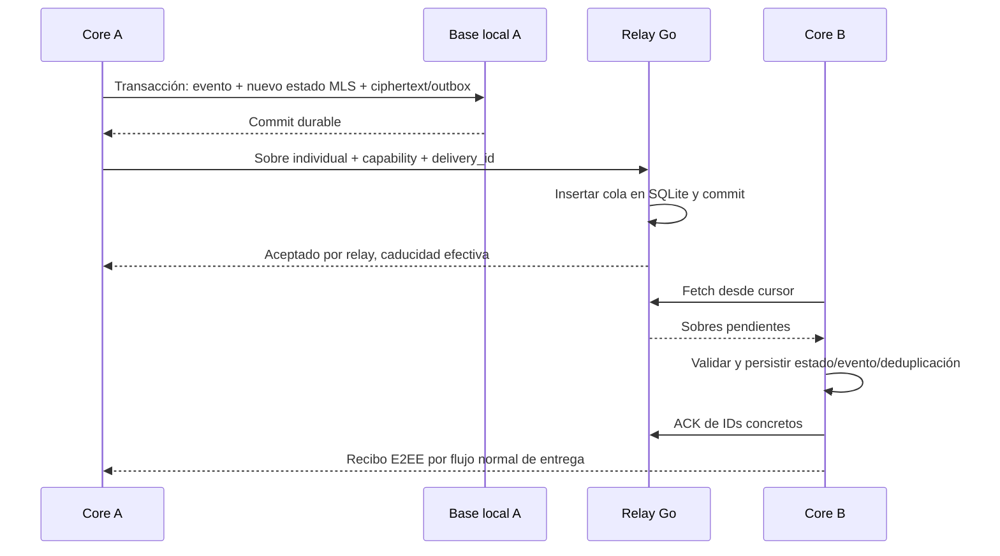

# Protocolo de aplicación y flujos

**Estado:** borrador de diseño v0.4. No constituye un protocolo listo para interoperabilidad o producción. [Modelo de dominio](DOMAIN_MODEL.md) · [Amenazas](THREAT_MODEL.md) · [ADR-008](adr/ADR-008-carrier-independent-transport.md).

*English version: [../PROTOCOL.md](../PROTOCOL.md)*

## 1. Capas y responsabilidades

```text
Evento de aplicación
  → MLS (conversación/grupo, autenticación de dispositivo)
  → sobre HPKE independiente para cada dispositivo receptor
  → frame CBOR versionado dentro del canal Noise dispositivo↔realm
  → WebSocket sobre el carrier disponible: LAN, tailnet, túnel, Internet
  → TLS opcional con validación WebPKI; no aporta seguridad al protocolo
```

El canal Noise autentica mutuamente dispositivo y realm y protege frames, identificadores y credenciales de la API frente a cualquier intermediario del carrier, incluidos túneles y CDNs que terminan TLS. MLS protege contenido y membresía criptográfica. HPKE exterior oculta al relay cabeceras MLS y bytes comunes entre destinatarios; no autentica por sí mismo a la persona remitente ni proporciona anonimato. El protocolo de identidad autentica las claves que consume MLS, las claves exteriores y la clave estática Noise de cada dispositivo. TLS solo facilita atravesar proxies y middleboxes; ningún requisito de seguridad depende de dónde termine. Perfil del canal en [ADR-008](adr/ADR-008-carrier-independent-transport.md#perfil-técnico-del-canal).

MLS usa su codificación definida por el estándar. Los objetos propios firmados emplearán un perfil CBOR determinista estricto: claves, tipos, límites, enteros y representación de bytes definidos, sin claves duplicadas. Firma sobre contexto de protocolo + versión + bytes canónicos. Los parsers rechazan representaciones alternativas; no firmar JSON reserializado ni asumir que cualquier Protobuf es canónico.

Perfil criptográfico candidato: MLS `MLS_128_DHKEMX25519_AES128GCM_SHA256_Ed25519`, suite obligatoria de MLS 1.0 y declarada por OpenMLS ([RFC 9420, sección 17.1](https://www.rfc-editor.org/rfc/rfc9420#section-17.1)); identidad Ed25519; HPKE X25519/HKDF-SHA256/AES-128-GCM mediante biblioteca compatible con RFC 9180. No se implementan primitivas ni variantes propias. La selección exacta debe quedar validada con vectores, dependencias y revisión antes de congelar v1. No se anuncia seguridad postcuántica.

## 2. Versionado y objetos

Todo framing lleva `protocol_version`; las capacidades requeridas son autenticadas dentro de objetos firmados o E2EE. Una versión mayor desconocida o una capacidad obligatoria ausente devuelve incompatibilidad. No existe negociación hacia plaintext. Se establecen longitudes máximas antes de reservar memoria o interpretar CBOR/MLS.

```text
DeviceCredential {
  version, identity_root_public_key, device_id,
  mls_signature_public_key, transport_noise_public_key,
  envelope_hpke_public_key, validity, allowed_uses,
  root_signature
}

RealmEndpointList {               # firmado por la clave de firma del realm
  version, realm_id, sequence, realm_noise_public_key,
  previous_noise_public_key_valid_until,
  endpoints[{ kind: lan | tailnet | public | admin,
              url, priority, valid_until }],
  realm_signature
}

DeviceManifest {
  version, identity_id, manifest_sequence, previous_manifest_hash,
  active_credential_hashes, revoked_credential_hashes,
  root_signature
}

DeliveryRequest {                 # visible al relay
  protocol_version, mailbox_id, delivery_id,
  requested_expiry, hpke_enc, ciphertext
}

InnerPayload {                    # dentro de HPKE
  version, kind, payload_bytes, padding
}

ApplicationEvent {                # dentro de MLS
  version, event_id, conversation_id,
  event_kind, author_device_id, client_created_at,
  body, optional_references
}
```

`hpke_enc` es la salida de encapsulación de la biblioteca, no una clave privada. `transport_noise_public_key` es una clave X25519 estática propia, no derivada de la clave de firma. La capability de escritura viaja como campo de frame dentro del canal Noise, nunca en URL, cabeceras HTTP, cookies ni logs. El contexto HPKE vincula versión, realm, mailbox y delivery ID como información autenticada; el perfil exacto de codificación debe fijarse. Una vez preparado el sobre, los campos autenticados no se modifican en un reintento. El servidor puede aplicar una caducidad efectiva menor y declararla en su respuesta.

`kind` puede indicar MLS, vinculación de dispositivos o transferencia de historial, pero no se expone en el framing exterior. La identidad declarada en un evento DEBE coincidir con la leaf autenticada por MLS; no se confía en `author_device_id` por sí solo. `client_created_at` es informativo: no prueba el orden ni evita replay.

El texto, título de grupo, roster, descriptores de archivos y recibos quedan dentro de la protección E2EE. Los IDs de evento se usan para deduplicación local; no se copian al ID exterior común de todos los destinatarios.

## 3. Bootstrap del realm e identidad

1. El operador inicializa la clave de firma del realm, su clave estática Noise y una credencial administrativa independiente. Publica un `RealmEndpointList` inicial. Crea una invitación de un uso con caducidad y rol mínimo.
2. El QR incorpora versión, hash de la clave de firma del realm, `RealmEndpointList` inicial o su hash, un endpoint de arranque y el secreto de invitación. Se entrega por un canal confiable; una firma del mismo servidor no vuelve confiable un QR sustituido.
3. El cliente abre un canal Noise contra el endpoint de arranque. El handshake solo prospera si la clave estática del realm coincide con la certificada por la clave de firma cuyo hash trae el QR. Durante el bootstrap el dispositivo usa una clave Noise recién generada que después se incluirá en su credencial. TLS, si existe, se valida con WebPKI ordinario y no sustituye este paso.
4. El cliente crea raíz e identidad local o usa una ya existente. Genera claves nuevas de dispositivo y firma su credencial/manifiesto desbloqueando la raíz.
5. Consume la invitación y registra los materiales públicos. La prueba de posesión de la clave Noise es el propio handshake; la de las demás claves se aporta por firma dentro del frame. Token consumido y membresía nueva se confirman atómicamente.
6. Guarda el realm, su clave de firma y la lista de endpoints; prepara el kit y publica KeyPackages/rutas según permisos. La membresía no verifica aún a ningún contacto.

La sesión de transporte coincide con la vida del canal Noise: no hay tokens de sesión reutilizables. El realm autoriza la conexión al asociar la clave estática del iniciador con una credencial activa de un miembro; una credencial revocada cierra el canal. Nunca se usa una firma genérica de bytes controlados por el servidor con la raíz personal.

**Estados de sesión implementados (M0.3).** El relay clasifica un canal por la clave estática Noise del iniciador: una clave desconocida abre una sesión *provisional* que solo puede enviar `invite_redeem`, `endpoint_list_get` y `ping`; una clave ligada a una credencial activa abre una sesión *miembro*; una credencial revocada o caducada se rechaza antes del mensaje 2. `invite_redeem` lleva el token de invitación, la credencial firmada y el primer manifiesto (secuencia 1, que lista esa credencial); el relay verifica la firma de la raíz, comprueba que `transport_noise_public_key` de la credencial coincide con la clave estática de la sesión, y consume la invitación, crea la membresía y guarda credencial y manifiesto en una sola transacción.

**Entrega implementada (M0.4).** `mailbox_create` devuelve un identificador de mailbox aleatorio de 16 bytes con una capability de lectura y otra de escritura de 32 bytes; el relay guarda solo hashes SHA-256 de las capabilities. `envelope_put` lleva mailbox, capability de escritura, identificador de entrega (1–32 bytes, elegido por el remitente), caducidad solicitada, `hpke_enc` y ciphertext; un reintento con bytes idénticos es idempotente, un cuerpo distinto bajo el mismo identificador es conflicto (409), los sobres por encima de 256 KiB más cabeceras se rechazan (413) y una mailbox admite como máximo 1 000 sobres en cola (429). `envelope_fetch` pagina por una secuencia opaca creciente; `envelope_ack` borra los sobres nombrados. El sobre exterior es HPKE en modo base con `info = "arveil/envelope/v1"` y AAD `{version, realm_id, mailbox_id, delivery_id}` en CBOR determinista; la carga interior se rellena hasta buckets de 256 B, 1 KiB, 4 KiB, 16 KiB, 64 KiB y 256 KiB.

**Adjuntos implementados (M1.5).** `blob_upload_begin { size }` devuelve un identificador de blob aleatorio de 16 bytes y una capability de lectura de 32 bytes; `blob_chunk` añade trozos contiguos de hasta 60 KiB a un fichero de staging; `blob_commit { ciphertext_hash, requested_expiry }` verifica tamaño y SHA-256, hace fsync, renombra al directorio final y marca la fila como confirmada (TTL por defecto 30 días, cuota por miembro 200 MiB, ficheros de hasta 25 MiB); `blob_fetch` lee rangos con la capability y responde 410 una vez caducado. Un reconciliador elimina ficheros sin fila confirmada. El cliente cifra el fichero completo con AES-256-GCM bajo una FileKey y un nonce aleatorios con `aad = "arveil/file/v1"`, y envía `FileDescriptor { version, blob_id, read_capability, file_key, nonce, ciphertext_hash, size, name, mime }` como evento `file` dentro de MLS. Los receptores verifican el hash y la etiqueta AEAD antes de escribir bajo un nombre base saneado.

### Endpoints y carriers

**Formatos implementados (M0.2).** La lista firmada viaja como `SignedObject { context: tstr, body: bstr, signature: bstr(64) }`, con `signature = Ed25519(u16be(len(context)) || context || body)`, `context = "arveil/endpoint-list/v1"` y `body` la codificación CBOR determinista de `RealmEndpointList` (campos `version`, `realm_id`, `sequence`, `realm_noise_public_key`, `endpoints[{kind, url, priority}]`). `realm_id = SHA-256("arveil/realm-id/v1" || clave pública de firma del realm)`. La cadena de bootstrap de la fase 0, precursora del QR, es `arveil-bootstrap:v0:<realm_id>:<signing_pub>:<noise_pub>:<url>` en hexadecimal. Los frames son `{ id, payload }` en CBOR con el payload etiquetado externamente por nombre de variante; los fragmentos llevan una cabecera de un byte (bit 0 = último) dentro de mensajes Noise de 65 535 bytes como máximo.

Un realm es alcanzable por varias vías a la vez. El cliente conserva el `RealmEndpointList` de mayor `sequence` conocido, rechaza retrocesos y firmas inválidas, y solicita la lista vigente al abrir cualquier canal. Ordena los endpoints por `priority`, normalmente LAN, después tailnet, después público, y cambia de uno a otro cuando falla la conexión o el handshake; un endpoint equivocado u hostil no compromete nada, porque solo produce un handshake fallido. Los frames administrativos se aceptan únicamente en endpoints de tipo `admin`.

El carrier no forma parte del contrato: LAN directa, tailnet de Tailscale, puertos expuestos, Tailscale Funnel, Cloudflare Tunnel o un VPS con passthrough TCP transportan los mismos frames. Un intermediario que termina TLS observa IP, tiempos, tamaños y número de conexiones; no observa frames, identificadores ni credenciales. La comparación por carrier está en [ADR-008](adr/ADR-008-carrier-independent-transport.md#qué-ve-cada-intermediario-con-este-diseño). Con varios relays independientes, cada relay tiene su propia lista; véase [ADR-007](adr/ADR-007-optional-realm-redundancy.md).

## 4. Verificación de contactos y rutas

El primer contacto intercambia raíz/fingerprint por QR o canal externo fiable. Un contacto obtenido solo del directorio permanece «sin verificar». Cambiar de raíz exige advertencia y reverificación; mantener el mismo nombre no conserva confianza.

El cliente verifica credencial raíz, manifiesto vigente respecto a su máximo conocido, prueba de posesión, validez y vínculos de claves. Una secuencia inferior se rechaza; dos manifiestos distintos con la misma secuencia constituyen conflicto. Una cadena firmada no garantiza que sea la última si un servidor oculta actualizaciones. Los clientes comparten hashes/máximos conocidos por canales autenticados para detectar inconsistencias, sin prometer detección bajo aislamiento total.

Un `RouteBundle` firmado por el dispositivo vincula su clave HPKE, el realm o relay de destino identificado por su clave de firma, mailbox, capability y generación. No incluye URLs: el remitente las obtiene del `RealmEndpointList` de ese relay. Se intercambia por canal verificado o E2EE; no hay libreta pública por defecto. Distribuir una capability autoriza transporte, no la incorporación a conversaciones. V1 exige además que las entregas se publiquen por el canal Noise de un dispositivo miembro del relay: esto simplifica cuotas y hace visible al relay la identidad del solicitante. Un perfil anónimo de entrega requerirá otro ADR.

**Verificación implementada (M3.2).** El número de seguridad entre dos identidades son ocho grupos de cinco dígitos de `SHA-256("arveil/safety-number/v1" || min(raíz_a, raíz_b) || max(raíz_a, raíz_b))`, de modo que ambas partes leen lo mismo en el mismo orden. Cubre identidades, no dispositivos: añadir o sustituir un dispositivo no lo cambia, y sustituir una identidad sí. Verificar fija la clave raíz de esa identidad donde se guardan las rutas, así que una ruta posterior que nombre otra raíz para ella se rechaza, tanto si llegó en un evento de roster como si se pegó a mano.

## 5. Grupos MLS, KeyPackages y autorización

Cada dispositivo genera sus propios KeyPackages estándar y conserva el material privado correspondiente en almacenamiento cifrado. Se publican en lote acotado y se reclaman una vez por una operación atómica del relay. Ante timeout se usa otro paquete; no se reutiliza uno dudoso. Un servidor malicioso puede repetir o agotar paquetes: la biblioteca, el estado local y los límites deben manejarlo sin confiar en la bandera `consumed` del relay.

La identidad se transporta en una credencial MLS con binding explícito a la credencial de dispositivo. El cliente comprueba que la clave de firma del KeyPackage y la leaf coinciden con la autorización raíz. Usar una `BasicCredential` con un nombre arbitrario no satisface esa validación. El formato exacto del binding es un entregable del spike.

### Creación y alta

1. El creador verifica identidades y dispositivos iniciales, obtiene KeyPackages y crea grupo con ID aleatorio y política autenticada.
2. El dispositivo creador se designa coordinador de commits en el contexto autenticado del grupo. Política inicial: altas/bajas y cambios requieren su aprobación; no se permite alta silenciosa por el directorio.
3. Prepara Add/Commit y Welcome mediante la biblioteca, sin activar todavía el estado nuevo. Resuelve y persiste la aceptación según el procedimiento siguiente. Solo entonces libera Welcome; distribuye cada pieza dentro de sobres HPKE individuales.
4. El receptor valida identidad del invitador y miembros, credenciales, política y material MLS antes de aceptar. El roster se presenta al usuario.
5. Las rutas se distribuyen dentro de eventos autenticados del grupo. Un nuevo dispositivo no descifra mensajes de epochs anteriores por entrar; el historial es otro flujo.

La política y la identidad del coordinador deben quedar ligadas al estado autenticado MLS, por ejemplo mediante una extensión obligatoria de GroupContext soportada y validada por todos los clientes. La API de la biblioteca debe permitir inspeccionar un commit y sus efectos antes de hacerlo durable. Si no permite imponer esa política de forma segura, se bloquea la adopción y se revisa el diseño; no se finge que MLS la impone automáticamente.

### Cambios, orden y particiones

El perfil de prototipo permite un coordinador único por grupo para serializar commits; todavía debe validarse su idoneidad para V1. El resto envía propuestas/solicitudes autenticadas. Las operaciones de actualización propias se tramitan mediante las operaciones MLS apropiadas y el coordinador; no se acepta que cualquier miembro produzca commits arbitrarios.

**Regla de committer implementada (M2.4).** El coordinador fijo se sustituye por un sucesor determinista, que resuelve la [revisión v0.3 §3.1](REVIEW-v0.3.md#31-coordinador-único-de-commits). La extensión `GroupPolicy` del GroupContext (tipo `0xF000`, versión 2) guarda la hoja del creador a título informativo; la regla que aplica cada miembro es que el committer autorizado es la **hoja más baja que no se sabe revocada**. Un dispositivo solo puede desplazar a las hojas por debajo de la suya retirándolas en el mismo commit, y solo cuando cada una fue revocada por un manifiesto que ese miembro verificó bajo la raíz de esa identidad. No hay elección ni secuenciación en el relay: perder al creador del grupo ya no obliga a recrearlo. Un miembro que aún no ha visto el manifiesto revocador rechaza el commit del sucesor y lo reintenta tras su siguiente refresco de manifiestos, en vez de fiarse de lo que el propio commit afirme.

**Preparación y aceptación:** generar un Commit no equivale a aceptarlo ni autoriza enviar su Welcome. Persistir el candidato pendiente, seleccionar el commit canónico por epoch y fusionar después; liberar Welcome solo cuando la aceptación esté establecida. Esto es distinto del avance del ratchet al cifrar mensajes de aplicación. [RFC 9420, sección 14](https://www.rfc-editor.org/rfc/rfc9420#section-14).

En nuestro prototipo, el coordinador conserva una selección durable e irrevocable por `(group_id, parent_epoch)` bajo exclusión local y sin clones de su estado. Preparar candidato, registrar selección y activar estado son pasos recuperables; una caída reanuda esa misma selección. La aceptación del relay solo certifica almacenamiento, no validez MLS. Si no puede demostrarse selección única o aparece conflicto, se pausa; no se elige otra rama después de usar sus claves. La atomicidad específica depende del provider y debe probarse.

Se conserva un registro local acotado de commits y checkpoints autenticados para dispositivos offline. El servidor no los identifica como control de grupo. Las aplicaciones se ordenan por estado de MLS y secuencia local de recepción; no se ofrece un orden total global de mensajes ni resolución de estado tipo Matrix.

Un commit repetido válido se deduplica. Un mensaje de epoch futuro se mantiene pendiente de forma acotada hasta obtener los commits faltantes. Si faltan definitivamente, se requiere reingreso con claves nuevas; jamás saltar epochs inventando estado. Los mensajes de epochs antiguos solo se aceptan dentro de la ventana explícita de secretos retenidos y según la política de revocación.

Dos commits incompatibles para el mismo padre disparan `fork_suspected`: detener envíos, conservar evidencia y verificar con participantes. El coordinador no puede deshacer un commit ya usado para enviar mensajes haciendo rollback local. La pérdida del coordinador deja enviar aplicaciones en un estado válido, pero bloquea cambios de membresía; la recuperación del perfil inicial consiste en crear un grupo nuevo con participantes reverificados y mantener el anterior como archivo. No hay elección automática. Esta limitación debe ser visible en UI.

**Retirada del coordinador:** MLS exige que un miembro restante retire a quien abandona. Como el perfil restringe quién puede hacer commits, no resuelve la baja del propio coordinador dentro del mismo grupo. La decisión conservadora del prototipo es crear un grupo nuevo sin ese dispositivo, reverificar participantes y archivar el anterior; un coordinador revocado nunca autoriza su propia recuperación. Un traspaso de rol cooperativo requiere diseño y pruebas separados. [RFC 9750, sección 6.1](https://www.rfc-editor.org/rfc/rfc9750#section-6.1).

**Reingreso:** V1 no acepta external commits ni reingresos automáticos usando únicamente GroupInfo entregado por el relay. Se usa Add/Welcome autorizado o grupo nuevo verificado. El RFC advierte del riesgo de recuperar contra estado obsoleto del servidor; esa operación podría reintroducir miembros comprometidos. [RFC 9750, sección 5.3](https://www.rfc-editor.org/rfc/rfc9750#section-5.3).

## 6. Entrega durable y reintentos



El fan-out incluye los otros dispositivos de la persona remitente, además de los dispositivos de los demás miembros. El dispositivo emisor conserva su propio evento desde la transacción de envío; no intenta descifrar su propio mensaje MLS como si fuera otro receptor. Las rutas y el roster usados pertenecen al estado autenticado conocido, y una ruta ausente queda como entrega pendiente visible.

La semántica de transporte es **al menos una vez**. El resultado visible debe ser idempotente gracias a persistencia y deduplicación. No se promete exactly-once distribuido.

- Un retry de `(mailbox_id, delivery_id)` con los mismos bytes devuelve la aceptación existente; con cuerpo distinto da conflicto.
- Los reintentos de red reutilizan el sobre persistido. Si hay que recifrar para un nuevo epoch tras una recuperación explícita, se crea un nuevo evento que referencia al anterior y mantiene visible el posible resultado incierto.
- El ACK de mailbox solo significa que el receptor asumió custodia durable. Un sobre futuro puede estar persistido pendiente, sin mensaje mostrado. La UI no lo equipara con lectura.
- El realm envía un frame `mailbox_wakeup` por el canal para anunciar disponibilidad; fetch y cursor durable permiten recuperar avisos perdidos. Un cursor no es una prueba de orden del grupo.
- No se reenvía contenido eliminado por el usuario sin una política explícita. TTL y falta de ACK dejan un estado expirado/desconocido, no «entregado».

### Catálogo de frames del canal

Todas las operaciones son frames CBOR con `frame_id` dentro del canal Noise; el realm responde con un frame de resultado correlacionado. No existen rutas HTTP: la única URL es la del WebSocket de cada endpoint. Los mensajes Noise tienen un máximo de 65 535 bytes; los frames mayores, como sobres y trozos de blob, se fragmentan con un límite acotado de reensamblado.

| Frame | Autorización | Resultado/invariante |
|---|---|---|
| `invite_redeem` | Invitación + firmas de posesión | Consumo único y alta atómica |
| `endpoint_list_get` | Canal establecido | Lista firmada vigente; el cliente valida secuencia y firma |
| `device_credential_put` | Canal + firma raíz | Nunca reemplaza otra raíz ni resucita credencial retirada |
| `manifest_put` | Canal + firma raíz | Secuencia creciente en servidor honesto; validación final cliente |
| `key_packages_publish` | Canal del dispositivo | Lote acotado asociado a ese dispositivo |
| `key_packages_claim` | Miembro autorizado | Consumo atómico; paquete aún no equivale a identidad confiable |
| `mailbox_create` | Canal del dispositivo | Mailbox y capabilities separadas |
| `envelope_put` | Canal + capability de escritura | Commit durable, idempotencia y cuota |
| `envelope_fetch` | Propietario + capability de lectura | Página acotada, cursor opaco |
| `envelope_ack` | Propietario + capability de lectura | ACK idempotente sobre IDs concretos |
| `blob_upload_begin` / `blob_chunk` / `blob_commit` | Canal + cuota | Carga staging fragmentada con límites y confirmación explícita |
| `blob_fetch` | Capability de lectura de blob | Bytes cifrados de objeto completo, fragmentados |
| `mailbox_wakeup` (servidor → cliente) | Canal del receptor | Aviso de actividad, no fuente de verdad |
| `admin_*` | Endpoint `admin` + credencial administrativa | Rechazado en cualquier otro endpoint |

Faltan por congelar los frames de rotación/revocación, manifiestos completos y cierre ordenado del canal. Se describen sus obligaciones, no una API implementada. Errores esperados: versión no soportada, no autorizado, conflicto de idempotencia, cuota, expiración y reintento por saturación; sin incluir capabilities o ciphertext en el texto de error.

## 7. Adjuntos

El cliente genera una FileKey aleatoria por archivo. V1 propone cifrado AEAD del archivo completo mediante biblioteca revisada y límite de 25 MiB; chunking/resume criptográfico se aplaza. No se improvisan nonces por índice de chunk. Si se adopta un formato streaming, requerirá especificación y revisión separadas.

Tras cifrar, sube bytes a staging; el servidor confirma el objeto solo cuando su longitud y persistencia son consistentes. Un rename atómico y la transición de DB necesitan orden durable y reconciliación de huérfanos tras crash: no hay transacción automática entre SQLite y filesystem.

El descriptor E2EE contiene versión del formato, suite, blob ID, capability de lectura, FileKey, nonce/parámetros requeridos, hash del ciphertext, tamaños, nombre y MIME originales. El receptor verifica límites, hash y autenticación antes de abrir o generar previews; hash sin MAC/AEAD no es suficiente. Nunca autoejecuta contenido descargado.

El relay puede conocer tamaño cifrado y horarios de acceso. No se deduplica por hash de plaintext. Un blob expirado no se recupera a partir del mensaje; solo desde un cliente o archivo que lo conserve.

**Reanudación implementada (M3.3).** `blob_resume` informa de cuánto tiene el realm de un blob en staging, solo a su propietario. El cliente conserva el identificador de blob, la FileKey y el nonce, así que una subida reanudada vuelve a cifrar exactamente el mismo ciphertext y continúa en ese offset; el realm sigue negándose a sobrescribir bytes que ya tiene. Quien descarga acumula el ciphertext en un fichero parcial junto al destino y escribe el fichero final solo cuando el ciphertext completo supera su hash y su etiqueta AEAD.

**Aviso de notificación implementado (M3.4).** Un dispositivo puede registrar un único endpoint http(s), al que el realm da un toque con un marcador fijo cuando su mailbox pasa de vacía a tener algo: sin remitente, sin tamaño, sin conversación, sin identificadores, sin añadir nada a la URL, sin reintentos y solo en esa transición, de modo que el endpoint tampoco puede contar mensajes. Es opcional; sin nada configurado no se envía nada ni se guarda nada. El realm no aprende nada nuevo, y el endpoint aprende que le dieron un toque y cuándo.

## 8. Añadir, retirar y recuperar dispositivos

### Incorporación con dispositivo superviviente

El nuevo dispositivo genera sus claves y muestra un QR de vinculación con material efímero, nonce y caducidad. El dispositivo de administración escanea y verifica el transcript; establece un canal autenticado mediante un protocolo existente y revisado. La selección concreta del protocolo queda abierta y bloquea la implementación de pairing de producción.

El usuario desbloquea la raíz para firmar la nueva credencial y el siguiente manifiesto, sin transmitir la raíz al nuevo dispositivo. Se registran las claves públicas. Cada grupo acepta un Add explícito; el nuevo dispositivo recibe claves de epochs nuevos, no un clon del estado del anterior. Un dispositivo ordinario sin raíz puede transferir historial a un dispositivo ya autorizado, pero no firmar su alta.

**Vinculación implementada (M2.1, M2.2).** Hasta que exista el protocolo de pairing de la fase 3, el transcript se sustituye por dos cadenas que el usuario copia por un canal en el que ya confía. `device request` imprime `arveil-link-request:v0:<device id>:<clave mls>:<clave noise>:<clave hpke>` y conserva cada mitad privada en el dispositivo nuevo. `device authorize`, en el dispositivo con la raíz, firma una credencial para exactamente esas claves y el manifiesto N+1 que la lista como activa, publica ambos en el realm e imprime `arveil-link-grant:v0:<CBOR en hex {credential, manifest, root_public}>`; no viaja material privado. `device link` acepta la concesión solo si la credencial nombra sus propias claves, verifica bajo la raíz de la concesión y el manifiesto la lista activa. El realm registra una credencial solo cuando el manifiesto más reciente que guarda ya la lista, y registra el alta en su log: un dispositivo nuevo nunca es silencioso.

**Emparejamiento implementado (M3.1).** La concesión copiada se sustituye por un canal vivo. El realm intermedia una cita que no puede leer: `pair_begin` devuelve un `pair_id` aleatorio con una capability al portador y una caducidad; `pair_put` y `pair_get` mueven tres ranuras de escritura única de hasta 8 KiB, durante diez minutos, con un límite de citas abiertas a la vez. Esos límites existen porque una sesión que aún no es miembro puede abrir una: es la única superficie de escritura no autenticada del protocolo.

El dispositivo nuevo imprime `arveil-pair:v1:<realm>:<pair_id>:<capability>:<clave estática>`, el código que el usuario lleva a la otra pantalla. El dispositivo de administración es el iniciador Noise `IK`, así que el propio código autentica la clave del respondedor; el dispositivo nuevo contesta con sus cuatro claves públicas dentro del mensaje 2, y el de administración se niega a firmar una clave de transporte distinta de aquella con la que acaba de negociar. Ambos derivan ocho dígitos del hash del handshake como `SHA-256("arveil/pair-sas/v1" || h) mod 10^8`. Ese número no es un secreto ni una contraseña: el dispositivo nuevo guarda la concesión pendiente y la aplica solo cuando el usuario confirma que las dos pantallas coinciden, de modo que cualquier intermediario es visible antes de que importe.

Las rutas llevan el dispositivo: `arveil-route:v1:<identity id>:<device id>:<hash de credencial>:<clave raíz>:<mailbox>:<capability de escritura>:<clave hpke>`, y el identity id debe derivar de la clave raíz que la ruta nombra. Una hoja MLS, una mailbox y una ruta por dispositivo; un mensaje se abanica a todos los dispositivos de todos los miembros, incluidos los propios.

### Retirada

1. La raíz firma un manifiesto nuevo que revoca la credencial.
2. Se publica a contactos y grupos por rutas autenticadas; se cierran sesiones y se invalidan mailboxes/capabilities afectadas en servidor honesto.
3. Cada grupo procesa Remove de todas las leaves afectadas y un commit válido. Quien conoce la revocación pausa envío hasta ello.
4. Se rotan rutas/capabilities compartidas que el dispositivo pudo conocer. Esto limita abuso del transporte, no borra secretos ya copiados.

**Retirada implementada (M2.3).** `device revoke` firma el manifiesto N+1 sin ese dispositivo, lo publica y lo envía como evento `manifest` dentro de cada conversación; si el dispositivo que revoca es el committer autorizado, retira la hoja en el mismo paso. El relay marca la credencial como revocada y revoca todas las capabilities de las mailboxes que ese dispositivo poseía, de modo que su handshake y su mailbox dejan de funcionar de inmediato. Los miembros aceptan un manifiesto solo bajo la raíz que ya tenían guardada para esa identidad y solo si avanza la secuencia conocida; `chat sync` además pide al realm el manifiesto más reciente de cada identidad, así que un grupo que aún no lo ha transportado y un realm que oculta versiones se descubren mutuamente. Un dispositivo revocado no recibe nada más, y los miembros que no son el committer pausan el envío, con motivo visible, hasta que haya un epoch sin esa hoja. Los sobres ya encolados a una mailbox rechazada quedan como `undeliverable`: ni se reintentan ni se muestran como entregados.

**Recuperación implementada (M2.5).** Con todos los dispositivos perdidos, el kit de identidad es la autoridad. Un cliente limpio restaura la raíz, firma una credencial para su nuevo dispositivo y un manifiesto que revoca todas las credenciales que la cadena listaba, y envía `recover_identity { credential, manifest }` en una sesión provisional: la única forma de hacerse miembro sin invitación. El realm comprueba que la credencial vincula la clave Noise de esa sesión, que la raíz es la que guardó para la identidad y que el manifiesto avanza la cadena que tiene; nunca retrocede. La respuesta lleva la secuencia que el realm tenía **antes** de la llamada, de modo que un realm restaurado desde una copia anterior se le comunica al dispositivo que recupera (invariante I-08) en lugar de darse por bueno. Un kit más antiguo que el realm se rechaza con la misma honestidad: la continuidad exige entonces un dispositivo superviviente o un contacto.

Revocar en el directorio no sustituye al paso MLS. Un dispositivo aislado que aún no conoce la revocación no dispone de una frescura global garantizada.

### Pérdida total o rollback del cliente

El kit permite descifrar la raíz en un cliente limpio con un secreto de recuperación de alta entropía. Se generan claves e ID de dispositivo nuevos. Se contrastan los manifiestos más recientes con dispositivos/contactos supervivientes; si el servidor oculta versiones y no hay fuente confiable, la recuperación de continuidad requiere verificación externa, no sobrescribir el directorio con una versión adivinada.

Se revocan dispositivos perdidos, se publica el nuevo estado y se solicita reingreso o grupo nuevo. No se restauran secretos de envío MLS activos desde un snapshot antiguo: podría reutilizar generaciones o ignorar revocaciones. El archivo de historial se importa como registros históricos separados y no como autoridad del estado actual.

## 9. Transferencia y archivo de historial

Dos dispositivos ya autorizados acuerdan un canal autenticado efímero y verifican el destinatario. El usuario selecciona conversaciones, periodo y archivos; el origen produce un manifiesto y registros cifrados. El destino verifica integridad, origen y duplicados antes de importar. Los recibos históricos no se presentan como eventos nuevos ni se reenvían a otros miembros.

Un backup de historial es un archivo versionado y autenticado, cifrado con secreto aleatorio propio; se guarda fuera del único servidor/dispositivo si se busca recuperación ante desastre. El formato de archivo y biblioteca se seleccionarán antes de implementar. Contraseñas elegidas por humanos no sustituyen por defecto a claves de alta entropía; si se permiten exigirán KDF y parámetros revisados.

El kit de identidad y el backup de historial tienen claves separadas y no contienen material MLS activo ni claves privadas de dispositivos de mensajería. Una copia de la raíz conserva facultad de autorizar: sus riesgos se explican al usuario. La disponibilidad de backups en el realm es opcional y no convierte al operador en autoridad de recuperación.

**Formato implementado (M2.5).** Ambos ficheros son `age` con destinatario X25519, como recomendaba la [revisión v0.3](REVIEW-v0.3.md); el secreto que se entrega al usuario es la propia identidad age, de alta entropía por construcción, así que no interviene ningún KDF de contraseña. El kit contiene `{version, root_seed, identity_id, manifest_sequence, latest_manifest, exported_at}` y el archivo `{version, identity_id, exported_at, records[]}`, siendo cada registro `{group_id, event_id, kind, body, created_at, file_name, file}` en CBOR determinista. Los registros importados van a su propia tabla: se muestran como historial archivado, no se reenvían, no se convierten en eventos nuevos y no restauran ningún epoch (invariante I-07). Volver a importar el mismo archivo no cambia nada.

**Almacenamiento implementado (M2.6).** La base de datos del cliente se abre con SQLCipher y una clave cruda de 32 bytes, que cubre la identidad y la semilla raíz, las tablas del proveedor MLS, el outbox, el inbox, los eventos y el WAL. Una contraseña elegida por una persona se rechaza en vez de estirarse. Sin clave el fichero es SQLite en claro y el cliente lo dice.

## 10. Gates antes de declarar v1

Fijar esquemas y límites, suites y providers, patrón y suite Noise del canal, formato de fragmentación de frames, transcript de bootstrap/pairing, extensión de política MLS, perfil AEAD de archivos/archives, retención de epochs y comportamiento de revocación. Verificar los criterios de aceptación de [ADR-008](adr/ADR-008-carrier-independent-transport.md#criterios-de-aceptación) con al menos un carrier que termine TLS. Crear vectores entre clientes y corpus adversarial. Verificar pérdida de red en cada paso de alta, commit, entrega, ACK, blob y recuperación. La revisión debe abarcar las capas de aplicación y sus metadatos además de MLS.

Referencias primarias y alcance de revisión: [README](README.md#referencias-y-trazabilidad).
